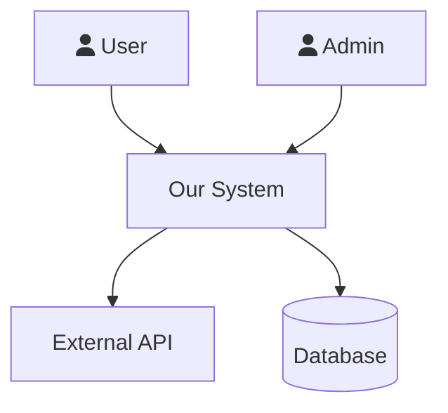
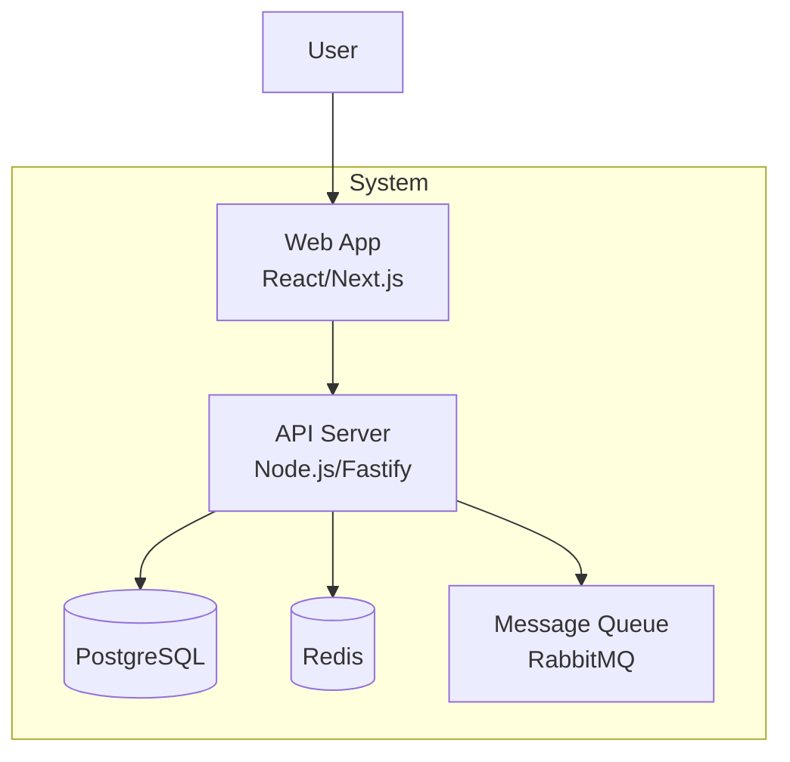
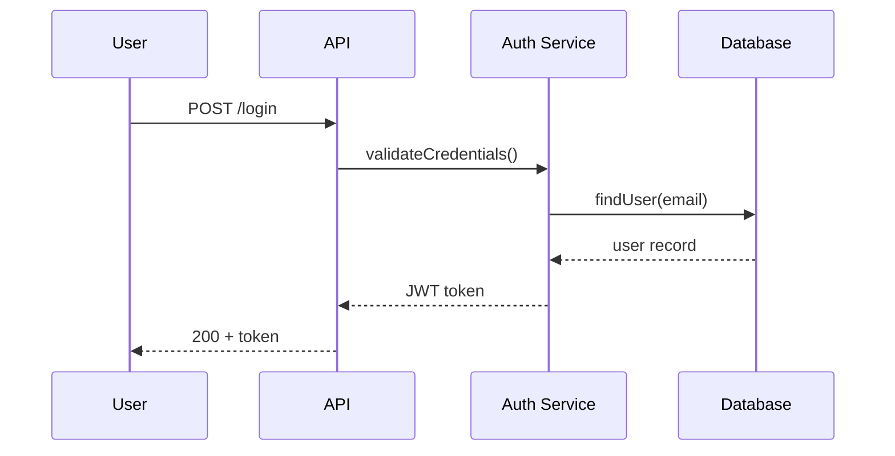
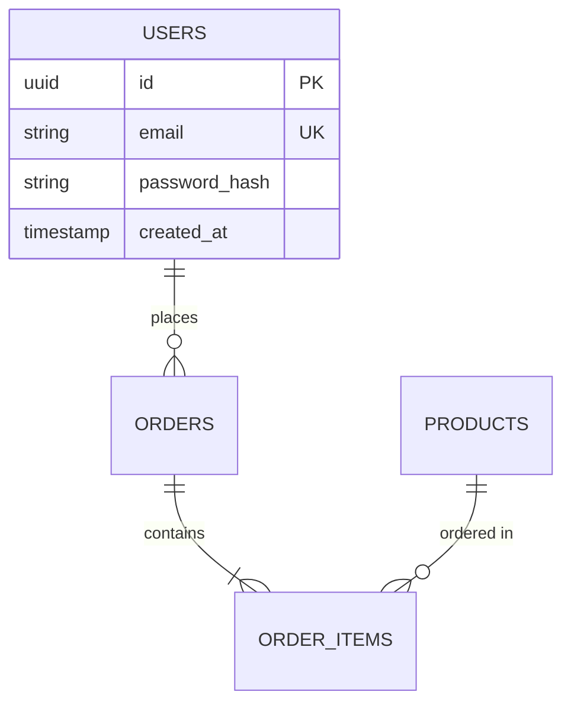
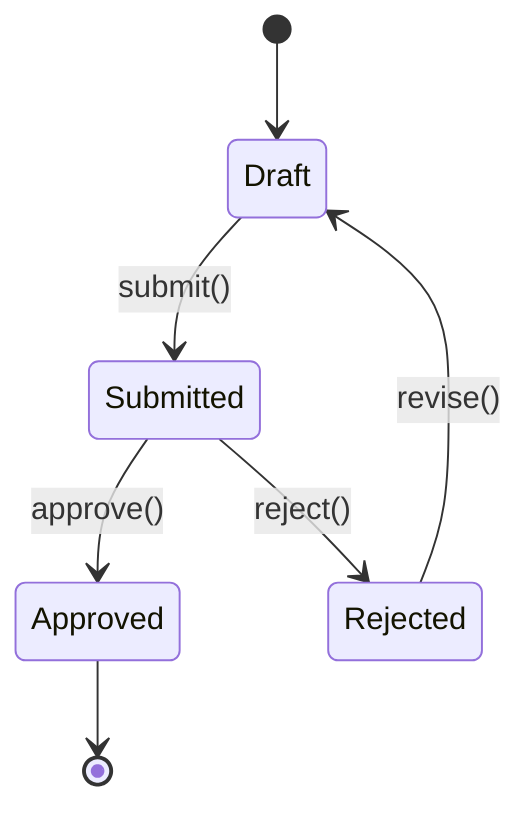
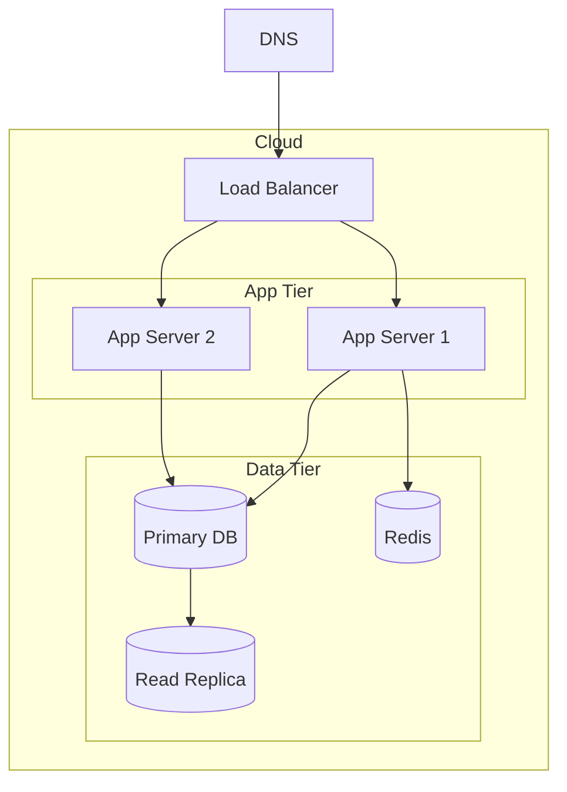

<!--
  Provenance: bpm-opencode-experts
  Source path: agents/sdlc-init-phases-3-4.md
  Import date: 2026-07-12
  DO NOT EDIT — this is imported content
-->


> **Persistence (do not end your turn early):** never end your turn after *announcing* an action — perform it; if you cannot call a tool, print `BLOCKED: <reason>` (never a plan as your final message). Full rule: `agents/shared/PERSISTENCE.md`.


> **DEPRECATED — do not load this file.** Content has been split into:
> - `agents/sdlc-init-phase-3.md` — Phase 3 (Design) + Phase 3.5 (Test Design)
> - `agents/sdlc-init-phase-4.md` — Phase 4 (Implementation) + Phase 5 (Release)
>
> `sdlc-init-mode.md` already uses those files. This file is retained only because
> `docs/GOFORWARD_PLAN.md`, `docs/review/A-appendices.md`, and `agents/templates/ARCHITECTURE_template.md`
> still reference the old name. Update those references — then delete this file.

# Mode 1 — Phases 3–4: Design, Test Design, Implementation

> Load only when sdlc-init-mode.md directs you here. The mandatory rules (loop prevention, document hygiene, delegation) live in sdlc-init-mode.md and apply here too.
>
> **task() → HANDOFF (compact reminder):** Any `task(agent="X", ...)` in this file = emit a HANDOFF block for X using the `════` delimiter format, save state to `docs/work/sdlc-state.md`, wait for user to return. Full rules in `sdlc-init-mode.md` § Delegation Rule.
> **Autonomy:** In `autonomy: auto` (per `agents/shared/AUTONOMY_PROTOCOL.md`) never wait on a paste — Executor C degrades to D (inline) per `EXECUTOR_SELECTION.md`.

## Phase 3: Design — HOW do we build it?

### Design Clarification Interview (MANDATORY — Run Before Any Design Work)

**Present ALL questions at once. Do NOT write any design documents until the user responds.**

Output exactly this block, then stop and wait:

```
Before I design the architecture, I need answers to make the right technical decisions.
Please answer these:

1. Where will this run? (AWS/GCP/Azure/on-prem/hybrid — which services/regions if known)
2. What's the expected scale? (users, requests/sec, data volume — today and in 12 months)
3. Any performance targets? (response time SLAs, throughput, availability %)
4. What external systems must this integrate with? (auth providers, payment, APIs, data sources)
5. What's the team's tech stack experience? (languages/frameworks they're strongest in)
6. Any existing infrastructure to reuse? (databases, queues, auth services, monitoring tools)
7. Any regulatory or compliance requirements? (GDPR, HIPAA, SOC2, PCI-DSS, etc.)

These answers will drive every architecture decision.
```

After the user responds:
- Write answers to `docs/DESIGN_CONTEXT.md`
- Reference DESIGN_CONTEXT.md when making every tech stack and architecture decision

**Deliverables:**
- `docs/ARCHITECTURE.md` — SAD with C4 diagrams (see SAD format below)
- `docs/TECH_STACK.md` — Language, framework, libraries + justification
- `docs/DATABASE.md` — ERD, schema, migrations, access patterns
- `docs/API_DESIGN.md` — Human-readable endpoint contracts (narrative + examples)
- `docs/api/openapi.yaml` — Machine-readable OpenAPI 3.0 spec (Swagger-compatible)
- `docs/THREAT_MODEL.md` — STRIDE threats + mitigations
- `docs/PARALLELIZATION_MAP.md` — modules grouped into Phase 4 implementation waves based on dependency order (enables opt-in parallel agent sets)
- `docs/diagrams/` — Mermaid files for all diagrams
- **If UI-bearing (see UX branch below):**
  - `docs/design/DESIGN_PRINCIPLES.md` — Aesthetic direction, tone, anti-patterns
  - `docs/design/STYLE_GUIDE.md` — Typography, color tokens, spacing, motion
  - `docs/design/UX_SPEC.md` — User workflows, screen hierarchy, component inventory, a11y plan

**Delegate SEQUENTIALLY — one at a time, verify output before the next:**

**Step 1 — Research (HANDOFF):** Tech stack evaluation:

```
write(filePath="docs/work/sdlc-state.md", content="
Mode: 1 / Phase: 3 — Design
Last completed: Design Clarification Interview
Awaiting: researcher — docs/research/RESEARCH_framework_comparison_<date>.md
Next after resume: Research Findings Review, then write TECH_STACK.md, then db-architect HANDOFF
Delegation log: docs/work/DELEGATION_LOG.md
")
```

```
---
  HANDOFF → researcher
---
Write this block to `docs/work/HANDOFF_researcher.md`, then tell the user: open `/research` and have it read `docs/work/HANDOFF_researcher.md` and follow it (it reads the doc — nothing is pasted):

SDLC-TASK for researcher:

CONTEXT (read these before starting):
- docs/DESIGN_CONTEXT.md — deployment environment, scale targets, team experience, constraints
- docs/DISCOVERY.md — what we're building

YOUR TASK:
Compare framework and tech stack options for [domain] given the constraints in DESIGN_CONTEXT.md.
Evaluate: which frameworks best match team experience and scale requirements; performance and
operational trade-offs between the top 2-3 candidates; ecosystem maturity (community, maintained
packages, known CVEs); any licensing or vendor lock-in risks.

PRODUCE exactly these files (nothing else):
- docs/research/RESEARCH_framework_comparison_<date>.md — structured comparison with recommendation

Include a Completion Manifest at the end.

When the file is written, print exactly:
"researcher done — framework comparison: [one sentence recommended stack and key reason]"
Then stop. Do not ask for follow-up. Do not run additional phases.
---
```

**After researcher returns:** Run the Research Findings Review Protocol before writing TECH_STACK.md.
→ Write TECH_STACK.md → mark DONE

**Step 2 — Module design (HANDOFF — new):**

MODULE_DESIGN.md defines the structural blueprint every other specialist designs inside. It must exist before db-architect and api-designer start — they design within the declared module boundaries.

Save state:
```
write(filePath="docs/work/sdlc-state.md", content="
Mode: 1 / Phase: 3 — Design
Last completed: TECH_STACK.md written
Awaiting: architecture-designer — docs/MODULE_DESIGN.md + docs/INFRASTRUCTURE.md
Next after resume: run handoff gates (validate-module-design), then db-architect
")
```

Use **Template 7** from `~/.config/opencode/agents/shared/HANDOFF_TEMPLATES.md` for this HANDOFF.

→ After "architecture-designer done": run `./scripts/validators/run-handoff-gates.sh --scope docs --manifest <manifest> --coverage validate-module-design.sh` → mark DONE

**Git checkpoint — save MODULE_DESIGN + INFRASTRUCTURE:**
```
task(agent="git-expert", prompt="Commit docs/MODULE_DESIGN.md and docs/INFRASTRUCTURE.md to sdlc/setup branch. Conventional commit: 'docs(phase-3): add module design and infrastructure topology'. Push sdlc/setup to origin. Only stage the listed files — git add by name, not git add -A.", timeout=60)
```

**Step 3 — Database design (HANDOFF):**

Save state first:
```
write(filePath="docs/work/sdlc-state.md", content="
Mode: 1 / Phase: 3 — Design
Last completed: TECH_STACK.md written
Awaiting: db-architect — docs/DATABASE.md
Next after resume: api-designer handoff
")
```

```
---
  HANDOFF → db-architect
---
Write this block to `docs/work/HANDOFF_db-architect.md`, then tell the user: open `/dba` and have it read `docs/work/HANDOFF_db-architect.md` and follow it (it reads the doc — nothing is pasted):

SDLC-TASK for db-architect:

CONTEXT (read these before starting):
- docs/MODULE_DESIGN.md — module boundaries and ownership (design tables within declared modules)
- docs/SRS.md — functional requirements and data entities
- docs/USER_STORIES.md — feature requirements driving data needs
- docs/TECH_STACK.md — database technology chosen

YOUR TASK:
Design the complete database schema for [project]. Derive all entities from
SRS.md and USER_STORIES.md. Organize tables by the module that owns them
(from MODULE_DESIGN.md § Module Inventory) — each table belongs to exactly
one module. Use the database technology specified in TECH_STACK.md.

PRODUCE exactly this file:
- docs/DATABASE.md — containing: Mermaid erDiagram of all tables and relationships,
  migration files (up/down) for every table, index strategy for each major access
  pattern, and query patterns for the top 5 most frequent operations

When the file is written, print exactly:
"db done — [one sentence: how many tables, key relationships, and notable design decisions]"
Then stop. Do not ask for follow-up. Do not run additional phases.

---
```

→ After "db done": run `./scripts/validators/run-handoff-gates.sh --scope docs --manifest docs/reviews/MANIFEST_database_<date>.md --coverage validate-erd-coverage.sh` → mark DONE

**Git checkpoint — save DATABASE.md:**
```
task(agent="git-expert", prompt="Commit docs/DATABASE.md and db/migrations/ to sdlc/setup branch. Conventional commit: 'docs(phase-3): add database schema, ERD, and migration stubs'. Push sdlc/setup to origin. Only stage the listed files — git add by name, not git add -A.", timeout=60)
```

**Step 3 — API contracts (HANDOFF):**

Save state:
```
write(filePath="docs/work/sdlc-state.md", content="
Mode: 1 / Phase: 3 — Design
Last completed: docs/DATABASE.md written
Awaiting: api-designer — docs/API_DESIGN.md
Next after resume: UX branch (if UI-bearing) or security-auditor handoff
")
```

```
---
  HANDOFF → api-designer
---
Write this block to `docs/work/HANDOFF_api-designer.md`, then tell the user: open `/api-design` and have it read `docs/work/HANDOFF_api-designer.md` and follow it (it reads the doc — nothing is pasted):

SDLC-TASK for api-designer:

CONTEXT (read these before starting):
- docs/MODULE_DESIGN.md — module boundaries and public interfaces (group endpoints by module)
- docs/USER_STORIES.md — features that need API endpoints
- docs/SRS.md — functional requirements including auth and data rules
- docs/DATABASE.md — schema and data shapes the API reads/writes

YOUR TASK:
Design complete API contracts for [project]. For every user story that requires
a server interaction, produce an OpenAPI-style endpoint contract. Group endpoints
by the module that owns them (from MODULE_DESIGN.md § Module Inventory) — each
endpoint belongs to exactly one module's public interface.

PRODUCE exactly these two files:

1. docs/API_DESIGN.md — human-readable contracts with: HTTP method, path, request
   body schema, response shapes (200/201/400/401/403/404/500), auth requirements,
   example request/response payloads, and a brief description of each endpoint's
   business purpose. Aimed at developers who need to understand the API quickly.

2. docs/api/openapi.yaml — a valid OpenAPI 3.0 spec that exactly mirrors the
   contracts in API_DESIGN.md. Requirements:
   - `openapi: "3.0.3"` header
   - `info` block: title, version ("0.1.0"), description (one sentence from VISION.md)
   - `servers` block: `- url: /api/v1` (or the correct base path)
   - Every endpoint from API_DESIGN.md as a `paths` entry
   - `components/schemas` for every request body and response object
   - `components/securitySchemes` matching the auth strategy in SRS.md
   - All error responses (400/401/403/404/500) as reusable `$ref` components
   - No inline schemas for objects used in more than one place — always $ref
   - The spec must pass `swagger-cli validate docs/api/openapi.yaml` with 0 errors

When both files are written, print exactly:
"api done — [one sentence: how many endpoints designed and key resources covered]"
Then stop. Do not ask for follow-up. Do not run additional phases.
---
```

→ After "api done": run `./scripts/validators/run-handoff-gates.sh --scope docs --manifest docs/reviews/MANIFEST_api_design_<date>.md --coverage validate-api-coverage.sh` → mark DONE.

**Git checkpoint — save API_DESIGN + OpenAPI spec:**
```
task(agent="git-expert", prompt="Commit docs/API_DESIGN.md and docs/api/openapi.yaml to sdlc/setup branch. Conventional commit: 'docs(phase-3): add API design and OpenAPI 3.0 spec'. Push sdlc/setup to origin. Only stage the listed files — git add by name, not git add -A.", timeout=60)
```
  Also run: `bash -c "swagger-cli validate docs/api/openapi.yaml 2>&1 || echo 'swagger-cli not found — install: npm i -g @apidevtools/swagger-cli'"`.
  If OpenAPI validation fails, return errors to api-designer with REVISE status before accepting.

**Step 4 — UX branch (HANDOFF, if UI-bearing — see below)**

**Step 5 — Threat model (HANDOFF):**

The threat model runs BEFORE ARCHITECTURE.md is synthesized — it reads the design artifacts directly (TECH_STACK + DATABASE + API_DESIGN) to identify threats. ARCHITECTURE.md is synthesized AFTER security controls are incorporated so it captures the full security picture.

Save state:
```
write(filePath="docs/work/sdlc-state.md", content="
Mode: 1 / Phase: 3 — Design
Last completed: API_DESIGN.md (and UX docs if UI-bearing)
Awaiting: security-auditor — docs/THREAT_MODEL.md
Next after resume: SECURITY_CONTROLS HANDOFF, then security reconciliation, then write ARCHITECTURE.md
")
```

```
---
  HANDOFF → security-auditor
---
Write this block to `docs/work/HANDOFF_security-auditor.md`, then tell the user: open `/security` and have it read `docs/work/HANDOFF_security-auditor.md` and follow it (it reads the doc — nothing is pasted):

SDLC-TASK for security-auditor:

CONTEXT (read these before starting):
- docs/TECH_STACK.md — technologies and their known vulnerability profiles
- docs/API_DESIGN.md — API endpoints, authentication requirements, data inputs
- docs/DATABASE.md — schema, sensitive fields, access patterns
- docs/SRS.md — security requirements and compliance constraints

YOUR TASK:
Produce a STRIDE threat model for [project]. For every component and data flow
(derived from TECH_STACK + API_DESIGN + DATABASE), identify threats across all
6 STRIDE categories. Assign a threat ID (T-01, T-02, ...) to every threat. For each:
describe the attack scenario, rate severity (CRITICAL/HIGH/MEDIUM/LOW), identify
the affected component, and describe the attack vector.

PRODUCE exactly this file:
- docs/THREAT_MODEL.md — STRIDE threats organized by component, with threat IDs,
  severity ratings, attack descriptions, and a summary table of all threats

When the file is written, print exactly:
"security done — [one sentence: how many threats found, how many CRITICAL/HIGH]"
Then stop. Do not ask for follow-up. Do not run additional phases.

---
```

→ After "security done": run `./scripts/validators/run-handoff-gates.sh --scope docs --manifest docs/reviews/MANIFEST_threat_model_<date>.md` → mark DONE.

**Git checkpoint — save THREAT_MODEL.md:**
```
task(agent="git-expert", prompt="Commit docs/THREAT_MODEL.md to sdlc/setup branch. Conventional commit: 'docs(phase-3): add threat model with attack scenarios and severity ratings'. Push sdlc/setup to origin. Only stage the listed files — git add by name, not git add -A.", timeout=60)
```
  No `--coverage` flag: threat model quality is validated downstream by `validate-security-controls.sh` (checks every HIGH/CRITICAL threat has a control). Verify THREAT_MODEL.md has threat IDs (T-01, T-02, ...) and severity ratings before accepting.

**Step 6 — Security controls (HANDOFF):**

Save state:
```
write(filePath="docs/work/sdlc-state.md", content="
Mode: 1 / Phase: 3 — Design
Last completed: docs/THREAT_MODEL.md written
Awaiting: security-auditor — docs/SECURITY_CONTROLS.md + document change requests
Next after resume: issue security reconciliation HANDOFFs to db-architect + api-designer, then ARCHITECTURE.md
")
```

Use **Template 5** from `~/.config/opencode/agents/shared/HANDOFF_TEMPLATES.md` for this HANDOFF.

→ After "security done" (security controls): run handoff gates with `--coverage validate-security-controls.sh` → mark DONE

**Git checkpoint — save SECURITY_CONTROLS.md:**
```
task(agent="git-expert", prompt="Commit docs/SECURITY_CONTROLS.md to sdlc/setup branch. Conventional commit: 'docs(phase-3): add security controls mapped to threat model'. Push sdlc/setup to origin. Only stage the listed files — git add by name, not git add -A.", timeout=60)
```

**Step 7 — Security reconciliation (HANDOFFs to db-architect and api-designer):**

SECURITY_CONTROLS.md contains specific change requests for DATABASE.md and API_DESIGN.md. Issue targeted update HANDOFFs:

Save state:
```
write(filePath="docs/work/sdlc-state.md", content="
Mode: 1 / Phase: 3 — Design
Last completed: SECURITY_CONTROLS.md written
Awaiting: db-architect (update DATABASE.md) + api-designer (update API_DESIGN.md + openapi.yaml)
Next after resume: verify both updates, then write ARCHITECTURE.md
")
```

For each update HANDOFF, use Template 1 from `HANDOFF_TEMPLATES.md` scoped to just the update:
- **db-architect update:** read SECURITY_CONTROLS.md change requests for DATABASE.md → add encryption-at-rest notes, sensitive field labels, access control patterns
- **api-designer update:** read SECURITY_CONTROLS.md change requests for API_DESIGN.md → add rate limiting, CORS policy, input validation, and security header notes per endpoint; update openapi.yaml securitySchemes

→ After both update HANDOFFs return and pass handoff gates → mark DONE

**Step 8 — Infrastructure topology (HANDOFF):**

After security controls are applied, the infrastructure shape is known. Delegate to sre-engineer to document the deployment topology.

Save state:
```
write(filePath="docs/work/sdlc-state.md", content="
Mode: 1 / Phase: 3 — Design
Last completed: Security reconciliation complete (DATABASE.md + API_DESIGN.md updated)
Awaiting: sre-engineer — docs/INFRASTRUCTURE.md
Next after resume: run handoff gates (validate-infrastructure), then ARCHITECTURE.md synthesis
")
```

Use **Template 8** from `~/.config/opencode/agents/shared/HANDOFF_TEMPLATES.md` for this HANDOFF.

→ After "sre done": run `./scripts/validators/run-handoff-gates.sh --scope docs --manifest <manifest> --coverage validate-infrastructure.sh` → mark DONE

**Git checkpoint — save INFRASTRUCTURE.md:**
```
task(agent="git-expert", prompt="Commit docs/INFRASTRUCTURE.md to sdlc/setup branch. Conventional commit: 'docs(phase-3): add infrastructure topology — environments, compute, data, networking'. Push sdlc/setup to origin. Only stage the listed files — git add by name, not git add -A.", timeout=60)
```

**You produce (orchestrator synthesis documents — write these yourself, AFTER steps 1-8):**
- `docs/ARCHITECTURE.md` — reconciles MODULE_DESIGN + TECH_STACK + DATABASE + API_DESIGN + THREAT_MODEL + SECURITY_CONTROLS into C4 diagrams. MUST reference both MODULE_DESIGN.md (application structure) and INFRASTRUCTURE.md (deployment topology). Security Architecture section MUST reference SECURITY_CONTROLS.md.
- `docs/PARALLELIZATION_MAP.md` — derives Wave 1/2/3/... from MODULE_DESIGN.md module inventory (use the Depends On column for wave ordering — modules in the same wave have no mutual dependencies)

Write ARCHITECTURE.md LAST — after all specialist handoffs have returned and security controls are incorporated. It synthesizes the full picture.

**Phase 3 sequencing rule (enforced — do not skip or reorder):**
1. TECH_STACK.md (researcher)
2. MODULE_DESIGN.md + INFRASTRUCTURE.md (architecture-designer) — needs TECH_STACK
3. DATABASE.md (db-architect) — needs TECH_STACK + MODULE_DESIGN
4. API_DESIGN.md + openapi.yaml (api-designer) — needs TECH_STACK + MODULE_DESIGN + DATABASE
5. UX docs (ux-engineer, if UI-bearing) — needs TECH_STACK + USER_STORIES
6. THREAT_MODEL.md (security-auditor) — reads TECH_STACK + DATABASE + API_DESIGN
7. SECURITY_CONTROLS.md (security-auditor) — reads THREAT_MODEL
8. DATABASE.md + API_DESIGN.md updates (db-architect + api-designer) — applies security controls
9. INFRASTRUCTURE.md (sre-engineer) — topology based on all the above
10. ARCHITECTURE.md synthesis (sdlc-lead) — references MODULE_DESIGN + INFRASTRUCTURE
11. PARALLELIZATION_MAP.md (sdlc-lead) — from MODULE_DESIGN dependency graph

**Never trigger two Phase 3 handoffs at once.** Each expert's output informs the next. **Phase 4 is different** — it supports parallel waves (see below).

### UX Branch — Mandatory If UI-Bearing

After TECH_STACK.md is written, detect whether this system has a user interface:
- Web app: package.json has `react`/`vue`/`svelte`/`next`/`nuxt`/`remix`/`astro`
- Mobile: `react-native`/`expo`/`flutter`/`swift`/`kotlin` with UI frameworks
- Desktop (JS shell): `tauri`/`electron`/`wails`
- Desktop (native GUI — these have NO package.json): Rust `egui`/`eframe`/`iced`/`slint`/`winit`(+`wgpu` app shell), Python `tkinter`/`pyqt`/`pyside`/`kivy`, C/C++ `qt`/`gtk`/`fltk`/`wxwidgets`, Go `fyne`, .NET `wpf`/`winforms`/`maui`/`avalonia`, JVM `swing`/`javafx` — any windowing/GUI toolkit named in TECH_STACK.md
- TUI: `ratatui`/`bubbletea`/`textual`/curses-class terminal UIs (UX branch runs scope-reduced: workflows + screen hierarchy + keybinding map; STYLE_GUIDE color system optional)
- Game: any engine/render-loop project with menus, HUD, or settings surfaces (visual system may route to the game experts; UX_SPEC is still required)
- Has pages/components/views/screens directory planned in ARCHITECTURE.md
- **Brief-driven catch-all (decisive):** the founding brief, SRS, or USER_STORIES mention any human-operated surface — frontend, UI, screen, panel, viewer, editor, dashboard, HUD, menu, settings, library view, input remapping. Grep them; any hit ⇒ UI-bearing.

**Default when ambiguous: UI-bearing = YES.** A wrong "yes" costs one UX pass; a wrong "no" ships an undesigned UI. (Lesson — RetroForge, 2026-07-06: a Rust/egui desktop app had no package.json, the web-centric list above missed it, and the frontend design doc only appeared because the user asked where it was.)

**Record the determination (MANDATORY, gate-checked):** ARCHITECTURE.md § Logical View must state either `UI-bearing: yes — <evidence>` or the exact sentence "No UI — UX branch not applicable". The phase-3 gate FAILS when neither UX docs nor this declaration exist — silent skip is impossible.

**If UI-bearing, UX delegation is MANDATORY before Phase 3 gate.**

Save state, then hand off:

```
write(filePath="docs/work/sdlc-state.md", content="
Mode: 1 / Phase: 3 — Design
Last completed: docs/API_DESIGN.md written
Awaiting: ux-engineer — docs/design/DESIGN_PRINCIPLES.md, STYLE_GUIDE.md, UX_SPEC.md
Next after resume: security-auditor handoff
")
```

```
---
  HANDOFF → ux-engineer
---
Write this block to `docs/work/HANDOFF_ux-engineer.md`, then tell the user: open `/ux` and have it read `docs/work/HANDOFF_ux-engineer.md` and follow it (it reads the doc — nothing is pasted):

SDLC-TASK for ux-engineer:

CONTEXT (read these before starting):
- docs/VISION.md — project purpose, target audience, success metrics
- docs/USER_PERSONAS.md — who the users are and what they need
- docs/USER_STORIES.md — what features users need
- docs/TECH_STACK.md — UI framework being used
- docs/DISCOVERY.md — constraints and brand direction from the client
- docs/DESIGN_CONTEXT.md — technical and compliance constraints

YOUR TASK:
Design the complete UX for [project]. Produce three documents that give the
implementation team everything they need to build the UI. Be specific and opinionated —
pick a real visual direction (NOT generic). Do not hedge. Do not produce placeholders.

PRODUCE exactly these files:
- docs/design/DESIGN_PRINCIPLES.md — core design philosophy, tone (pick one extreme:
  minimal / maximalist / brutalist / refined / playful — explain why), visual anti-patterns
  to avoid, decision criteria for future design choices
- docs/design/STYLE_GUIDE.md — specific typefaces (NOT Inter/Roboto/Arial — pick something
  with personality), exact color tokens with hex values, spacing scale, motion principles
- docs/design/UX_SPEC.md — must include ALL of:
  * Component Library Selection: choose ONE specific library (shadcn/ui, MUI, Ant Design,
    Chakra UI, Headless UI + Tailwind, etc.) with justification from TECH_STACK.md framework
  * Screen Hierarchy / Information Architecture: Mermaid diagram showing page/screen tree
  * User Workflows: one Mermaid flowchart per user story (actor → steps → outcomes)
  * Component Inventory: table listing every reusable UI component (name, purpose, variants,
    which screens use it) — minimum 5 components
  * Accessibility Plan (WCAG 2.2 AA): table covering keyboard navigation, color contrast
    (4.5:1 minimum), screen reader support (ARIA), focus indicators
  * Responsive Strategy: breakpoints table with layout approach per breakpoint

When all three files are written, print exactly:
"ux done — [one sentence: design direction chosen and how many workflows covered]"
Then stop. Do not ask for follow-up. Do not run additional phases.

---
```

After "ux done":
1. Verify all three files exist and are >50 lines each
2. Run the **Research Findings Review Protocol** — check for conflicts with TECH_STACK, USER_PERSONAS, or DESIGN_CONTEXT
3. **Run handoff gates:** `./scripts/validators/run-handoff-gates.sh --scope docs/design --manifest <manifest> --coverage validate-ux-spec.sh`
   - Gate uses Track 1 (validate-ux-spec.sh) — objective coverage, not confidence scoring
   - If gaps: return specific gap to ux-engineer with REVISE status (up to 3 iterations)
   - All gaps closed → mark DONE
4. Run Inter-Phase Check-In Protocol for the UX deliverables before proceeding

**After UX passes — HANDOFF to frontend-design for visual implementation:**

If ux-engineer produced DESIGN_PRINCIPLES.md, STYLE_GUIDE.md, and UX_SPEC.md,
the visual design is specified but not implemented. Hand off to frontend-design:

```
---
  HANDOFF → frontend-design
---
Write this block to `docs/work/HANDOFF_frontend-design.md`, then tell the user: open `/frontend` and have it read `docs/work/HANDOFF_frontend-design.md` and follow it (it reads the doc — nothing is pasted):

SDLC-TASK for frontend-design:

CONTEXT (read these before starting):
- docs/design/DESIGN_PRINCIPLES.md — aesthetic direction and anti-patterns
- docs/design/STYLE_GUIDE.md — typography, color tokens, spacing, motion
- docs/design/UX_SPEC.md — component inventory and screen hierarchy
- docs/TECH_STACK.md — UI framework and component library

YOUR TASK:
Implement the design system from the UX specs. Create or update the design
token file (Tailwind config, theme.ts, or CSS custom properties), implement
the typography scale, color palette, and spacing system. Apply to 3
representative components as examples.

PRODUCE exactly these files:
- Updated theme/token files matching STYLE_GUIDE.md specifications
- docs/design/DESIGN_SYSTEM.md — token inventory, naming convention, example usage
- docs/design/IMPLEMENTATION_NOTES.md — what was implemented, before/after

Include a Completion Manifest.

When all files are written, print exactly:
"frontend done — [one sentence: tokens implemented, components styled]"
Then stop. Do not ask for follow-up. Do not run additional phases.
---
```

This is optional in Phase 3 (design phase) — the full visual implementation happens
in Phase 4 after the codebase exists. But establishing the token layer early gives
implementation a clear starting point.

**If NOT UI-bearing** (pure backend API, CLI tool, library, data pipeline): skip the UX branch. Note "No UI — UX branch not applicable" in ARCHITECTURE.md § Logical View.

### High-Level Architecture (HLA)

ARCHITECTURE.md MUST include ALL of the following diagrams. Do not skip any:

1. **System Context (C1)** — Mermaid diagram showing the system and ALL external actors/systems
2. **Container Diagram (C2)** — Mermaid diagram showing ALL services/components from TECH_STACK.md
3. **Component Diagrams (C3)** — ONE Mermaid diagram PER MAJOR SERVICE showing internal components
4. **Sequence Diagrams** — ONE per P0 use case from USE_CASES.md (not a fixed minimum — one per critical path)
5. **Deployment Diagram** — Mermaid diagram showing infrastructure topology from DESIGN_CONTEXT.md
6. **Data Flow Diagram** — Mermaid diagram showing data movement end-to-end

If ARCHITECTURE.md is missing any of these 6 diagram types, the Phase 3 gate CANNOT pass.

### Per-Diagram Confidence Loop (Mandatory — Run After Writing Each Diagram)

After writing EACH diagram in ARCHITECTURE.md, run this loop before moving to the next:

**For C1 (System Context):**
1. List every persona from USER_PERSONAS.md — are they all present as actors?
2. List every external system from SRS.md § Interface Requirements — are they all present?
3. Rate Completeness 1-10. Score < 7 → revise (add missing actors/systems). Score < 5 → surface to user.
4. Update the SDLC_TRACKER diagram inventory row: `⏳ PENDING` → `✅ DONE | [score]`

**For C2 (Container Diagram):**
1. List every service/runtime in TECH_STACK.md — is each represented as a container node?
2. Are the communication arrows (HTTP, gRPC, queue) matching what TECH_STACK.md specifies?
3. Rate Completeness 1-10. Score < 7 → add missing containers. Score < 5 → surface to user.
4. Update tracker C2 row.

**For C3 (Component Diagrams — one per service):**
1. For EACH major service: list its internal modules from the planned feature-sliced structure
2. Do module names match the real implementation plan (not generic "ServiceA", "ModuleB")?
3. Are dependency arrows showing direction (who depends on whom — no circular deps)?
4. Rate each C3 separately. Score < 7 → name real modules. Score < 5 → surface to user.
5. Update tracker row for each C3 (named by service).

**For Sequence Diagrams (one per P0 use case):**
1. Read USE_CASES.md — list every P0 use case
2. For EACH P0 use case: produce one `sequenceDiagram` block tracing: actor → API → service → repository → DB → response
3. Each diagram MUST include: happy path AND at least one error path (validation failure, auth failure, or DB error)
4. Rate each sequence diagram: (a) all participants named specifically — no "Service" generics; (b) error path present; (c) consistent with SRS acceptance criteria for that use case. Score < 7 → add error path or rename generics. Score < 5 → surface.
5. Update tracker — one row per sequence diagram.

**For Deployment Diagram:**
1. Cross-reference with DESIGN_CONTEXT.md § infrastructure — does the diagram reflect the ACTUAL infra choices (cloud provider, services, regions)?
2. Are load balancers, CDN, container runtime, DNS, and monitoring represented if applicable?
3. Rate Completeness 1-10. Score < 7 → add missing infra components. Score < 5 → surface.
4. Update tracker deployment row.

**For Data Flow Diagram:**
1. Trace from user browser/client → through all intermediate hops → to persistence layer → and the read path back
2. Show where data transforms (e.g., DTO → domain model → DB schema)
3. Show where data at rest is encrypted or masked (if applicable per THREAT_MODEL.md)
4. Rate Completeness 1-10. Score < 7 → fill in missing hops. Score < 5 → surface.
5. Update tracker data flow row.

**HLA Overview (write LAST — after all diagrams pass):**
After all 6 diagram types pass their confidence loops, write a 3-paragraph HLA Overview at the TOP of ARCHITECTURE.md:
- Para 1: What the system is, how it's partitioned (monolith / services / serverless), and the key architectural metaphor
- Para 2: The most important architectural decisions and WHY (reference the ADR table)
- Para 3: What a new engineer should understand first to navigate the codebase

This overview is grounded in the real decisions made during the diagram phase — not a copy of the discovery interview answers.

### SAD Format (4+1 Views)

**MANDATORY:** Every section below must be filled with real names from the project — no `[placeholder]` text in the final document. Placeholders exist only in this template as a guide.

**Use the canonical template:** read `agents/templates/ARCHITECTURE_template.md` and copy its structure into `docs/ARCHITECTURE.md`. Fill every section with real project names — no `[placeholder]` text. The template includes all 6 mandatory diagram types (C1 / C2 / C3 / sequence / data flow / deployment) as Mermaid blocks.


### Modular Design Requirements

**Every architecture MUST follow these principles:**

1. **Feature-sliced structure** (not layer-sliced)
   ```
   GOOD:                    BAD:
   src/                     src/
     payments/                controllers/
       service.ts              paymentController.ts
       repository.ts           userController.ts
       types.ts              services/
     users/                    paymentService.ts
       service.ts              userService.ts
       repository.ts         models/
       types.ts                payment.ts
   ```

2. **Interface-driven design** — modules depend on interfaces, not implementations
   ```typescript
   // Define the contract
   interface PaymentProcessor {
     charge(amount: number): Promise<Result>
   }
   // Implement it
   class StripeProcessor implements PaymentProcessor { ... }
   // Depend on the interface
   class CheckoutService {
     constructor(private processor: PaymentProcessor) {}
   }
   ```

3. **Dependency injection** — objects don't create their own dependencies

4. **Clear module boundaries** — each module has:
   - Public API (exported functions/types)
   - Private implementation (internal)
   - Declared dependencies (what it needs from other modules)

5. **Separation of concerns** — business logic, data access, UI, infrastructure are separate

6. **Service boundary criterion (parallel-development-ready)** — every module MUST be independently buildable:
   - Owns its own directory tree (`src/<module>/`) — no sibling writes
   - Exposes a frozen contract (OpenAPI path group, gRPC service, event schema, or public TypeScript interface file)
   - Has zero direct imports from another module's internals — cross-module communication only through contracts
   - Can be replaced with a mock/stub that conforms to the contract without other modules noticing
   - Has an explicit list of dependencies on other modules (used to derive wave ordering in `PARALLELIZATION_MAP.md`)

7. **Write-scope isolation (enforced in Phase 4)** — during implementation, each module's directory is the exclusive write-scope of the agent building it. Agents in the same wave MUST NOT touch files outside their assigned module. Shared code (`src/shared/`, `src/common/`) is written in a prior wave, not concurrently.

8. **Contract-first ordering** — API contracts (`docs/API_DESIGN.md` + `docs/api/openapi.yaml`), event schemas, and public interfaces are frozen at the end of Phase 3, BEFORE any Phase 4 implementation starts. This lets independent modules implement against mocks of each other without blocking. Contract changes during Phase 4 require returning to Phase 3 for that module.

### Parallelization Map — `docs/PARALLELIZATION_MAP.md`

After ARCHITECTURE.md is complete, derive the Phase 4 wave plan. This is a synthesis document the orchestrator writes (like ARCHITECTURE.md) — not a specialist handoff.

**Format:**

```markdown
# Parallelization Map

## Module Inventory
| Module | Directory | Contract artifact | Depends on | Wave |
|--------|-----------|-------------------|------------|------|
| shared-types | src/shared/types | src/shared/types/index.ts | — | 1 |
| auth | src/auth | openapi.yaml §auth | shared-types | 2 |
| users | src/users | openapi.yaml §users | shared-types, auth | 2 |
| orders | src/orders | openapi.yaml §orders | shared-types, users | 3 |
| payments | src/payments | openapi.yaml §payments | shared-types, orders | 3 |

## Waves
- **Wave 1 (sequential foundation):** shared-types — everything depends on these
- **Wave 2 (parallel-safe):** auth, users — independent of each other, both need shared-types
- **Wave 3 (parallel-safe):** orders, payments — independent of each other, both need auth+users

## Cross-cutting (always sequential, outside waves)
- Test strategy (before Wave 1)
- DB migrations (after schema-owning waves)
- Security audit (after all waves)
- CI/CD pipeline (after all code complete)

## Execution mode
- [ ] Sequential (default) — run modules one at a time in wave order
- [ ] Parallel waves — run every module in a wave concurrently (user opt-in per wave)
```

**Wave rules:**
1. Two modules belong in the same wave only if NEITHER depends on the other AND their write-scopes do not overlap
2. `src/shared/` writes ALWAYS go in their own wave (Wave 1 typically) — never concurrent with anything
3. A module's contract (OpenAPI section, interface file) must be frozen in the `docs/` deliverable from Phase 3 BEFORE its wave begins — otherwise downstream waves can't mock it
4. Default execution is sequential; parallel is user-opt-in per wave (see Phase 4 below)

### Tracker Data Model — Mandatory Before Any External-Tracker Backlog (T29.6)

**Only applies when this project's backlog will be generated into an
external issue tracker** (Jira, Linear, GitHub Projects, or anything that
isn't this repo's own `plan.json` — see `docs/TICKET_SCHEMA.md` for that
internal path, which this step does not touch). If the project uses
`plan.json`/`scripts/lib/tickets.mjs` exclusively, this step is not
applicable — say so and move on.

Field lesson (`issues/field-report-mode1-sdlc-run-2026-07.md` §A-6): a
live Mode-1 engagement generated ~200 requirement-stories directly in a
client's tracker with no deliberate data model. Phases and stories ended up
as siblings under one umbrella epic — nothing structurally tied a phase to
its stories — so completion rollups had no native answer, 150+ phase↔story
links had to be retrofitted mid-project, labels silently undercounted scope
because they were unenforced, and template/sample tickets polluted totals.
This step exists so that reverse-engineering never has to happen again.

**Before generating a single backlog item in the external tracker:**

1. Copy `references/tracker-data-model-template.md` to
   `docs/TRACKER_DATA_MODEL.md` and fill all four sections: **Layer Map**
   (what epic/story/task/sub-task mean in *this* tracker), **Phase → Work
   Linkage** (structural strongly preferred over label-only — if the
   tracker's native parent field is already spent on a single umbrella
   epic, choose the explicit link type now, not after 150 items exist),
   **Source of Truth** (name the one field authoritative for scope +
   completion), **Stray & Template Handling** (tag sample/scaffolding
   items `stray: true` from the first snapshot, never leave them
   untagged).
2. As the backlog is generated, maintain a normalized snapshot at
   `docs/work/tracker-snapshot.json` (schema:
   `docs/TRACKER_DATA_MODEL_SCHEMA.md`) — however this project pulls one
   from the live tracker (API script, CSV export, ...).
3. Link each new story to its phase **at creation time**, and re-run the
   idempotent straggler sweep any session:
   `node scripts/tracker-link-sweep.mjs docs/work/tracker-snapshot.json --write`
   — a clean run links 0 stragglers; this is what keeps linkage continuous
   instead of a one-time retrofit.
4. Run `scripts/validators/validate-tracker-integrity.sh` — chained at the
   Phase 3 gate (spec must exist before any snapshot does) and the Phase 4
   gate (item-level integrity: unlabeled items, unlinked stories, untagged
   strays polluting scope math, once a snapshot exists).

### Mermaid Diagram Templates

**C1 System Context:**


**C2 Container:**


**Sequence Diagram:**


**ERD:**


**State Machine:**


**Deployment Diagram:**


**Exit:** All components documented, data flows diagrammed, modular structure defined, security threats identified, ARCHITECTURE.md contains all 6 required diagram types

**Architecture Diagram Pre-Gate (Mandatory — Run BEFORE the Phase 3 Gate Loop):**

Before rating the standard gate deliverables, verify every row in the SDLC_TRACKER Diagram Inventory is `✅ DONE`:

```
read(filePath="docs/sdlc/SDLC_TRACKER.md")
```

Check the **Architecture Diagram Inventory** table. For every row that is NOT `✅ DONE`:
1. Identify which diagram is missing or incomplete
2. Write/revise that diagram following the Per-Diagram Confidence Loop rules above
3. Score it. Score < 5 → surface to user immediately. Score 5-6 → revise up to 3 times. Score ≥ 7 → mark `✅ DONE` in tracker.
4. Do NOT start the main gate loop until EVERY diagram row is `✅ DONE`.

**Diagram Inventory Completion Check (print before gate):**
```
Architecture Diagram Inventory — Phase 3 Pre-Gate:
  C1 System Context:          [✅ DONE | score] / [⚠️ BLOCKED | reason]
  C2 Container:               [✅ DONE | score] / [⚠️ BLOCKED | reason]
  C3 [service-1]:             [✅ DONE | score] / [⚠️ BLOCKED | reason]
  C3 [service-N]:             ...
  Seq: [UC-001 name]:         [✅ DONE | score] / [⚠️ BLOCKED | reason]
  Seq: [UC-002 name]:         ...  (one row per P0 use case)
  Deployment:                 [✅ DONE | score] / [⚠️ BLOCKED | reason]
  Data Flow:                  [✅ DONE | score] / [⚠️ BLOCKED | reason]

  ALL DONE? [YES → proceed to gate] / [NO → fix blocked items first]
```

### Spec Traceability Audit — Mandatory Before The Phase 3 Gate

Audit the finished document set against the **founding brief** (the user's
original request + Discovery Interview answers) — NOT just the SRS, which may
itself have dropped requirements:

1. Re-read the founding brief and discovery answers. Enumerate EVERY concrete
   requirement/feature/constraint as a row: goals, layers/subsystems,
   per-domain requirement lists, UI surfaces, tooling, testing asks,
   constraints, explicitly promised deliverables.
2. Grade each row against docs/ + the ticket board: **COVERED** (traceable to
   a doc §/requirement id/ticket) / **PARTIAL** ("mentioned in passing" —
   be strict) / **MISSING**.
3. Write `docs/TRACEABILITY.md`: dense tables per group + a Gap register
   listing every non-COVERED row with a proposed fix (which doc to extend,
   which ticket to add).
4. Close the gaps (or record explicit user-approved deferrals), append a
   Gap-resolution section stating the final count ("0 MISSING"), re-grade.
5. `validate-spec-traceability.sh` enforces this at the gate.

Origin — RetroForge (2026-07-06): a fully-gated doc set still shipped without
a frontend design doc, because nothing compared the finished docs against the
*original brief*. SRS-internal traceability (requirements ↔ stories) cannot
catch what never made it into the SRS.

**Gate Loop — Phase 3 Coverage (Ralph Wiggum style, 3-iteration max):**

Run the Phase 3 coverage validator:
```bash
./scripts/validators/run-coverage-loop.sh phase-3
```

This chains: `validate-architecture.sh` + `validate-module-design.sh` + `validate-erd-coverage.sh` + `validate-api-coverage.sh` + `validate-security-controls.sh` + `validate-ux-spec.sh` (ALWAYS — passes only with UX docs present OR an explicit "No UI — UX branch not applicable" declaration in ARCHITECTURE.md) + `validate-spec-traceability.sh` + `validate-no-ascii-art.sh`.

**Exit code → action:**
- **Exit 0** (all clean) → proceed to git checkpoint below
- **Exit 1** (gaps remain, iteration < 3) → read `docs/work/COVERAGE_LOOP_phase-3_<date>.md`, emit one gap-fill HANDOFF per uncovered row back to the specialist that owns it, re-run the script. The HANDOFF should use the ════ delimiter format and include a VERIFY checklist specific to the gap.
- **Exit 2** (3 iterations exhausted) → emit Ralph Wiggum escalation block:
  ```
  PHASE 3 GATE — RALPH WIGGUM ESCALATION
  3 iterations exhausted. Gaps remain. Options:
  A) WAIVER — mark the gap as accepted technical debt (document reason in ARCHITECTURE.md § Known Gaps)
  B) LOWER-BAR — reduce coverage requirement for this row (document in SDLC_TRACKER)
  C) SPECIALIST — bring in a different specialist to address the specific gap
  D) MANUAL — user reviews the gap directly and approves manually
  
  Gaps outstanding: [list from COVERAGE_LOOP file]
  Awaiting user decision before advancing to Phase 3.5.
  ```

**Content quality checks (run AFTER coverage loop exits 0):**
- ARCHITECTURE.md Diagram Inventory: ALL rows `✅ DONE` with score ≥ 7 (enforced above)
- ARCHITECTURE.md § 0 HLA Overview: present and NOT placeholder text (written after diagrams)
- TECH_STACK.md has explicit rationale for each choice, referencing DESIGN_CONTEXT.md
- DATABASE.md has ERD + migrations + access patterns (not just a schema dump)
- API_DESIGN.md has example request/response payloads for every endpoint, not just schemas
- `docs/api/openapi.yaml` exists, passes `swagger-cli validate`, and every endpoint in API_DESIGN.md has a corresponding path entry
- THREAT_MODEL.md has mitigations, not just threats listed
- `docs/PARALLELIZATION_MAP.md` exists with a populated Module Inventory table AND a Waves section listing Wave 1..N
- **If UI-bearing:** `docs/design/DESIGN_PRINCIPLES.md`, `docs/design/STYLE_GUIDE.md`, `docs/design/UX_SPEC.md` all present, all gate-passed. If NOT UI-bearing, ARCHITECTURE.md § Logical View must say "No UI — UX branch not applicable".
- **Spec Traceability Audit:** `docs/TRACEABILITY.md` present — every concrete requirement from the founding brief + Discovery Interview answers graded COVERED/PARTIAL/MISSING against the doc set and ticket board; zero MISSING remaining, every PARTIAL resolved or explicitly deferred with user approval. `validate-spec-traceability.sh` gate-passed.
- **Tracker Data Model (external trackers only):** if this project's backlog targets an external issue tracker, `docs/TRACKER_DATA_MODEL.md` exists with all four sections filled (no placeholders) BEFORE any `docs/work/tracker-snapshot.json` is written. `validate-tracker-integrity.sh` gate-passed. Not applicable projects using only `plan.json` skip this row.

**Git checkpoint — commit Phase 3 docs before advancing:**
```
task(agent="git-expert", prompt="Commit all new docs/ files from Phase 3 (ARCHITECTURE.md, TECH_STACK.md, DATABASE.md, API_DESIGN.md, docs/api/openapi.yaml, THREAT_MODEL.md, SECURITY_CONTROLS.md, docs/PARALLELIZATION_MAP.md, docs/diagrams/, docs/design/ if UI-bearing) to the sdlc/setup branch. Conventional commit: 'docs(phase-3): add design artifacts — architecture, tech stack, DB, API, OpenAPI spec, threat model, security controls, parallelization map'. Push sdlc/setup to origin. Do NOT push to main.", timeout=60)
```
**Inter-Phase Check-In:** After the gate passes AND docs are committed, run the Inter-Phase Check-In Protocol. Do NOT auto-advance.
**Autonomy:** If `autonomy: auto` per `agents/shared/AUTONOMY_PROTOCOL.md`: continue to the next step and log to `docs/work/APPROVALS.md` instead of waiting.

## Phase 3.5: Test Design — WHAT exactly do we verify?

Phase 3.5 bridges design and implementation. All architecture, API contracts, and security controls are now frozen. The test engineer reads everything produced in Phases 0-3 and produces a detailed test design — concrete test cases per component, endpoint, use case, and threat.

**Save state:**
```
write(filePath="docs/work/sdlc-state.md", content="
Mode: 1 / Phase: 3.5 — Test Design
Last completed: Phase 3 gate passed, Human Approval Gate A confirmed
Awaiting: test-engineer — docs/testing/TEST_DESIGN.md
Next after resume: Phase 3.5 gate, then Human Approval Gate B, then Phase 4
")
```

**HANDOFF:** Use **Template 6** from `~/.config/opencode/agents/shared/HANDOFF_TEMPLATES.md`.

→ After "test-design done": run handoff gates with `--coverage validate-test-design.sh`

**Gate Loop:** Run `./scripts/validators/run-coverage-loop.sh phase-3.5` (uses validate-test-design.sh). Non-blocking style:
- Exit 0 (clean) → mark DONE, advance
- Exit 1 (gaps, iter < 3) → return specific gaps to test-engineer, re-run
- Exit 2 (3 iterations exhausted) → emit Ralph Wiggum escalation block — test-design gaps do NOT block implementation; user may waive individual rows

**Git checkpoint — commit Phase 3.5 docs:**
```
task(agent="git-expert", prompt="Commit docs/testing/TEST_DESIGN.md and docs/work/REQUIREMENTS_MATRIX.md to sdlc/setup branch. Conventional commit: 'docs(phase-3.5): add test design — unit targets, integration cases, E2E scenarios, security tests'. Push to origin.", timeout=60)
```

**HUMAN APPROVAL GATE B:** After Phase 3.5 gate passes and docs are committed, emit **Human Approval Gate B** (defined in `sdlc-lead.md` § Human approval gates). Wait for explicit "yes" before any Phase 4 coding HANDOFFs.

**Merge `sdlc/setup` → `main` before Phase 4 begins:**
Design is approved — merge the planning and design docs into main now so Phase 4 feature branches have an up-to-date base.
```
task(agent="git-expert", prompt="Run --feature mode (PR ready phase): open the sdlc/setup branch PR for review. PR title: 'sdlc: add planning and design docs (phases 0-3)'. PR body: phases 0-3 complete — VISION, SCOPE, RISKS, CONSTRAINTS, PERSONAS, SRS, USER_STORIES, ARCHITECTURE, TECH_STACK, DATABASE, API_DESIGN, docs/api/openapi.yaml (validated OpenAPI 3.0 spec), THREAT_MODEL. All phase gates passed. Ready to merge to main before Phase 4 implementation begins. After PR is approved, merge and delete the sdlc/setup branch.", timeout=120)
```
After the merge is confirmed, Phase 4 feature branches will be cut from the updated `main`.

## Phase 4: Implementation — BUILD it

Delegate implementation work via HANDOFF. Supports two execution modes — always ASK THE USER which mode they want before emitting Wave 1 HANDOFFs.

### Execution Mode Selection (Mandatory First Step)

Read `docs/PARALLELIZATION_MAP.md`. Present the **full parallel opportunity map** to the user — not just waves, but every dimension of parallelism available:

```
Phase 4 execution plan (from docs/PARALLELIZATION_MAP.md):

IMPLEMENTATION WAVES (can be S or P per wave):
  Wave 0: Design System [always S — foundation, must complete first if UI-bearing]
  Wave 1: [shared-types or foundation modules] — 1 module [recommend S]
  Wave 2: [module-A, module-B] — N modules, parallel-safe (no mutual deps)
  Wave 3: [module-C, module-D] — N modules, parallel-safe (no mutual deps)
  ...

INFRASTRUCTURE WAVES (parallel-safe alongside Wave N — no code overlap):
  IaC Scaffolding:  can start once ARCHITECTURE.md is frozen (runs alongside Wave N)
  CI/CD Pipeline:   can start once IaC is ready (runs alongside Wave N)

REVIEW ROUNDS (always parallel regardless of wave mode):
  Within every wave, Round 2 reviews fan out in parallel:
  code-reviewer + [security if auth/input touched] + [perf if DB/loops touched] + [ux if UI touched]
  ALL emitted in ONE message. You open N sessions concurrently.

Which execution mode per wave? [S = sequential / P = parallel]
  Wave 1: __ (recommended: S — only 1 module or shared foundation)
  Wave 2: __ (safe to parallelize — modules are independent)
  Wave N: __
  IaC:    S (1 agent, always sequential within itself)
  CI/CD:  S (1 agent, always sequential within itself)

Default if no answer: S for all. You can change per wave.
```

Record choices in `docs/work/sdlc-state.md`:
```
Phase 4 execution plan:
  Wave 1: [S|P] — [modules]
  Wave 2: [S|P] — [modules]
  Infrastructure: IaC runs alongside Wave [N], CI/CD runs alongside Wave [N]
```

---

### Sequential Wave — Round 1/2/3 per module

Sequential mode processes one module at a time, but **each module goes through the same 3-round lifecycle as parallel mode**. The rounds are identical — the only difference is you open one session at a time instead of N concurrently.

**For each module in the wave (one at a time):**

**Round 1 — Code:**
Emit one coding-agent HANDOFF for this module. Wait for completion phrase. Run:
```bash
./scripts/validators/run-handoff-gates.sh \
  --scope src/<module> \
  --manifest docs/reviews/MANIFEST_<module>_<date>.md \
  --runtime
```
If gate fails → return gap to coding-agent with REVISE. Repeat up to 3 times.

**Round 2 — Review (always parallel, even in sequential wave mode):**
Emit ALL triggered review HANDOFFs in ONE message:
```
---
  <MODULE> — ROUND 2: REVIEW (open N sessions concurrently)
---
[code-reviewer HANDOFF — always]
[security-auditor HANDOFF — if auth/input/credentials touched]
[performance-engineer HANDOFF — if DB queries/loops/caching touched]
[ux-engineer HANDOFF — if any UI file touched]
```
Wait for all completion phrases. Synthesize `docs/reviews/FIX_BACKLOG_<module>_<date>.md`. Run Fix-Verify Loop (see `agents/shared/FIX_VERIFY_LOOP.md`) — up to 3 iterations, escalate if still failing.

**Round 3 — Runtime:**
Emit one runtime-validation HANDOFF scoped to this module. Produces `docs/reviews/RUNTIME_<module>_<date>.md`. Completion phrase: `"runtime done — <module>: [PASS or FAIL]"`.
If FAIL → fix module → re-run. RUNTIME PASS is required before moving to the next module.

**Module gate (before next module):**
1. RUNTIME_<module>.md shows PASS
2. FIX_BACKLOG_<module>.md has 0 open CRITICAL/HIGH (or signed waivers)
3. run-handoff-gates.sh scope check clean
→ Only then emit Round 1 for the next module in the wave.

### Parallel Wave (opt-in) — each module runs its own full mini-lifecycle

A parallel wave runs THREE rounds per module: **code → review → runtime**. Every module in the wave produces its own `CODE_REVIEW_<module>_<date>.md` and `RUNTIME_<module>_<date>.md`. A wave does not advance until every module has its own runtime verdict `PASS`. Rounds are emitted as separate messages so each specialist sees only its own scope.

**Round 1 — Code (N parallel coding-agent HANDOFFs):**

Emit ONE message containing every coding HANDOFF for the wave. Example for a 3-module wave:

```
---
  WAVE 2 — ROUND 1: CODE (3 HANDOFFs — open 3 OpenCode sessions)
---
These 3 modules are independent — no shared write-scope, no cross-module imports.
Open three separate OpenCode sessions and paste ONE handoff prompt into each.
Report back with all three completion phrases before I emit Round 2.

Write-scope (ENFORCED):
  HANDOFF #1 (coding-agent → auth):          src/auth/           ONLY
  HANDOFF #2 (coding-agent → users):         src/users/          ONLY
  HANDOFF #3 (coding-agent → notifications): src/notifications/  ONLY

If any agent needs to change a file outside its assigned directory, it MUST
stop and flag the cross-cutting concern — do not edit cross-module.

───── HANDOFF #1 ─────
[coding-agent prompt for module 1 — completion phrase: "code done — auth module: [summary]"]
───── HANDOFF #2 ─────
[coding-agent prompt for module 2 — completion phrase: "code done — users module: [summary]"]
───── HANDOFF #3 ─────
[coding-agent prompt for module 3 — completion phrase: "code done — notifications module: [summary]"]
---
```

Round 1 gate: every module's completion phrase present, no write-scope collisions (`git status` shows no overlap).

**Round 2 — Review (N parallel HANDOFFs, then Fix-Verify Loop per module):**

Emit ONE message with every triggered review HANDOFF per module (code-reviewer always; security / perf / ux per the auto-trigger rules in Fix-Verify Loop Protocol § Step 1). Completion phrases: `"review done — <module>: <verdict>"`, `"security done — <module>: <verdict>"`, etc. After all completion phrases return, run the Fix-Verify Loop Protocol (§ Steps 2–5) **per module** — each module produces its own `FIX_BACKLOG_<module>_<date>.md`, iterates up to 3 times with per-module remediation + re-verification, and passes when every merge-blocking row in its backlog is VERIFY=PASS. A module stuck after 3 iterations emits the escalation block for that module only; peer modules advance to Round 3.

**Round 3 — Runtime (N parallel coding-agent HANDOFFs, runtime-validation scope):**

Emit ONE message with N runtime-validation HANDOFFs, one per module. Each runs the full runtime gate (build → lint/typecheck → start → module-level smoke → regression smoke) scoped to its module and produces `docs/reviews/RUNTIME_<module>_<date>.md`. Completion phrase: `"runtime done — <module>: [PASS or FAIL]"`.

Round 3 gate — **per module** (before marking the module done):
1. Module's RUNTIME_<module>.md shows PASS
2. Module's FIX_BACKLOG_<module>.md has 0 open CRITICAL/HIGH
3. run-handoff-gates.sh scope check clean for this module

A module that fails Round 3 blocks only itself — fix that module and re-run its Round 3 HANDOFF while other modules' PASS verdicts remain valid.

**Wave gate — mandatory before Wave N+1 (applies to both S and P modes):**
1. Every module in the wave has RUNTIME PASS and clean FIX_BACKLOG
2. No write-scope collisions (`git status --porcelain` — no overlap between modules)
3. Update PARALLELIZATION_MAP.md: mark wave DONE
4. Update SDLC_TRACKER Phase 4 Wave Execution row: `Status = ✅ DONE`

Print this before advancing:
```
WAVE [N] COMPLETE ✓
  Modules: [list] — all RUNTIME PASS, all FIX_BACKLOGs clean
  Advancing to Wave [N+1]: [modules]
  [or: All waves complete — running Phase 4 pre-gate checklist]
```

**When to refuse parallel and force sequential:**
- The wave contains any module that writes to `src/shared/`, `src/common/`, or root-level config (tsconfig, package.json, etc.)
- Two modules in the wave both depend on a contract that hasn't been frozen yet
- PARALLELIZATION_MAP.md lists the modules in different waves (don't cross wave boundaries for convenience)

Delegate implementation work via HANDOFF — one specialist at a time within a sequential wave, or three rounds of N HANDOFFs in a parallel wave.

**0. Design system — Wave 0 (UI-bearing projects only, BEFORE any feature coding):**

If the project is UI-bearing (docs/design/UX_SPEC.md exists), Wave 0 must complete before any coding waves start. Coding agents building feature UI need the design system to exist so they import from it rather than inventing their own tokens and components.

```
write(filePath="docs/work/sdlc-state.md", content="
Mode: 1 / Phase: 4 — Wave 0 (Design System)
Last completed: Phase 3.5 gate passed, Human Approval Gate B confirmed
Awaiting: frontend-design — design system implementation
Next after resume: run handoff gates (validate-design-system), then test strategy
")
```

Use **Template 10** from `~/.config/opencode/agents/shared/HANDOFF_TEMPLATES.md` for this HANDOFF.

→ After "frontend done": run `./scripts/validators/run-handoff-gates.sh --scope src/components --scope src/styles --scope src/theme --manifest <manifest> --coverage validate-design-system.sh` → mark DONE

**Wave 0 must pass before Wave 1 coding begins.** The design system is the foundation for all feature UI — no exceptions.

**1. Test strategy confirmation — before any code:**

TEST_DESIGN.md from Phase 3.5 already defines what to test and how. Phase 4 begins with test-engineer confirming the framework setup and tooling choices so coding agents write tests in the right format from day one.

```
write(filePath="docs/work/sdlc-state.md", content="
Mode: 1 / Phase: 4 — Implementation
Last completed: Phase 3.5 gate passed, Human Approval Gate B confirmed
Awaiting: test-engineer — docs/TEST_STRATEGY.md (framework setup confirmation)
Next after resume: db-architect migrations handoff
")
```

```
---
  HANDOFF → test-engineer
---
Write this block to `docs/work/HANDOFF_test-engineer.md`, then tell the user: open `/test-expert` and have it read `docs/work/HANDOFF_test-engineer.md` and follow it (it reads the doc — nothing is pasted):

SDLC-TASK for test-engineer:

CONTEXT (read these before starting):
- docs/testing/TEST_DESIGN.md — detailed test cases already defined (unit/integration/e2e/security)
- docs/ARCHITECTURE.md — module structure and critical paths
- docs/TECH_STACK.md — tech stack to select test frameworks from

YOUR TASK:
TEST_DESIGN.md already defines what to test. Your task is to produce a test strategy
AND the E2E test infrastructure config files so coding agents write tests in the
right format from day one. Do NOT re-derive what to test — focus on HOW.

**For Playwright projects (most web apps), PRODUCE ALL of these files:**
- docs/TEST_STRATEGY.md — framework choices, coverage targets, naming conventions,
  UC-ID naming rule (describe: "UC-NNN: <name>", it: "AC-N: <criterion>")
- playwright.config.ts — with JSON reporter (test-results.json), retries, screenshot,
  baseURL, globalSetup, storageState auth project (see test-engineer.md Playwright section)
- e2e/auth.setup.ts — saves storageState to e2e/.auth/user.json
- e2e/fixtures.ts — test.extend() with api helper for test data setup/teardown
- e2e/global-setup.ts — DB reset + seed before test run
- e2e/pages/BasePage.ts — Page Object Model base class
- .github/workflows/e2e.yml (or .gitea/workflows/e2e.yml) — CI pipeline that runs
  playwright, uploads playwright-report/ and test-results.json artifacts
- Update docs/testing/TEST_DESIGN.md § Test Infrastructure — fill in framework choice,
  JSON reporter path (test-results.json), auth fixture approach

**For non-Playwright projects (backend/CLI/library), PRODUCE:**
- docs/TEST_STRATEGY.md with the above framework and scaffold information
- jest.config.ts or vitest.config.ts with --json output to test-results.json
- CI workflow with test step

Refer to test-engineer.md § Playwright Infrastructure for canonical templates.
These files are checked by validate-e2e-setup.sh at the Phase 4 gate.

When all files are written, print exactly:
"test-strategy done — [frameworks chosen, E2E infrastructure configured, CI pipeline defined]"
Then stop. Do not ask for follow-up. Do not run additional phases.
---
```

**2. Implementation — after "test-strategy done":**

Branch on the execution mode the user chose during Execution Mode Selection (read `docs/work/sdlc-state.md` to confirm per-wave choice).

### Sequential mode (one wave at a time, one agent at a time within a wave)

Use the IMPLEMENTATION CHECKPOINT block below as-is for the whole codebase, OR iterate through `docs/PARALLELIZATION_MAP.md` emitting ONE coding-agent HANDOFF per module, waiting for "done" + verification ≥ 7 before the next. Either works in sequential mode — pick whichever the user preferred.

### Parallel mode (opt-in per wave)

**Do NOT use the single-shot IMPLEMENTATION CHECKPOINT block below in parallel mode.** Instead, for each wave marked `[P]` in `docs/PARALLELIZATION_MAP.md`:

1. Save state:
   ```
   write(filePath="docs/work/sdlc-state.md", content="
   Mode: 1 / Phase: 4 — Wave [N] (parallel)
   Last completed: Wave [N-1] verified
   Awaiting: coding-agent × [M modules] — see HANDOFFs below
   Next after resume: verify each, gate wave, advance to Wave [N+1]
   ")
   ```

2. Emit ONE message containing every module's HANDOFF to `coding-agent` — one block per module. Each HANDOFF MUST:
   - Name the module's directory as the exclusive write-scope (e.g. "Write-scope: `src/auth/` ONLY — do NOT edit files outside this directory")
   - List the frozen contracts the module must conform to (OpenAPI section, interface file, event schema)
   - Tell the agent other wave-peers are running concurrently — cross-module edits MUST be flagged as deferred, never edited
   - Use the standard "PRODUCE exactly these files" + "print exactly [phrase]. Then stop." structure
   - Use a unique completion phrase per module (e.g. `"coding-agent done — auth module: [summary]"`) so you can match them on return

3. Wave gate (before advancing to Wave N+1):
   - Every agent in the wave has printed its completion phrase
   - Run the "Resuming after a HANDOFF" protocol on each output individually — score ≥ 7 on each
   - Write-scope collision check: `git status` — no two agents touched the same file (if yes, surface to user, resolve before advancing)
   - Update DELEGATION_LOG with one row per module
   - Update PARALLELIZATION_MAP.md to mark the wave DONE

4. Only AFTER all wave gates pass, advance to Step 2b (E2E tests). Waves 1..N must all be verified before E2E, not just the last one.

### IMPLEMENTATION CHECKPOINT — Sequential mode only

The test plan is ready. The design docs are complete. Time to build.

```
write(filePath="docs/work/sdlc-state.md", content="
Mode: 1 / Phase: 4
Last completed: docs/TEST_STRATEGY.md
Awaiting: developer — implementation complete
Next after resume: DB migrations, then expert reviews
")
```

```
---
  IMPLEMENTATION CHECKPOINT
---
Time to implement. Your design documents are the spec:

  Tech stack:      docs/TECH_STACK.md    (language, framework, libraries — MANDATORY constraint)
  Architecture:    docs/ARCHITECTURE.md  (structure, patterns, DI)
  Requirements:    docs/SRS.md + docs/USER_STORIES.md
  API contracts:   docs/API_DESIGN.md    (endpoints, shapes, auth)
  DB schema:       docs/DATABASE.md      (tables, migrations, indexes)
  Test plan:       docs/TEST_STRATEGY.md (write tests alongside code)

Tech stack constraint: use ONLY the libraries and frameworks listed in TECH_STACK.md.
Do not introduce unlisted dependencies — flag deviations instead of silently adopting them.

Build rule: feature-sliced structure, interfaces before implementations,
no god functions (keep under 50 lines per function).
Write tests alongside each module — not after.

When implementation is complete, come back and say: "implementation done"
---
```

After "implementation done":
1. Verify the codebase directory structure matches ARCHITECTURE.md § Implementation View
2. Verify test files exist alongside the implementation (not zero test files)
3. Proceed to E2E test writing and discovery audit below

**2b. E2E test writing — MANDATORY before expert reviews:**

```
write(filePath="docs/work/sdlc-state.md", content="
Mode: 1 / Phase: 4
Last completed: implementation
Awaiting: test-engineer — E2E test specs for P0 use cases
Next after resume: discovery audit, then expert reviews
")
```

```
---
  HANDOFF → test-engineer
---
Write this block to `docs/work/HANDOFF_test-engineer.md`, then tell the user: open `/test-expert` and have it read `docs/work/HANDOFF_test-engineer.md` and follow it (it reads the doc — nothing is pasted):

SDLC-TASK for test-engineer:

CONTEXT (read these before starting):
- docs/testing/USE_CASES.md — all use cases with personas and flows
- docs/testing/TEST_DESIGN.md — E2E scenarios section (Phase 3.5 output — use these as spec)
- docs/TEST_STRATEGY.md — framework choices, test scaffold, naming conventions
- docs/API_DESIGN.md — endpoint contracts for API-level tests

YOUR TASK:
Write E2E test specs for ALL P0 use cases defined in TEST_DESIGN.md § E2E Scenarios. For each P0:
create a Playwright (or framework from TEST_STRATEGY.md) test file that
exercises the main flow end-to-end. Use a shared fixtures helper for
login, data creation, and cleanup.

**Naming convention (MANDATORY for traceability):**
- Top-level describe block:  — exact UC-ID from USE_CASES.md
- Each it/test:  — maps to a specific
  Given/When/Then step from the use case acceptance criteria

Example:
```ts
describe("UC-003: User Login", () => {
  it("AC-1: redirects to dashboard on valid credentials", async () => { ... })
  it("AC-2: shows error on invalid password", async () => { ... })
})
```

Each test must:
- Create its own fixture data (self-contained, no shared state between tests)
- Exercise the exact flow steps from the use case main flow
- Assert the success criteria from the use case
- Include a clean check (no console errors, no 5xx responses)
- Clean up after itself

After all tests are written and run, produce the UC verification summary:
```
UC VERIFICATION SUMMARY
UC-001: [N tests] — PASS / FAIL — [failing test names if any]
UC-002: [N tests] — PASS / FAIL
...
Overall: M/N use cases fully verified
```

PRODUCE exactly these files:
- e2e/use-cases/_fixtures.ts (or equivalent) — shared helpers for login,
  API calls, model creation, clean check
- e2e/use-cases/*.spec.ts — one per P0 use case, describe named "UC-NNN: <name>"
- Update docs/testing/TEST_PLAN.md — mark each P0 with its test file path and PASS/FAIL
- Run:  (or pytest equivalent) so the
  validate-tests-mapping.sh gate can produce UC-level pass/fail verdicts

When all files are written and tests have been run, print exactly:
"e2e-tests done — [N tests written, M/N use cases verified, key failures listed]"
Then stop. Do not ask for follow-up. Do not run additional phases.

---
```

→ After "e2e-tests done":
1. Read the pass/fail report
2. If < 80% passing: surface failures to user, ask whether to fix before proceeding
3. If >= 80% passing: proceed to discovery audit

**2c. Discovery audit — find what's broken before reviews (HANDOFF):**

```
write(filePath="docs/work/sdlc-state.md", content="
Mode: 1 / Phase: 4
Last completed: E2E tests written
Awaiting: test-engineer (or ux-engineer if UI-bearing) — discovery audit
Next after resume: DB migrations, then expert reviews
")
```

```
---
  HANDOFF → test-engineer   [or /ux if UI-bearing]
---
Write this block to `docs/work/HANDOFF_test-engineer.md`, then tell the user: open `/test-expert` and have it read `docs/work/HANDOFF_test-engineer.md` and follow it (it reads the doc — nothing is pasted):

SDLC-TASK for test-engineer:

CONTEXT (read these before starting):
- docs/testing/USE_CASES.md — routes and flows to visit
- docs/ARCHITECTURE.md — services and their ports
- A running instance of the app (dev or prod) — the user will provide the URL

YOUR TASK:
Run a discovery audit on the running application. Navigate every page/route
the app exposes. For each route, check for console errors, 4xx/5xx responses,
visible error text, and slow loads (>3s). This is ground truth before expert
reviews — do not fix anything, just record findings.

PRODUCE exactly this file:
- docs/audits/discovery-<YYYY-MM-DD>.md — one section per route with:
  HTTP status, console errors observed, visible error text, load time, severity
  (CRITICAL if 5xx or page doesn't render / HIGH if 4xx or visible error /
  MEDIUM if console warnings / LOW if slow load only). End with a summary table.

When the file is written, print exactly:
"discovery done — [one sentence: N routes checked, M critical, K high]"
Then stop. Do not ask for follow-up. Do not run additional phases.
---
```

→ After "discovery done":
- If any CRITICAL findings: surface to user, fix via coding-agent HANDOFF before proceeding to reviews
- If only MEDIUM/LOW: note and proceed
- Do NOT navigate the app yourself — the specialist owns this

**GATE: E2E tests + discovery must both be clean before expert reviews start.**

**3. DB migrations:**

```
write(filePath="docs/work/sdlc-state.md", content="
Mode: 1 / Phase: 4
Last completed: implementation + tests
Awaiting: db-architect — migration files
Next after resume: api-designer contract verification
")
```

```
---
  HANDOFF → db-architect
---
Write this block to `docs/work/HANDOFF_db-architect.md`, then tell the user: open `/dba` and have it read `docs/work/HANDOFF_db-architect.md` and follow it (it reads the doc — nothing is pasted):

SDLC-TASK for db-architect:

CONTEXT (read these before starting):
- docs/DATABASE.md — complete schema with all tables, columns, and relationships

YOUR TASK:
Generate migration files for every table defined in docs/DATABASE.md. Each
migration must have both an up (create/alter) and a down (rollback). Verify
the migrations would run cleanly in order with no dependency issues.

PRODUCE exactly these:
- db/migrations/ — one migration file per table/change, numbered sequentially
  (e.g. 001_create_users.sql, 002_create_orders.sql)
- docs/reviews/DB_MIGRATION_<date>.md — verification report confirming each
  migration runs cleanly, with any issues found and how they were resolved

When all files are written, print exactly:
"db done — [one sentence: how many migrations generated and any notable issues]"
Then stop. Do not ask for follow-up. Do not run additional phases.
---
```

**3. API contract verification:**

```
---
  HANDOFF → api-designer
---
Write this block to `docs/work/HANDOFF_api-designer.md`, then tell the user: open `/api-design` and have it read `docs/work/HANDOFF_api-designer.md` and follow it (it reads the doc — nothing is pasted):

SDLC-TASK for api-designer:

CONTEXT (read these before starting):
- docs/API_DESIGN.md — the agreed API contracts
- The implemented route/handler files in the codebase (search src/ for route definitions)

YOUR TASK:
Verify that every endpoint in the implemented codebase matches its contract in
docs/API_DESIGN.md. For each endpoint, check: HTTP method, path, request body
schema, response shapes, and auth requirements. Flag any drift.

PRODUCE exactly this file:
- docs/reviews/API_CONTRACT_REVIEW_<date>.md — for each endpoint: MATCH or DRIFT,
  with specific differences noted (e.g. "POST /users returns 200 but contract says 201"),
  and a summary table of all endpoints with pass/fail status

When the file is written, print exactly:
"api done — [one sentence: how many endpoints checked, how many drifted]"
Then stop. Do not ask for follow-up. Do not run additional phases.
---
```

**4. Container config:**

```
---
  HANDOFF → container-ops
---
Write this block to `docs/work/HANDOFF_container-ops.md`, then tell the user: open `/containers` and have it read `docs/work/HANDOFF_container-ops.md` and follow it (it reads the doc — nothing is pasted):

SDLC-TASK for container-ops:

CONTEXT (read these before starting):
- docs/ARCHITECTURE.md — all services, their ports, and dependencies
- docs/TECH_STACK.md — language, runtime, and framework versions

YOUR TASK:
Write production-ready container configuration for [project]. Use multi-stage
builds to minimize image size. Include health checks for every service. Use the
exact runtime versions from docs/TECH_STACK.md.

PRODUCE exactly these files:
- Dockerfile — multi-stage build (build stage + minimal runtime stage)
- docker-compose.yml — all services from ARCHITECTURE.md with correct ports,
  volumes, environment variables, health checks, and service dependencies
- .dockerignore — exclude node_modules, build artifacts, .env files, docs

When all files are written, print exactly:
"containers done — [one sentence: services configured and final image size estimate]"
Then stop. Do not ask for follow-up. Do not run additional phases.
---
```

**5. IaC scaffolding + CI/CD — Infrastructure Wave (parallel-safe with last coding wave):**

IaC and CI/CD have no write-scope overlap with application code modules. They can run alongside the LAST coding wave in the PARALLELIZATION_MAP, not after it. Emit both HANDOFFs in ONE message alongside Wave N coding HANDOFFs.

```
---
  INFRASTRUCTURE WAVE — runs in parallel with coding Wave [N]
---
Open 2 additional sessions alongside your Wave [N] coding sessions:

[IaC HANDOFF — sre-engineer, Template 9]
[CI/CD HANDOFF — sre-engineer, Template below]
```

Wait for both `"sre done — IaC..."` and `"devops done — ..."` completion phrases. The infrastructure wave does NOT block coding Wave N — they run concurrently.

**IaC scaffolding (HANDOFF — own wave, parallel-safe with other infrastructure-only work):**

```
write(filePath="docs/work/sdlc-state.md", content="
Mode: 1 / Phase: 4
Last completed: container config
Awaiting: sre-engineer — IaC scaffolding in infra/
Next after resume: CI/CD pipeline
")
```

```
---
  HANDOFF → sre-engineer
---
Write this block to `docs/work/HANDOFF_sre-engineer.md`, then tell the user: open `/devops` and have it read `docs/work/HANDOFF_sre-engineer.md` and follow it (it reads the doc — nothing is pasted):

SDLC-TASK for sre-engineer:

CONTEXT (read these before starting):
- docs/INFRASTRUCTURE.md — the topology to provision (environments, compute, data, networking)
- docs/TECH_STACK.md — runtime versions and build tooling
- docs/ARCHITECTURE.md — service names and port assignments

YOUR TASK:
Produce Infrastructure-as-Code scaffolding for [project] based on docs/INFRASTRUCTURE.md.
Auto-detect the appropriate IaC tool (Terraform preferred; Helm if Kubernetes is the
target; CloudFormation if AWS-only and no Terraform preference stated in DESIGN_CONTEXT.md).

PRODUCE exactly these:
- infra/ — IaC directory structure:
  - infra/main.[tf|yaml|json] — root entry point declaring all resources
  - infra/variables.[tf|yaml] — all configurable inputs with descriptions and types
  - infra/outputs.[tf|yaml] — all outputs (URLs, ARNs, connection strings)
  - infra/envs/staging/ — staging-specific variable values
  - infra/envs/prod/ — production-specific variable values
  - infra/README.md — what this IaC provisions, how to run it, references docs/INFRASTRUCTURE.md
- docs/reviews/MANIFEST_iac_<date>.md — completion manifest

Requirements:
- No hardcoded credentials — all secrets via variables + secrets manager references
- All resources tagged with environment and project name
- Staging and prod configs MUST differ (prod gets HA/multi-AZ where applicable)
- `terraform validate` (or equivalent) must pass before printing completion phrase

When all files are written, print exactly:
"sre done — IaC scaffolding: [tool used, N resources, staging + prod configs]"
Then stop. Do not ask for follow-up. Do not run additional phases.
---
```

→ After "sre done": run `./scripts/validators/run-handoff-gates.sh --scope infra --manifest docs/reviews/MANIFEST_iac_<date>.md --coverage validate-iac.sh` → mark DONE

**6. CI/CD pipeline:**

```
---
  HANDOFF → sre-engineer
---
Write this block to `docs/work/HANDOFF_sre-engineer.md`, then tell the user: open `/devops` and have it read `docs/work/HANDOFF_sre-engineer.md` and follow it (it reads the doc — nothing is pasted):

SDLC-TASK for sre-engineer:

CONTEXT (read these before starting):
- docs/TECH_STACK.md — language, package manager, test command, build command
- docs/ARCHITECTURE.md — deployment targets and infrastructure

YOUR TASK:
Write a CI/CD pipeline for [project]. The pipeline must run on every PR and
main branch push. Include stages in this order: lint → test → build →
security scan → deploy. Use the commands from docs/TECH_STACK.md. Target
the deployment environment described in docs/ARCHITECTURE.md.

PRODUCE exactly these files:
- .github/workflows/ci.yml OR .gitea/workflows/ci.yml — the complete pipeline
  with all stages, correct triggers (push to main, pull_request), and environment
  variables (referenced as secrets, not hardcoded)

When the file is written, print exactly:
"devops done — [one sentence: pipeline stages included and deploy target]"
Then stop. Do not ask for follow-up. Do not run additional phases.
---
```

**6. Security audit (after each significant feature):**

```
---
  HANDOFF → security-auditor
---
Write this block to `docs/work/HANDOFF_security-auditor.md`, then tell the user: open `/security` and have it read `docs/work/HANDOFF_security-auditor.md` and follow it (it reads the doc — nothing is pasted):

SDLC-TASK for security-auditor:

CONTEXT (read these before starting):
- The implemented [feature/module] files (listed in the impact analysis)
- docs/API_DESIGN.md — endpoint auth requirements for this feature
- docs/THREAT_MODEL.md — known threats this feature should guard against

YOUR TASK:
Audit [feature/module] for OWASP Top 10 vulnerabilities. Focus on: auth and
access control (A01), injection vectors in user inputs (A03), and any
authentication failures (A07). For each finding include a verbatim code quote
with file:line, a severity rating, and a specific fix recommendation.

PRODUCE exactly this file:
- docs/reviews/SECURITY_<feature>_<date>.md — findings sorted by severity
  (CRITICAL first), each with: description, file:line code quote, severity,
  and concrete fix. Plus a summary table of all findings.

When the file is written, print exactly:
"security done — [one sentence: findings count by severity]"
Then stop. Do not ask for follow-up. Do not run additional phases.
---
```

**7. Code review (after each feature):**

**PRE-REVIEW GATE:** Before handing off to code-reviewer, verify:
- All P0 E2E tests pass (from step 2b)
- Discovery audit has no critical findings (from step 2c)
- If either fails, fix first — don't waste reviewer time on broken code

```
---
  HANDOFF → code-reviewer
---
Write this block to `docs/work/HANDOFF_code-reviewer.md`, then tell the user: open `/review-code` and have it read `docs/work/HANDOFF_code-reviewer.md` and follow it (it reads the doc — nothing is pasted):

SDLC-TASK for code-reviewer:

CONTEXT (read these before starting):
- The [feature/module] source files (from the impact analysis)
- docs/ARCHITECTURE.md — patterns and structure this code should follow

YOUR TASK:
Run a 9-dimension code health review on [feature/module]. The 9 dimensions are:
complexity, duplication/DRY, error handling (silent failures), type safety,
pattern consistency, naming quality, comment accuracy, anti-slop (AI code hygiene), and
tech-stack compliance (deps match TECH_STACK.md; no tech outside the design). For each finding
include the file:line and a specific fix.

PRODUCE exactly this file:
- docs/reviews/CODE_REVIEW_<feature>_<date>.md — findings per dimension with
  file:line references, severity (CRITICAL/HIGH/MEDIUM/LOW), and a verdict:
  APPROVED / APPROVED WITH SUGGESTIONS / NEEDS REVISION / REJECT

When the file is written, print exactly:
"review done — [one sentence: verdict and most critical finding]"
Then stop. Do not ask for follow-up. Do not run additional phases.
---
```

**8. Git — three explicit steps, in order:**

**8a. Create branch + push + draft PR immediately (before code is written):**
```
task(agent="git-expert", prompt="--feature mode: cut branch feat/<project-slug>/<module-slug> from main, push to origin + github, create draft PR titled 'feat(<module>): implement <module name>' on both Gitea and GitHub. Do NOT wait for code — draft PR activates CI from the first commit and keeps work visible. Report the branch name and PR URLs.", timeout=60)
```

**8b. Commit atomically as work completes (after coding-agent HANDOFF returns):**
```
task(agent="git-expert", prompt="--feature mode (commit phase): analyze the diff for feat/<project-slug>/<module-slug>. Split into atomic conventional commits — one per logical unit (e.g., 'feat(<module>): add data model and migration', 'test(<module>): cover <module> edge cases'). Use git add -p for partial staging if needed. Each commit must leave tests green. Push after committing.", timeout=120)
```

**8c. Mark PR ready + merge (only after RUNTIME PASS + reviews APPROVED + CI green):**
```
task(agent="git-expert", prompt="--feature mode (merge phase): verify docs/reviews/RUNTIME_<module>_<date>.md shows PASS, FIX_BACKLOG_<module>_<date>.md has no open merge-blocking rows, CODE_REVIEW_<module>_<date>.md is APPROVED, and CI checks are green on the PR. If all conditions met: mark the draft PR as ready, merge with squash merge, delete the branch. If any condition fails: report which gate is blocking and stop.", timeout=120)
```

**9. Performance (only if NFRs flag perf requirements):**

```
---
  HANDOFF → performance-engineer
---
Write this block to `docs/work/HANDOFF_performance-engineer.md`, then tell the user: open `/perf` and have it read `docs/work/HANDOFF_performance-engineer.md` and follow it (it reads the doc — nothing is pasted):

SDLC-TASK for performance-engineer:

CONTEXT (read these before starting):
- docs/SRS.md — NFR performance targets (response time, throughput, etc.)
- The [specific endpoint/query] implementation files

YOUR TASK:
Profile [specific endpoint/query] and verify it meets the NFR targets in
docs/SRS.md. Measure the current baseline first — do not optimize without
measuring. If it misses a target, optimize and re-measure to show the
before/after delta.

PRODUCE exactly this file:
- docs/reviews/PERF_<date>.md — baseline measurements, NFR targets from SRS.md,
  pass/fail per target, any optimizations applied with before/after numbers

When the file is written, print exactly:
"perf done — [one sentence: which NFR targets passed/failed]"
Then stop. Do not ask for follow-up. Do not run additional phases.
---
```

**Your role:**
- Track components: implemented vs pending
- Ensure modular structure matches ARCHITECTURE.md
- Ensure tests written alongside code (not after)
- Verify each module has: interface, implementation, tests
- Gate PRs: code review + security check before merge

### Phase 4 Pre-Gate Checklist (run before validate-phase-gate.sh phase-4)

Before running the Phase 4 gate, verify all waves and infrastructure work are complete:

```
PHASE 4 PRE-GATE CHECK

Implementation waves (from docs/PARALLELIZATION_MAP.md):
  Wave 1 [modules]: ✓/✗ DONE
  Wave 2 [modules]: ✓/✗ DONE
  ...
  Wave N [modules]: ✓/✗ DONE

Per-wave verification:
  Every module has RUNTIME_<module>_<date>.md with PASS verdict: ✓/✗
  Every module FIX_BACKLOG has 0 open CRITICAL/HIGH: ✓/✗
  Every module PR has CI checks green (gh pr checks / tea pr view): ✓/✗

Infrastructure wave:
  IaC scaffolding: ✓/✗ DONE (infra/ exists, validate-iac.sh passes)
  CI/CD pipeline:  ✓/✗ DONE (.github/workflows/ci.yml or .gitea/workflows/ci.yml exists)

Design system (if UI-bearing):
  Wave 0 DESIGN_SYSTEM.md: ✓/✗ DONE (validate-design-system.sh passes)

ALL ✓ → run: ./scripts/validators/run-coverage-loop.sh phase-4
ANY ✗ → fix the gap before running the gate
```

The coverage loop (`run-coverage-loop.sh phase-4`) chains: validate-build, validate-lint, validate-tests, validate-tests-mapping, validate-migrations, validate-iac, validate-module-boundaries, and (if UI-bearing) validate-design-system.

**Exit:** All waves DONE, all RUNTIME PASS, all FIX_BACKLOGs clean, IaC and CI/CD in place, module boundaries respected
