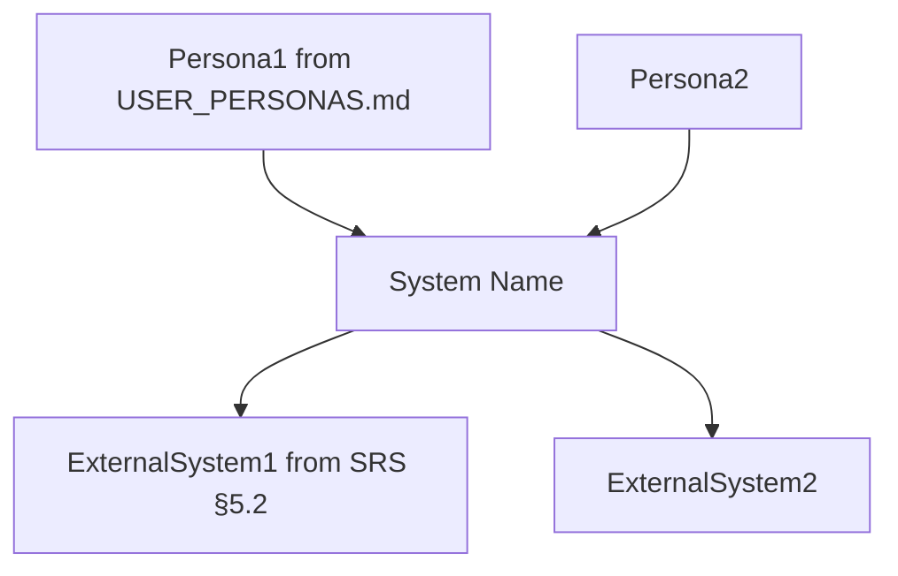
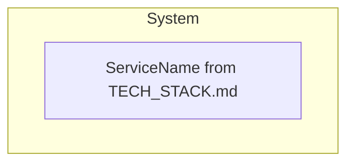
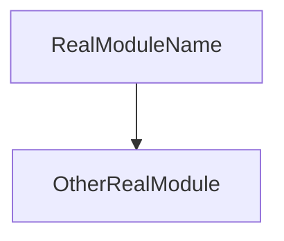
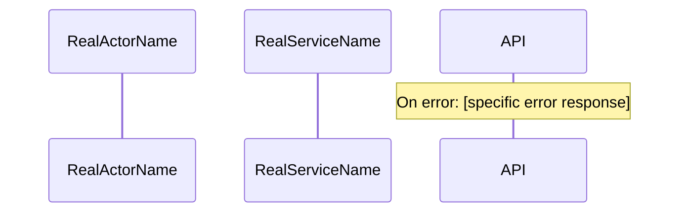

<!--
  Provenance: bpm-opencode-experts
  Source path: agents/templates/ARCHITECTURE_template.md
  Import date: 2026-07-12 (gap-fill)
  DO NOT EDIT — imported content
-->

---
description: 'Reference document — read on demand, not an agent.'
disable: true
mode: "all"
---

<!--
ARCHITECTURE.md template — used by SDLC Lead Mode 1 Phase 3.
Copy this content into docs/ARCHITECTURE.md and fill in project-specific details.
Referenced from: agents/sdlc-init-phases-3-4.md (Phase 3).
-->

# Software Architecture Document — [Project Name]

## 0. HLA Overview
[Write LAST — after all diagrams pass. See Per-Diagram Confidence Loop above.]
[3 paragraphs: system partition metaphor | key architectural decisions | what to read first]

## 1. Architecture Goals & Constraints
- Quality attributes: [specific targets from SRS.md NFR section — e.g., "P95 < 200ms, 99.9% uptime"]
- Technology constraints: [from DESIGN_CONTEXT.md — e.g., "must run on AWS us-east-1, Node 22 LTS"]
- Team constraints: [from DESIGN_CONTEXT.md — e.g., "team of 3 engineers, TypeScript expertise"]

## 2. C4 Diagrams

### 2.1 System Context (C1)
<!-- Actors: all personas from USER_PERSONAS.md. External systems: all from SRS §5.2 -->
<!-- Score this diagram with the C1 confidence loop before writing § 2.2 -->


### 2.2 Container Diagram (C2)
<!-- All services/runtimes from TECH_STACK.md. Communication style on arrows. -->
<!-- Score with C2 confidence loop before writing § 2.3 -->


### 2.3 Component Diagrams (C3) — one subsection per major service
<!-- Real module names from the feature-sliced structure. Arrows show dependency direction. -->
<!-- Score each C3 separately before writing the next. -->

#### 2.3.1 [Service Name 1]


#### 2.3.2 [Service Name 2]
```mermaid
graph TB
    %% add more nodes here
```
<!-- Add one 2.3.x subsection per major service -->

### 2.4 Deployment Diagram
<!-- Reflect DESIGN_CONTEXT.md infrastructure choices. No invented infra. -->
<!-- Score with Deployment confidence loop before writing § 2.5 -->
```mermaid
graph TB
    %% add more nodes here
```

### 2.5 Data Flow Diagram
<!-- Trace user request all the way to persistence and back. Show transforms and masking. -->
<!-- Score with Data Flow confidence loop before writing § 3 -->
```mermaid
graph LR
    %% add more nodes here
```

### 2.6 Sequence Diagrams — one per P0 Use Case
<!-- Derive from USE_CASES.md. Each MUST have a happy path AND an error path. -->
<!-- Score each sequence diagram separately. -->

#### [UC-001 name from USE_CASES.md]

<!-- Add one sequence section per P0 use case -->

## 3. Logical View
- Major modules: [real module names from feature-sliced structure]
- Module dependencies: [who depends on whom — reference C3 diagrams above]
- Design patterns: [repository, service, factory — where each is used]
- Interface definitions: [list key interfaces and where they live in src/]

## 4. Process View
- Request flow: [specific path for the most common request — names all hops]
- Async flows: [queue names, event names, job names — if applicable]
- Concurrency model: [e.g., "Node.js single-threaded event loop + worker threads for CPU work"]
- Sequence diagrams: [reference the 2.6 subsections above]

## 5. Implementation View
- Directory structure: [actual planned feature-sliced layout]
- Module boundaries: [which modules are public API vs internal]
- Build system: [command, output location, key scripts]

## 6. Deployment View
- Infrastructure: [reference the deployment diagram in § 2.4]
- CI/CD: [pipeline file path, stages, deploy target]
- Environment configuration: [where .env lives, required vars, secrets management]

## 7. Architecture Decision Records
| ADR | Decision | Rationale | Alternatives Considered |
|-----|----------|-----------|------------------------|
| ADR-001 | [Real decision, e.g., Use PostgreSQL] | [Why — reference DESIGN_CONTEXT.md or research findings] | [Real alternatives evaluated] |

## 8. Cross-Cutting Concerns
- Logging strategy: [specific library + format + levels — not "use a logger"]
- Error handling: [pattern name + where defined — e.g., "Result<T,E> type in src/shared/result.ts"]
- Caching strategy: [what is cached, TTL, where invalidated]
- Security controls: [reference THREAT_MODEL.md mitigations — e.g., "JWT RS256, httpOnly cookies"]
