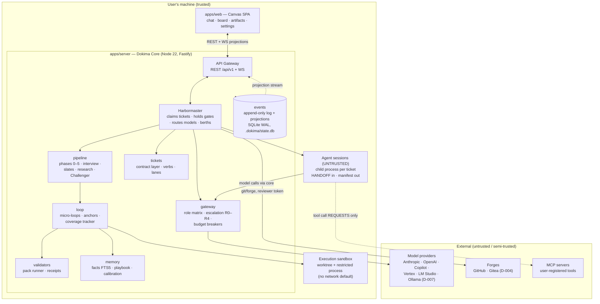
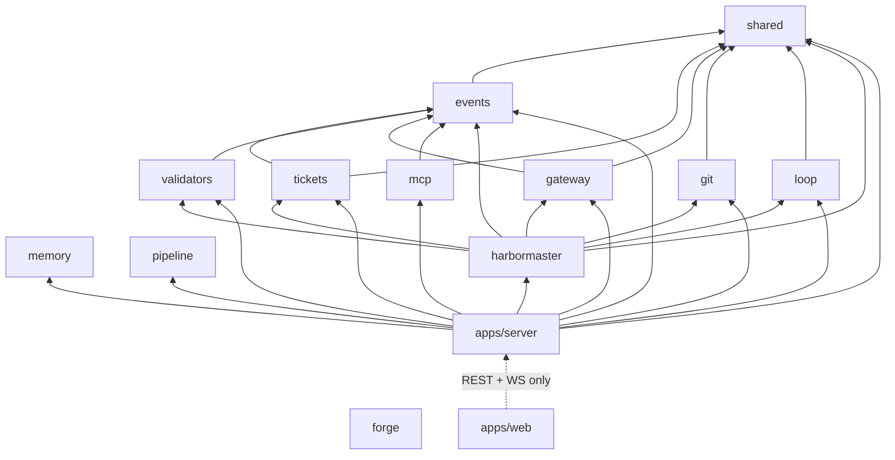

# Dokima — Architecture

Traces to: BLUEPRINT.md §2–3/§7, DECISIONS.md D-003 (local-first Node/Fastify/SQLite/React),
D-004 (native board + forge mirror), D-005 (identity model), D-008 (standalone runtime),
D-010 (berths), D-013 (multi-project Fleet). Versions: docs/TECH_STACK.md. This is the load-bearing doc: module
boundaries in §4 are lint-enforced (**enforcement ticket W3-10 — not yet active as of
2026-07-14**; until it lands, compliance is by review only), and the trust boundary in §2 is the product.

## 1. System context



- Everything runs on the user's machine; providers, forges, and MCP servers are
  integrations, not prerequisites (BLUEPRINT §1.4, D-003).
- The server binds localhost only; the SPA is served by the core (THREAT_MODEL TB-L).

## 2. The trust boundary (load-bearing)

**Agent sessions are untrusted.** An agent is a child process holding a HANDOFF contract;
it produces files, commits, and a Completion Manifest inside a scoped worktree. Everything
that changes durable state is performed by the **Harbormaster** from outside the session,
after independently re-running the gates (BLUEPRINT §2.2).

| Action | Agent session | Harbormaster (out-of-session) |
|---|---|---|
| Edit files | ✅ inside its write-scope worktree only | — |
| Model calls | ✅ via gateway (its role's models only) | routes + meters every call |
| Ticket verbs (claim/close/accept…) | ❌ never | ✅ sole caller of `tickets` mutations |
| Mint gate/close receipts | ❌ receipts require a real validator run | ✅ runs validators, mints receipts |
| Phase advancement | ❌ | ✅ after receipt re-verification |
| Forge writes (PR, mirror, merge) | ❌ no forge token in agent env | ✅ maker token; reviewer token isolated (SC-03) |
| MCP tool execution | request only | ✅ executes under permission matrix |
| Waivers / NEVER-AUTO actions | ❌ agent identities blocklisted | ❌ human only (SC-05, SC-10) |

Consequences, mechanically enforced:
1. An agent cannot flip its ticket to `done`; `close` is refused unless the manifest is
   truth-checked (files stat'd, `verify` re-run exit 0, commits present) — SC-02.
2. Completion is never a string an agent can type: no promise-token greps anywhere; the
   signal is the existence of a receipt row (SC-04).
3. `accept` requires reviewer identity ≠ owner identity; with the forge mirror on, maker
   and reviewer use different scoped tokens (D-004) — maker≠verifier is credentials, not prose.

## 3. Event-sourced core

All durable state changes flow through an append-only event log (SQLite WAL, single
writer — the core process; DATABASE.md §1, constraint C6). Board, chat, phase status,
spend, notifications are **projections** streamed to the UI over WS. One decision, three
long-tail wins (BLUEPRINT §7): board-state sync during multi-hour loops, idempotent
crash resume, tamper-evident audit.

**Event envelope:** `seq, event_type, actor_id, project_id, ticket_id?, payload JSON,
created_at, prev_hash, hash` — `hash = sha256(prev_hash‖seq‖type‖actor‖payload)` forms a
per-project hash chain; `dokima audit verify` walks it (SC-11).

**Event types** (representative, from BLUEPRINT §2.3): `ticket.created / claimed / closed /
accepted / released / commented`, `gate.receipt_minted`, `gate.waived`,
`loop.pass_completed`, `loop.heartbeat`, `loop.escalated`, `model.call_completed`
(tokens + cost), `approval.requested / decided`, `clarification.asked / answered /
dismissed`, `decision.slated / decided`, `artifact.written`, `git.commit`,
`git.pr_opened`, `budget.threshold_crossed`, `conflict.detected`, `human.file_edited`,
`settings.changed` (configuration is audited, not just execution — FR-S3),
`playbook.promoted` (FR-F5).

**Projections** (DATABASE.md §3): `tickets` (contract + live status), `board` (claimable
set, lanes, stale-blocked flags — recomputed on every event), `budget_ledger`/`spend`,
`notifications` (Decide/Review/Record tiers), `runs`. Projections are rebuildable from
the log; a rebuild command exists and is the recovery of last resort.

## 4. Module map (pnpm monorepo) and dependency law

| Module | Lives in | Responsibility | Blueprint |
|---|---|---|---|
| shared | packages/shared | zod contracts, config, logger, typed errors, id/hash utils | (all) |
| events | packages/events | event log, hash chain, projections, receipts primitive, migrations | §2.3 |
| tickets | packages/tickets | ticket contract schema, six lifecycle verbs, lane/write-scope invariants, reflow | §3.4 |
| loop | packages/loop | micro-loop engine, anchors (tool/memory/challenger/adaptive), coverage tracker, calibration | §3.5 |
| validators | packages/validators | validator-pack runner (exit 0/1 + JSON gaps), receipt minting inputs | §3.2 |
| gateway | packages/gateway | provider adapters (Anthropic/OpenAI/Copilot/Vertex/LM Studio/Ollama/OpenAI-compat), role matrix, escalation ladder R0–R4, budget breakers, spend metering, warm-up/queueing | §3.3, D-007 |
| agent-session | packages/harbormaster (`src/agent-session/**`) | **the tool-using ticket session (D-023)**: renders the HANDOFF, sends it with a tool schema through `gateway`, executes returned tool calls against the ticket worktree under `write_scope`, commits on the ticket branch, and iterates to a Completion Manifest. Lives in harbormaster because it already declares BOTH `@dokima/gateway` and `@dokima/loop` and already owns the claim loop that consumes a `SpawnSession`. Tool allowlisting, approval and audit reuse `packages/mcp` (W6-04) rather than a parallel mechanism — that import is now **declared and permitted** (founder decision 2026-08-05): `@dokima/mcp` is in `harbormaster`'s `package.json` and carries its ✅ in the §4 matrix below, made as one change so `scripts/validate-plan.mjs` P10 stays green. It is a safe edge, not merely a convenient one: `@dokima/mcp` itself declares only `@dokima/events`, which `harbormaster` already had, so the graph gains no cycle and no new leaf. W11-02 therefore consumes an existing dependency rather than amending the architecture mid-ticket | §3.6, D-023 |
| harbormaster | packages/harbormaster | out-of-session orchestrator: claim loop, gate re-execution, berths, breakpoints, watchdog, morning queue, resume | §3.6 |
| pipeline | packages/pipeline | phase state machine 0–5, discovery interview, decision slates + Blueprint stage, research path, Challenger, task decomposer | §3.2, §4 |
| git | packages/git | worktrees, ticket branches, explicit-path staging, diff-based scope check, landing | §3.9 |
| forge | packages/forge | GitHub/Gitea adapters: issue mirror, PR lifecycle, branch protection, identity/token mgmt | §3.4, §3.9, D-004 |
| mcp | packages/mcp | MCP client host, per-role tool allowlists, requiresApproval, audited tool-call events | §3.9 |
| memory | packages/memory | working + long-term memory, FTS5/BM25 (+ optional embeddings), ACE playbook, consolidation, error-first recall | §3.8 |
| apps/server | apps/server | Fastify core: REST + WS, auth middleware (D-005), wires all packages, agent session spawner | §2.1 |
| apps/web | apps/web | React/Vite Canvas: three-pane UI over projections | §3.1 |
| content/ | content/ | imported expert definitions + validator packs (markdown/scripts, provenance headers, signed — D-006/D-008) | §11.2/.4 |

### Declared-dependency matrix (row imports column; blank = not currently declared)

A cell records what a package **currently declares** in its `package.json`
`dependencies` — not a lifetime ceiling nobody is using yet. What's
permanently *forbidden* regardless of what's declared is Laws 1–6 below
(ESLint-enforced from W3-10); this table is the narrower, live "who imports
whom today" fact, and `scripts/validate-plan.mjs` (P10) parses it and fails
if any row disagrees with that package's declared `@dokima/*` dependencies,
in either direction (W11-05). Growing into a new import means declaring it
in `package.json` **and** adding the ✅ here in the same change.

| imports → | shared | events | tickets | validators | gateway | memory | git | forge | mcp | loop | pipeline |
|---|---|---|---|---|---|---|---|---|---|---|---|
| **events** | ✅ | | | | | | | | | | |
| **tickets** | ✅ | ✅ | | | | | | | | | |
| **validators** | | ✅ | | | | | | | | | |
| **gateway** | ✅ | ✅ | | | | | | | | | |
| **memory** | | | | | | | | | | | |
| **git** | ✅ | | | | | | | | | | |
| **forge** | | | | | | | | | | | |
| **mcp** | | ✅ | | | | | | | | | |
| **loop** | ✅ | | | | | | | | | | |
| **pipeline** | | | | | | | | | | | |
| **harbormaster** | ✅ | ✅ | ✅ | ✅ | ✅ | | ✅ | | ✅ | ✅ | |
| **apps/server** | ✅ | ✅ | ✅ | ✅ | ✅ | ✅ | ✅ | ✅ | ✅ | ✅ | ✅ (+harbormaster) |
| **apps/web** | | | | | | | | | | | |

`memory`, `forge` and `pipeline` each ship real, tested code (BLUEPRINT
§3.5/§3.2/§3.9) but declare **no** `@dokima/*` dependency today — they are
self-contained, not unbuilt; none of their current responsibilities happens
to need calling another package in this graph yet. Row-narrowing here
records that fact, not a demotion of what those packages do. `apps/web`
declares no `@dokima/*` dependency either, not even for types (hand-mirrored
instead, per file-level comments across `apps/web/src/**`, e.g.
`board/types.ts`, `settings/providers-api.ts`) — it talks to the core
exclusively over REST/WS (§1 diagram).

Laws (each gets a lint rule or validator — W3-10 wires them; review-enforced until then):
1. **No package ever imports `apps/*`.** Domain logic is UI/transport-agnostic.
2. **All model calls go through `gateway`.** `loop`, `tickets`, `pipeline` never import a
   provider SDK or open a socket to a model endpoint — the escalation ladder, budget
   breakers, and spend ledger only work if there is exactly one egress point.
3. **All ticket mutations go through `tickets` verbs**, and only `harbormaster` (and the
   API layer acting for a human, which calls the same verbs) may invoke mutating verbs.
4. **Only `events` touches the database write path.** Every other package appends events
   and reads projections through its API — single-writer is a code property, not a hope.
5. **Only `harbormaster` imports `forge` write paths**; the reviewer token never leaves it (SC-03).
6. **`content/` is data, not code**: loaded at runtime, signature-verified (D-006), never imported.



## 5. Berths — the concurrency model (D-010)

The project has a concurrency dial, **berths 1–N**. Each berth is an independent worker
identity (machine identity row, DATABASE.md §2) running the Harbormaster claim loop:

- **One berth per lane.** The Ticket Engine guarantees same-lane active tickets have
  disjoint write-scopes and cross-lane overlap is a schema error (BLUEPRINT §3.4) — so
  N berths on N lanes are provably collision-free. Berths=1 is strict sequential.
- **Per-berth isolation:** each berth gets its own git worktree per ticket
  (`sw/<ticket-id>-<slug>` branches) and its own actor identity in every event it causes.
- **Serialized landing:** PR/merge goes through the review queue one at a time regardless
  of N; merges to main are NEVER-AUTO (morning queue).
- **Shared governors:** budget breakers aggregate across berths (100% halts every berth at
  its next ticket boundary); gateway capacity caps effective parallelism — one-at-a-time
  local endpoints queue transparently rather than thrash.
- **Autorun** = breakpoint `never` × berths N: one toggle + one slider.

WIP=1 per actor holds per berth; the claim step re-checks lane occupancy atomically
(single-writer event append is the serialization point — no distributed locking needed).

## 6. Fleet & process model (FR-F2/F3, D-013)

**One core process serves N registered projects** (BLUEPRINT §3.11):

- **Per-project isolation (FR-F2):** each project owns its event log + projections
  (`.dokima/state.db` beside the repo) and its **own Harbormaster instance**; memory
  facts, calibration, receipts, and budgets are per-project. State travels with the repo
  directory — archiving a project is closing a folder. Nothing cross-contaminates.
- **Shared global services (FR-F3):** the Model Gateway is one process-wide pool —
  per-endpoint request queues with **fair cross-project scheduling** (three autorunning
  projects cannot thrash a single LM Studio host) — and a **global concurrency governor**
  caps total berths across all projects; the per-project berth dial (§5) allocates within
  that cap. Credential store and provider registry are global (register Copilot once,
  use it everywhere — DATABASE.md §7).
- **One inbox (FR-F4):** the notification center and morning queue aggregate across all
  projects, sorted by leverage, filterable per project — a night of three autorunning
  programs is still one ten-minute review.
- **Two-level playbook (FR-F5):** entries are per-project by default; a project-agnostic
  lesson can be **promoted** to the global playbook with provenance (`playbook.promoted`
  event), and global entries are consulted at R0 for every project. Promotion is explicit
  (human or reviewer-gated), never automatic.

## 7. Crash safety & resume

Crash-safe by construction (NFR-3), inherited pattern: **persist-before-execute**.

1. Every intent is an event *before* its effect: `ticket.claimed` lands before the agent
   session spawns; `approval.requested` before any pause; `model.call_completed` is
   written from the gateway response handler before results propagate.
2. **Orphan sweep on boot:** any ticket claimed-but-unclosed is re-verified from its
   receipts and disk state — resumed at the last checkpoint or returned to `ready`.
   No phase and no ticket is ever stuck `running` after a crash.
3. **Watchdog per session:** max wall-clock + heartbeat-stall detection → terminate,
   dead-letter event, ticket → `blocked-with-evidence`, visible within seconds (§7.1).
4. **Resume refuses on drift:** if event log, receipts, and disk disagree, the state-drift
   validator blocks resume and shows the human the discrepancy — never guesses.
5. **Human edits are events:** a file watcher on the human's checkout flags edits inside a
   leased scope → `conflict.detected` → checkpoint, rebase, re-ground; the human always
   wins (BLUEPRINT §7.3).

## 8. Failure modes

| Failure | Detection | Behavior | User-visible |
|---|---|---|---|
| Core crash mid-loop | boot orphan sweep | re-verify from receipts; resume or `ready` | activity feed note |
| Agent session hang | watchdog heartbeat stall | kill, dead-letter, `blocked-with-evidence` | card flips within seconds |
| Local model cold/one-at-a-time | gateway warm-up ping / queue depth | queue + warm-up retry; never parallel-thrash | model chip shows "queued" |
| Gate fails after ladder R1–R3 | failure receipts | ticket parked R4 blocked-with-evidence | Decide card only when idle-blocked |
| Budget 70/85/100% | ledger thresholds | warn / downshift / hard stop at ticket boundary | spend meter + Decide card at 100% |
| Forge unreachable | adapter error | verbs queue in ticket history[], flush on reconnect | mirror status chip |
| Human edits leased file | file watcher | checkpoint → rebase → re-ground; park on material conflict | Decide card: take mine / agent's / merge |
| Event log tamper | hash chain break | `audit verify` fails, names first bad seq | audit error, refuse silent repair |
| Review output truncated/unparseable | manifest/verdict parse failure | infra event: free retry of the review; zero finding-ledger writes, zero attempts charged (FR-L6) | Record-tier note on the card |
| Provider limit window | 429/529/quota classify (FR-G8) | park affected berths, `limit.pause` event, auto-resume at reset/backoff | Record tier; model chip "paused until HH:MM" |
| Oversized session output/diff (ENOBUFS class) | bounded buffers on session/git pipes | truncate-with-marker + summarize; never a process crash; oversized tool results spill to disk (FR-L8) | card note "output summarized (N MB)" |
| Reviewer bookkeeping vs verdict divergence | fresh APPROVE with stale sticky findings | fresh explicit verdict wins; block only on freshly-raised or explicitly STILL-PRESENT findings (field report §5) | history shows the superseded findings |
| Resume state drift | event log vs receipts vs disk disagree | resume REFUSES with a drift report; never guesses (FR-H3) | drift report card, human decides |

## 9. Controls on generated projects (W21-39)

Dokima's own board is guarded by the gates in §2. A **generated** project — the
thing a founder actually asked for — is guarded by much less, and the gap is
not in the content pack. `content/validators/` ships 83 validators imported
from attest; a generated project's close gate ran two of them.

The comparison, measured rather than asserted (every "Dokima" row was observed
on the vault project during W21):

| Control | attest | Dokima on a generated project | Gap |
| --- | --- | --- | --- |
| Write-scope containment | `run-handoff-gates.sh` gate 1, in-session | SC-01, **out of session** against the real worktree diff | none — Dokima is stronger, the agent cannot influence it |
| Manifest checked against disk | gate 2, in-session | close gate re-stats every claimed file (FR-H1) | none — stronger, same reason |
| Verify re-run | gate 5 (`--runtime`) | close gate re-runs it in a sandbox (SC-07) and never trusts the manifest's claim | none — stronger |
| Ticket acceptance criteria executed | n/a (HANDOFF-shaped) | W21-41: executable criteria are run; zero-test runs refuse; W21-50: a criterion that also passes at BASE certifies nothing | Dokima-only |
| Dependency ↔ designed stack | `validate-tech-stack.sh` | ships, and was **never required** until W21-38 | closed as a mechanism; see the skip note below |
| Supply-chain / CVE | `validate-deps.sh` | ships, never required | as above |
| Dead code, duplication, complexity | 6 code-health validators | ship, never required | as above |
| ANTI_SLOP R-01…R-31 | `ANTI_SLOP_RULES.md` + anti-slop auditor, dispatched | **ship in `content/protocols/` and `content/experts/` and nothing reads them** | open — no code path injects a protocol into a handoff or dispatches that auditor |
| Domain coverage / tracker freshness | gates 3 and 4 | not run | open, and likely correct to leave open — see below |

### Which of the 83 belong in a generated product's gate

Not all of them, and the reason is not cost. Most assume documents a generated
project may never produce, and **a gate that refuses for debt a ticket did not
create teaches people to bypass the gate** — which is worse than not running
it. The set is therefore per-project (`requiredValidators`, W21-38) rather
than a new default, and the default stays at two.

The candidates worth enabling for a typical generated product, with what each
actually did when run against the vault worktree:

- `validate-tech-stack` — **skipped**, see below. Enable only alongside a real
  `docs/TECH_STACK.md`.
- `validate-deps` — emitted **no JSON envelope at all** on a project with no
  lockfile-backed audit; needs investigating before it is required.
- `validate-file-size`, `validate-dead-code`, `validate-no-reinvent`,
  `validate-circular-deps` — all ran and reported clean on a 5-file project,
  so they are cheap and honest there; their value grows with the codebase.

### The skip that reports as a pass (open, upstream)

`validate-tech-stack.sh` on the vault worktree prints

```
! no docs/TECH_STACK.md found — skipping (Phase 3 may not have produced one)
[validate-tech-stack] clean -- 0 gaps
```

and exits **0**. `_lib.sh`'s `warn` writes to stderr only, and the JSON
envelope carries `gaps`/`exit` and nothing else, so a skip is **structurally
identical to a pass**. Requiring that validator today would enforce nothing
while reporting success — the exact failure shape W21-40, W21-44 and W21-58
each found elsewhere.

This cannot be fixed here: `content/` is imported, provenance-headed and never
hand-restyled (CLAUDE.md), so the envelope has to gain a `skipped` field
**upstream in attest**. Until it does, requiring a document-dependent
validator is worse than not requiring it, and that is why W21-38 shipped the
mechanism and left the policy to the founder.

The deeper cause is one layer further back: the vault project has no `docs/`
on disk at all. The pipeline recorded blueprint, technical-slate and
ticket-decomposition phases in the event log and none of it materialised as
files — and the phase-0 gate said so ("declared deliverable(s) not found on
disk") while the build proceeded anyway.

## 10. Model size and agentic tool use are different axes (W21-66)

The escalation ladder (D-018) is cheapest-first, which encodes an assumption:
that a **higher rung is better**. For raw reasoning that holds. For *acting on
a repository* it does not, and the product had no way to say so.

**Three controlled tests**, identical mid-session fixture — same tools, same
conversation, the failure and the file contents already supplied:

| Condition | `qwen/qwen3-coder-next` | `qwen/qwen3.8-27b` |
|---|---|---|
| Free choice | `edit` — 529 tokens, 12s | `list, list` — 93 tokens, 14s, holding the file already |
| Directive prompt ("ACT, do not explore; never `list` or `read` a file you have been shown") | — | `list, list` again — 43s, 960 tokens |
| Forced (`read`/`list` removed, `tool_choice=required`) | — | `write` to the correct path with EMPTY CONTENT — a destructive no-op |

So it is not a prompting problem and not a timeout problem: the model is
exploration-biased, and compelling it to act produces degenerate output.

**Confirmed against real ledgers** on 2026-08-29, across three projects on one
machine (per-model mutation rate — tool calls that changed the worktree, over
all tool calls):

| Project | Model | Calls | Mutations | Rate |
|---|---|---|---|---|
| vault | `qwen/qwen3-coder-next` | 1011 | 341 | 33.7% |
| vault | `qwen3.6-35b-a3b` | 590 | 169 | 28.6% |
| vault | `qwen/qwen3.8-27b` | 106 | **0** | **0.0%** |
| tally | `qwen/qwen3-coder-next` | 398 | 107 | 26.9% |
| tally | `qwen/qwen3.8-27b` | 81 | 11 | 13.6% |

The vault row reproduces the controlled finding on work that actually ran:
`read x66, list x40` and nothing else.

**The tally row is why this is measured per project and never written down as
a list of model names.** The same model that changed nothing in one project
mutated on 13.6% of its calls in another. "Cannot do agentic work" is not a
property of a model; it is what a model did on a particular body of work.

**What the product does with it.** `modelToolProfiles`
(`packages/harbormaster/src/loop-land-policy.ts`) derives the rate from the
project's own ledger — `spend.recorded` names the model, and the tool calls
that follow it belong to that turn, because a turn completes before its
requested calls execute. A rung whose model has made at least
`AGENTIC_PROFILE_MIN_CALLS` calls here and mutated nothing is not escalated to,
with the reason commented on the ticket. **The last available rung is never
skipped** — W21-63 fixed the mirror image, a ladder that skipped to an
unreachable rung and parked with no session at all, and condemning every rung
would reintroduce it.


## 11. One execution engine, not two (W21-36)

**`runLandLoop` is the only engine. `runClaimLoop` was deleted 2026-08-30.**

F1 built two. `runClaimLoop` (W3-01a) claimed a ticket, gave it a worktree and
dispatched sessions; `runLandLoop` (W3-01c) did that and landed the result.
Both were real, both were tested, and `apps/*` only ever called the second —
for months. `loop-claim.ts`'s own docstring said so, and the package's
public-surface test asserted `runClaimLoop`'s reachability the whole time,
which is worth stating plainly: a public surface can be a contract and still be
a contract with nobody.

**Why delete rather than keep with a marker.** Documented-dead code is worse
than either live code or absent code. It passes every mechanical check a live
path passes — it compiles, its tests are green, it is exported and importable —
and nothing distinguishes it from a live path except a comment somebody has to
happen to read. That is not a hypothetical cost here. W21-12 put worktree
provisioning into `runClaimLoop`, the full gate went green because its tests
exercised it, and a live run then proved the code had never executed. The
docstring was already there; it was not read, because nothing required reading
it.

**What moved across, and what never had to.** The deletion was conditional on
`runLandLoop` covering both capabilities `runClaimLoop` uniquely carried, and
it already did:

- **The abandoned-claim sweep** (W13-12) — `findAbandonedTickets` and
  `STALE_CLAIM_MS` stay in `loop-claim.ts`; `loop-land-reclaim.ts` imports them
  and `loop-land.ts` calls `reclaimAbandoned` at every idle turn.
- **The WIP=1 protocol** — `pickNextTicket` lives in `loop-land-board.ts` and
  `loop-land.ts` calls it; WIP=1 itself is enforced by `@dokima/tickets`'
  `claimTicket`, not by either loop.

So `loop-claim.ts` survives its own headline function. Deleting the file would
have deleted the sweep the deletion was conditional on.

**`runWatchdogSession` went in the same pass**, on its own evidence rather than
by analogy: its only callers were its own tests, and both live watchdog paths
compose the pieces directly without it — the built-in agent checks
cooperatively at a turn boundary (`session-limits.ts`, W13-44) and the external
CLI wraps `createWatchdogChildProcessSpawn` itself (`run-build-spawn.ts`,
W13-47). The real spawner keeps its live caller and is untouched.

**The guard against recurrence is a ratchet, and its limits are worth naming.**
`validate-exports`' `--max` dropped 47 → 46 with the deletion, so the next
export left with no non-test caller now exceeds the baseline and fails the
gate. It counts; it cannot tell an orchestration entry point from any other
symbol. And it is not transitive: deleting `runWatchdogSession` immediately
revealed `deadLetterAndBlock`, whose only non-test caller *was*
`runWatchdogSession` — dead code propping up dead code, reported as reached the
entire time. Filed as W22-20.

### 11a. A breach is an outcome, not a verdict (W22-20)

`deadLetterAndBlock` was deleted 2026-08-30, one commit after `runClaimLoop`,
and for a reason beyond being dead: it was a **second answer to a question the
product already answers**.

It minted a `session.dead_letter` event, commented evidence, and *stole the
claim back* — deciding a ticket's fate at the moment a watchdog fired. Both
live paths do the opposite: the external CLI forces a non-zero exit through
`onBreach` (`run-build-spawn.ts`) and the built-in agent returns a
`SpawnSessionOutput` from `watchdogStop` (`session-limits.ts`). A breach
becomes an ordinary attempt outcome, and the **ladder** decides whether to
retry, park or release — which is the design W21-33's ownership guard was built
around. Keeping both would have left two mechanisms racing to release the same
ticket.

**Its only caller was `runWatchdogSession`, itself deleted the same day.** Dead
code propping up dead code: both ratchets reported it as *reached* the entire
time, because "has a caller" was true — the caller was simply also dead.

**This pair answers a question worth recording: the ratchet is not transitive,
and it is not worth making so.** W22-20 was filed asking whether
`validate-exports` should compute reachability from live entry points rather
than counting callers. Measured instead of assumed (L-56): deleting
`deadLetterAndBlock` revealed **no** replacement, so the chain was exactly one
link deep and a transitive analysis would have reclassified exactly one symbol.
The honest summary is that the ratchet works and reveals a chain one link per
deletion — slower than a real reachability pass, and enough.
