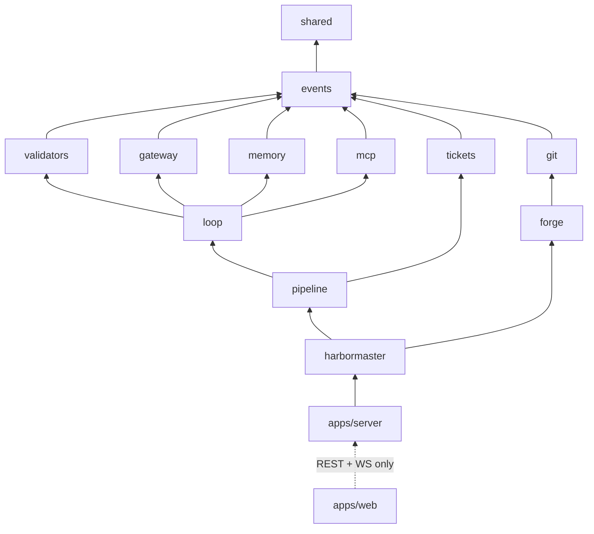

# Shipwright — Architecture

Traces to: BLUEPRINT.md §2–3/§7, DECISIONS.md D-003 (local-first Node/Fastify/SQLite/React),
D-004 (native board + forge mirror), D-005 (identity model), D-008 (standalone runtime),
D-010 (berths), D-013 (multi-project Fleet). Versions: docs/TECH_STACK.md. This is the load-bearing doc: module
boundaries in §4 are lint-enforced (**enforcement ticket W3-10 — not yet active as of
2026-07-14**; until it lands, compliance is by review only), and the trust boundary in §2 is the product.

## 1. System context

- Everything runs on the user's machine; providers, forges, and MCP servers are
  integrations, not prerequisites (BLUEPRINT §1.4, D-003).
- The server binds localhost only; the SPA is served by the core (THREAT_MODEL TB-L).

## 2. The trust boundary (load-bearing)

**Agent sessions are untrusted.** An agent is a child process holding a HANDOFF contract;
it produces files, commits, and a Completion Manifest inside a scoped worktree. Everything
that changes durable state is performed by the **Harbormaster** from outside the session,
after independently re-running the gates (BLUEPRINT §2.2).

| Action | Agent session | Harbormaster (out-of-session) |
|---|---|---|
| Edit files | ✅ inside its write-scope worktree only | — |
| Model calls | ✅ via gateway (its role's models only) | routes + meters every call |
| Ticket verbs (claim/close/accept…) | ❌ never | ✅ sole caller of `tickets` mutations |
| Mint gate/close receipts | ❌ receipts require a real validator run | ✅ runs validators, mints receipts |
| Phase advancement | ❌ | ✅ after receipt re-verification |
| Forge writes (PR, mirror, merge) | ❌ no forge token in agent env | ✅ maker token; reviewer token isolated (SC-03) |
| MCP tool execution | request only | ✅ executes under permission matrix |
| Waivers / NEVER-AUTO actions | ❌ agent identities blocklisted | ❌ human only (SC-05, SC-10) |

Consequences, mechanically enforced:
1. An agent cannot flip its ticket to `done`; `close` is refused unless the manifest is
   truth-checked (files stat'd, `verify` re-run exit 0, commits present) — SC-02.
2. Completion is never a string an agent can type: no promise-token greps anywhere; the
   signal is the existence of a receipt row (SC-04).
3. `accept` requires reviewer identity ≠ owner identity; with the forge mirror on, maker
   and reviewer use different scoped tokens (D-004) — maker≠verifier is credentials, not prose.

## 3. Event-sourced core

All durable state changes flow through an append-only event log (SQLite WAL, single
writer — the core process; DATABASE.md §1, constraint C6). Board, chat, phase status,
spend, notifications are **projections** streamed to the UI over WS. One decision, three
long-tail wins (BLUEPRINT §7): board-state sync during multi-hour loops, idempotent
crash resume, tamper-evident audit.

**Event envelope:** `seq, event_type, actor_id, project_id, ticket_id?, payload JSON,
created_at, prev_hash, hash` — `hash = sha256(prev_hash‖seq‖type‖actor‖payload)` forms a
per-project hash chain; `shipwright audit verify` walks it (SC-11).

**Event types** (representative, from BLUEPRINT §2.3): `ticket.created / claimed / closed /
accepted / released / commented`, `gate.receipt_minted`, `gate.waived`,
`loop.pass_completed`, `loop.heartbeat`, `loop.escalated`, `model.call_completed`
(tokens + cost), `approval.requested / decided`, `clarification.asked / answered /
dismissed`, `decision.slated / decided`, `artifact.written`, `git.commit`,
`git.pr_opened`, `budget.threshold_crossed`, `conflict.detected`, `human.file_edited`,
`settings.changed` (configuration is audited, not just execution — FR-S3),
`playbook.promoted` (FR-F5).

**Projections** (DATABASE.md §3): `tickets` (contract + live status), `board` (claimable
set, lanes, stale-blocked flags — recomputed on every event), `budget_ledger`/`spend`,
`notifications` (Decide/Review/Record tiers), `runs`. Projections are rebuildable from
the log; a rebuild command exists and is the recovery of last resort.

## 4. Module map (pnpm monorepo) and dependency law

| Module | Lives in | Responsibility | Blueprint |
|---|---|---|---|
| shared | packages/shared | zod contracts, config, logger, typed errors, id/hash utils | (all) |
| events | packages/events | event log, hash chain, projections, receipts primitive, migrations | §2.3 |
| tickets | packages/tickets | ticket contract schema, six lifecycle verbs, lane/write-scope invariants, reflow | §3.4 |
| loop | packages/loop | micro-loop engine, anchors (tool/memory/challenger/adaptive), coverage tracker, calibration | §3.5 |
| validators | packages/validators | validator-pack runner (exit 0/1 + JSON gaps), receipt minting inputs | §3.2 |
| gateway | packages/gateway | provider adapters (Anthropic/OpenAI/Copilot/Vertex/LM Studio/Ollama/OpenAI-compat), role matrix, escalation ladder R0–R4, budget breakers, spend metering, warm-up/queueing | §3.3, D-007 |
| harbormaster | packages/harbormaster | out-of-session orchestrator: claim loop, gate re-execution, berths, breakpoints, watchdog, morning queue, resume | §3.6 |
| pipeline | packages/pipeline | phase state machine 0–5, discovery interview, decision slates + Blueprint stage, research path, Challenger, task decomposer | §3.2, §4 |
| git | packages/git | worktrees, ticket branches, explicit-path staging, diff-based scope check, landing | §3.9 |
| forge | packages/forge | GitHub/Gitea adapters: issue mirror, PR lifecycle, branch protection, identity/token mgmt | §3.4, §3.9, D-004 |
| mcp | packages/mcp | MCP client host, per-role tool allowlists, requiresApproval, audited tool-call events | §3.9 |
| memory | packages/memory | working + long-term memory, FTS5/BM25 (+ optional embeddings), ACE playbook, consolidation, error-first recall | §3.8 |
| apps/server | apps/server | Fastify core: REST + WS, auth middleware (D-005), wires all packages, agent session spawner | §2.1 |
| apps/web | apps/web | React/Vite Canvas: three-pane UI over projections | §3.1 |
| content/ | content/ | imported expert definitions + validator packs (markdown/scripts, provenance headers, signed — D-006/D-008) | §11.2/.4 |

### Allowed-dependency matrix (row imports column; blank = forbidden; ESLint-enforced from W3-10)

| imports → | shared | events | tickets | validators | gateway | memory | git | forge | mcp | loop | pipeline |
|---|---|---|---|---|---|---|---|---|---|---|---|
| **events** | ✅ | | | | | | | | | | |
| **tickets** | ✅ | ✅ | | | | | | | | | |
| **validators** | ✅ | ✅ | | | | | | | | | |
| **gateway** | ✅ | ✅ | | | | | | | | | |
| **memory** | ✅ | ✅ | | | | | | | | | |
| **git** | ✅ | ✅ | | | | | | | | | |
| **forge** | ✅ | ✅ | | | | | ✅ | | | | |
| **mcp** | ✅ | ✅ | | | | | | | | | |
| **loop** | ✅ | ✅ | | ✅ | ✅ | ✅ | | | ✅ | | |
| **pipeline** | ✅ | ✅ | ✅ | ✅ | ✅ | ✅ | | | | ✅ | |
| **harbormaster** | ✅ | ✅ | ✅ | ✅ | ✅ | ✅ | ✅ | ✅ | ✅ | ✅ | ✅ |
| **apps/server** | ✅ | ✅ | ✅ | ✅ | ✅ | ✅ | ✅ | ✅ | ✅ | ✅ | ✅ (+harbormaster) |
| **apps/web** | (types only) | | | | | | | | | | |

Laws (each gets a lint rule or validator — W3-10 wires them; review-enforced until then):
1. **No package ever imports `apps/*`.** Domain logic is UI/transport-agnostic.
2. **All model calls go through `gateway`.** `loop`, `tickets`, `pipeline` never import a
   provider SDK or open a socket to a model endpoint — the escalation ladder, budget
   breakers, and spend ledger only work if there is exactly one egress point.
3. **All ticket mutations go through `tickets` verbs**, and only `harbormaster` (and the
   API layer acting for a human, which calls the same verbs) may invoke mutating verbs.
4. **Only `events` touches the database write path.** Every other package appends events
   and reads projections through its API — single-writer is a code property, not a hope.
5. **Only `harbormaster` imports `forge` write paths**; the reviewer token never leaves it (SC-03).
6. **`content/` is data, not code**: loaded at runtime, signature-verified (D-006), never imported.

## 5. Berths — the concurrency model (D-010)

The project has a concurrency dial, **berths 1–N**. Each berth is an independent worker
identity (machine identity row, DATABASE.md §2) running the Harbormaster claim loop:

- **One berth per lane.** The Ticket Engine guarantees same-lane active tickets have
  disjoint write-scopes and cross-lane overlap is a schema error (BLUEPRINT §3.4) — so
  N berths on N lanes are provably collision-free. Berths=1 is strict sequential.
- **Per-berth isolation:** each berth gets its own git worktree per ticket
  (`sw/<ticket-id>-<slug>` branches) and its own actor identity in every event it causes.
- **Serialized landing:** PR/merge goes through the review queue one at a time regardless
  of N; merges to main are NEVER-AUTO (morning queue).
- **Shared governors:** budget breakers aggregate across berths (100% halts every berth at
  its next ticket boundary); gateway capacity caps effective parallelism — one-at-a-time
  local endpoints queue transparently rather than thrash.
- **Autorun** = breakpoint `never` × berths N: one toggle + one slider.

WIP=1 per actor holds per berth; the claim step re-checks lane occupancy atomically
(single-writer event append is the serialization point — no distributed locking needed).

## 6. Fleet & process model (FR-F2/F3, D-013)

**One core process serves N registered projects** (BLUEPRINT §3.11):

- **Per-project isolation (FR-F2):** each project owns its event log + projections
  (`.shipwright/state.db` beside the repo) and its **own Harbormaster instance**; memory
  facts, calibration, receipts, and budgets are per-project. State travels with the repo
  directory — archiving a project is closing a folder. Nothing cross-contaminates.
- **Shared global services (FR-F3):** the Model Gateway is one process-wide pool —
  per-endpoint request queues with **fair cross-project scheduling** (three autorunning
  projects cannot thrash a single LM Studio host) — and a **global concurrency governor**
  caps total berths across all projects; the per-project berth dial (§5) allocates within
  that cap. Credential store and provider registry are global (register Copilot once,
  use it everywhere — DATABASE.md §7).
- **One inbox (FR-F4):** the notification center and morning queue aggregate across all
  projects, sorted by leverage, filterable per project — a night of three autorunning
  programs is still one ten-minute review.
- **Two-level playbook (FR-F5):** entries are per-project by default; a project-agnostic
  lesson can be **promoted** to the global playbook with provenance (`playbook.promoted`
  event), and global entries are consulted at R0 for every project. Promotion is explicit
  (human or reviewer-gated), never automatic.

## 7. Crash safety & resume

Crash-safe by construction (NFR-3), inherited pattern: **persist-before-execute**.

1. Every intent is an event *before* its effect: `ticket.claimed` lands before the agent
   session spawns; `approval.requested` before any pause; `model.call_completed` is
   written from the gateway response handler before results propagate.
2. **Orphan sweep on boot:** any ticket claimed-but-unclosed is re-verified from its
   receipts and disk state — resumed at the last checkpoint or returned to `ready`.
   No phase and no ticket is ever stuck `running` after a crash.
3. **Watchdog per session:** max wall-clock + heartbeat-stall detection → terminate,
   dead-letter event, ticket → `blocked-with-evidence`, visible within seconds (§7.1).
4. **Resume refuses on drift:** if event log, receipts, and disk disagree, the state-drift
   validator blocks resume and shows the human the discrepancy — never guesses.
5. **Human edits are events:** a file watcher on the human's checkout flags edits inside a
   leased scope → `conflict.detected` → checkpoint, rebase, re-ground; the human always
   wins (BLUEPRINT §7.3).

## 8. Failure modes

| Failure | Detection | Behavior | User-visible |
|---|---|---|---|
| Core crash mid-loop | boot orphan sweep | re-verify from receipts; resume or `ready` | activity feed note |
| Agent session hang | watchdog heartbeat stall | kill, dead-letter, `blocked-with-evidence` | card flips within seconds |
| Local model cold/one-at-a-time | gateway warm-up ping / queue depth | queue + warm-up retry; never parallel-thrash | model chip shows "queued" |
| Gate fails after ladder R1–R3 | failure receipts | ticket parked R4 blocked-with-evidence | Decide card only when idle-blocked |
| Budget 70/85/100% | ledger thresholds | warn / downshift / hard stop at ticket boundary | spend meter + Decide card at 100% |
| Forge unreachable | adapter error | verbs queue in ticket history[], flush on reconnect | mirror status chip |
| Human edits leased file | file watcher | checkpoint → rebase → re-ground; park on material conflict | Decide card: take mine / agent's / merge |
| Event log tamper | hash chain break | `audit verify` fails, names first bad seq | audit error, refuse silent repair |
| Review output truncated/unparseable | manifest/verdict parse failure | infra event: free retry of the review; zero finding-ledger writes, zero attempts charged (FR-L6) | Record-tier note on the card |
| Provider limit window | 429/529/quota classify (FR-G8) | park affected berths, `limit.pause` event, auto-resume at reset/backoff | Record tier; model chip "paused until HH:MM" |
| Oversized session output/diff (ENOBUFS class) | bounded buffers on session/git pipes | truncate-with-marker + summarize; never a process crash; oversized tool results spill to disk (FR-L8) | card note "output summarized (N MB)" |
| Reviewer bookkeeping vs verdict divergence | fresh APPROVE with stale sticky findings | fresh explicit verdict wins; block only on freshly-raised or explicitly STILL-PRESENT findings (field report §5) | history shows the superseded findings |
| Resume state drift | event log vs receipts vs disk disagree | resume REFUSES with a drift report; never guesses (FR-H3) | drift report card, human decides |
