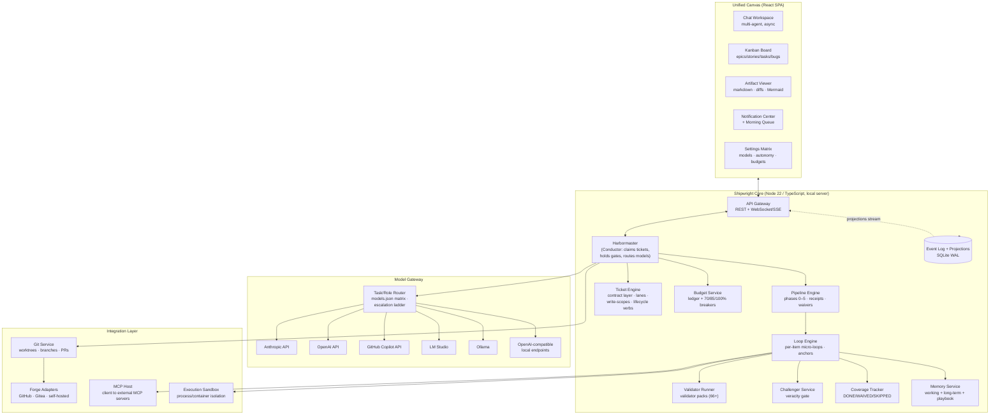
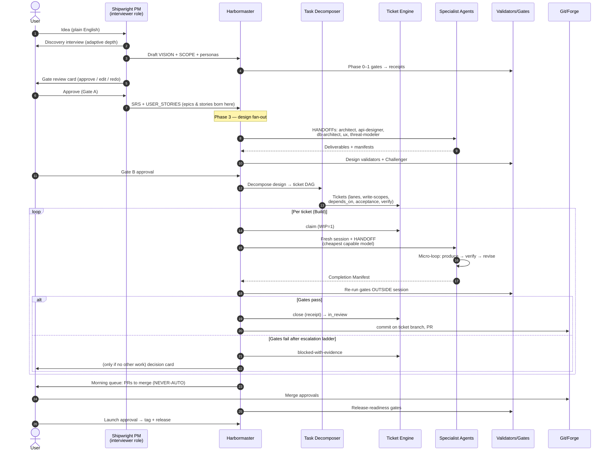

# Shipwright — SRS & System Architecture Blueprint

**Version:** 0.1.0-draft · **Date:** 2026-07-10 · **Status:** For review (Phase 0/3 hybrid founding document)
**Author:** Principal Architect session (Claude Fable 5) with Brad Matthews

> **Shipwright** is a local-first, human-in-the-loop developer platform where a person takes an idea to a secure, well-built, shipped product. It acts as their product manager and their agentic development team: a guided SDLC program with expert AI agents, gated pipelines, per-item micro-loops, cheapest-model-first execution with escalation, a native Kanban/ticket engine, and an evidence-based trust model in which **the platform holds the gates, not the agents**.

---

## 0. Provenance — what Shipwright productizes

Shipwright is the productization of three proven internal systems. Every mechanism in this blueprint traces to a design that has already run, failed, been fixed, and re-run in those systems. This is not a green-field fantasy; it is a packaging exercise over battle-tested operational logic.

| Source system | What it contributes | Shipwright subsystem |
|---|---|---|
| **bpm-opencode-experts** (expert system + SDLC pipeline: ~70 agents, 66 validators, phase gates, HANDOFF protocol, micro-loop contract, ticket schema, autonomy protocol) | The *discipline*: phase pipeline 0–5, receipt-based gates, Challenger veracity layer, coverage loops, maker≠verifier scoring, plan-as-contract tickets with lanes and write-scopes | **Pipeline Engine**, **Validator Packs**, **Ticket Engine**, **Expert Registry** |
| **bpm-agent-amplifier** (program repo: gap analysis, gate-integrity audit M27, Conductor design M28, Gitea-ledger research, advisor/rung-ladder M30, board-server) | The *integrity and economics*: receipts-not-flags, "conductor holds the gates", per-role model routing, escalation ladder, morning-review queue, forge-as-audit-ledger with per-identity credentials, memory-as-first-line-advisor | **Harbormaster (Conductor)**, **Trust & Receipts layer**, **Model Gateway routing policy**, **Forge Mirror** |
| **Jarvis / Foreman** (24/7 TS runtime: AutonomousSdlcRunner, per-item micro-loops with anchors, coverage tracker, localFrontier soft-gates, budget circuit breakers, approval queue, clarification API, two-tier memory) | The *runtime*: long-running server, per-item micro-loop engine with external anchors, honest coverage reporting (DONE/WAIVED/SKIPPED never silent), budget breakers 70/85/100%, suspension/resume, dashboard APIs | **Loop Engine**, **Coverage Tracker**, **Budget Service**, **HITL services**, **Memory Service** |

**Honesty invariants (the design spine, inherited verbatim):**

1. No gate passes on self-attestation — only real runs mint receipts; the graded entity never grades itself.
2. Skipped or waived work is always *visible*, never silent (`SKIPPED`/`WAIVED` are first-class statuses).
3. Verification buys correctness; memory buys economy and consistency — never confuse the two.
4. Cheap/local models are raised toward frontier quality **only on bounded tasks with a checkable oracle** (compile, tests, tool scans, schema checks). Judgment moments escalate.
5. Maker ≠ verifier, enforced mechanically (different agent identity, different model, different credential), not by prose.
6. Every human dead-end has an autonomous policy; the platform never parks silently.

---

## 1. Vision & product definition

### 1.1 The one-paragraph pitch

You describe a product idea in plain English. Shipwright interviews you like a good product manager, produces the vision, scope, requirements, and threat model with you in the loop, then decomposes the build into a dependency-ordered ticket board and executes it with a crew of expert AI agents — starting every task on the cheapest capable model and escalating only when a task provably fails its gates. You watch the board move in real time, answer the occasional crisp question, and review a small morning queue of decisions only a human may make (merges, releases, destructive operations). What comes out the other end is a secure, tested, documented product — with an audit trail proving every gate that passed actually ran.

### 1.2 Who it is for

| Persona | Need Shipwright serves |
|---|---|
| **Solo builder / indie hacker** | An idea and no team. Shipwright is the PM, architect, security reviewer, and dev crew. |
| **Professional dev** | Wants the discipline (gates, threat model, coverage) without the ceremony; wants agents doing the bulk work under supervision. |
| **Small team lead** | Replaces Jira + GitHub + scattered AI extensions with one cohesive surface; agents and humans share the same board. |
| **Local-LLM enthusiast** | Owns hardware; wants maximum work out of local models with frontier spend only where it matters — with receipts proving the cheap tier is honest. |

### 1.3 What it replaces

A traditional stack of Jira/Linear (tracking) + GitHub (code/PRs) + disparate AI chat extensions (unaccountable helpers) — three tools with no shared state, where "the AI said it's done" is unverifiable. Shipwright's answer: one canvas where the chat, the board, and the artifacts are projections of one event-sourced execution state, and "done" is a machine-checked receipt.

### 1.4 Product principles

- **Guided, not gated-by-jargon.** A newcomer follows a program (Idea → Plan → Design → Build → Launch); an expert drops to the escape hatches (single-phase runs, direct HANDOFFs, custom validators).
- **Local-first.** One install, runs on your machine, SQLite state, works offline against local models. Cloud APIs and forges are integrations, not prerequisites.
- **Evidence over vibes.** Receipts, coverage reports, challenge reports, spend ledgers — every claim the UI makes is backed by an artifact you can open.
- **Cheap-first economics.** Every role has a model assignment; the default ladder starts local/cheap and escalates per-ticket on proven failure, with the spend ledger showing exactly what escalation bought.
- **HITL that respects attention.** Interrupts are rare, batched, and decision-shaped (a question with options, a diff with a verdict) — never a firehose.

---

## 2. High-level architecture

### 2.1 System diagram



### 2.2 The trust boundary (load-bearing)

The single most important architectural decision, inherited from the M27/M28 work: **agent sessions are untrusted**. An agent produces work products (files, diffs, a Completion Manifest) inside a scoped workspace. Everything that changes durable state — ticket status, phase advancement, board columns, merge actions — is performed by the **Harbormaster** from *outside* the agent session, after independently re-running the gates. Concretely:

- An agent cannot flip its own ticket to `done`; it can only produce a manifest the Harbormaster verifies (files exist, verify command exits 0, commits present).
- An agent cannot mint a phase-gate pass; gates emit **receipts** (validator list, exit codes, gap counts, input-tree hash, timestamp) and only a real validator run writes one.
- Reviewer actions run under a *different internal identity* than maker actions; when the Forge Mirror is enabled, maker and reviewer use **different forge API tokens**, making maker≠verifier mechanical rather than aspirational.
- The completion signal is never a string an agent can type (no promise-token greps); it is the existence of a verifiable receipt.

### 2.3 Event-sourced core

All durable state changes flow through an append-only **event log** (SQLite, WAL mode). Board columns, chat threads, phase status, spend totals, and notification badges are **projections** of this log, streamed to the UI over WebSocket/SSE. This single decision solves three long-tail problems at once (see §7): board-state sync during multi-hour loops, idempotent resume after crashes, and a tamper-evident audit trail (each event carries actor identity + hash chain).

Representative event types: `ticket.claimed`, `ticket.closed`, `gate.receipt_minted`, `gate.waived`, `loop.pass_completed`, `loop.escalated`, `model.call_completed` (with token/cost), `approval.requested`, `approval.decided`, `clarification.asked`, `clarification.answered`, `artifact.written`, `git.commit`, `git.pr_opened`, `budget.threshold_crossed`, `conflict.detected`.

---

## 3. Component deep-dive

### 3.1 Unified Canvas (Interface)

A React SPA served by the local core. Three-pane split layout, every pane collapsible; layouts persist per project.

**3.1.1 Chat Workspace (left pane).**
- **Threads are per-concern, not one endless scroll**: a program thread (you ↔ Shipwright-as-PM), plus ephemeral agent threads that open when an agent needs you (clarification) and archive when resolved.
- Asynchronous by design: agents post structured messages (finding cards, question cards, manifest cards) that render as interactive components, not walls of text. You can answer a question hours later; the affected loop suspends and resumes exactly there (checkpoint/resume, §3.7).
- Every agent message carries provenance: agent name, model used, ticket ID, cost of the turn. Click-through to the underlying receipt/artifact.
- Slash-commands expose expert escape hatches (`/security --deep`, `/review`, `/perf`) that dispatch a specialist directly onto the current project without the full program.

**3.1.2 Kanban Board (center pane).**
- Native tracking engine (§3.4) rendered as: swimlanes = **lanes** (parallel-safe work streams derived from write-scope disjointness), columns = lifecycle states (`Ready / Claimed / In Progress / In Review / Blocked / Done`), cards = tickets typed as Epic / Story / Task / Bug.
- Cards move only via lifecycle verbs — whether a human drags a card or an agent closes a ticket, the same verb fires and the same invariants apply (WIP=1 per actor, dependency satisfaction, receipt-on-close). A human drag that violates an invariant is refused with the reason inline.
- Stale-blocked detection is always on: a card whose named blockers are all done gets a "STALE — claimable?" badge (ported from board-server).
- Board header: "claim right now" strip (smallest ready ticket per lane), spend meter for the day, and the active agents strip (who is working on what, with heartbeat freshness).
- The "Shipped today" ticker: commits landed since midnight, linked to their tickets.

**3.1.3 Artifact & Document Viewer (right pane).**
- Renders: markdown docs (the SDLC document tree), live code diffs (per ticket: the branch diff vs base, updating as the agent commits), and **Mermaid.js diagrams** (architecture C2/C3, sequence diagrams, state machines, the ticket dependency DAG) rendered client-side.
- Every phase deliverable (VISION, SCOPE, SRS, ARCHITECTURE, THREAT_MODEL…) is a first-class artifact with version history (each save is an event; diffs between versions render inline).
- Receipt inspector: open any gate receipt / coverage report / challenge report / approval ledger row as a structured view, not raw JSON.
- Docs live on disk in the project repo (`docs/…`) — the viewer is a window onto files git also sees, never a proprietary silo.

**3.1.4 Settings Matrix.**
- **Model-to-role matrix** (§3.3): rows = agent roles, columns = task types, cells = model choice with fallback chain. Presets ship in three profiles: *All-local*, *Hybrid (local + frontier review)*, *All-cloud*.
- **Autonomy dial** per project: `interactive` (every gated pause asks) / `auto` (documented defaults taken + ledgered) — with the NEVER-AUTO list always visible and non-editable below the dial (destructive DB ops, merges/releases/deploys, auth/crypto changes, scope-boundary breaks, new tech-stack additions, interviews).
- **Budget panel**: per-project and per-run token/dollar budgets with the 70/85/100% circuit-breaker thresholds, plus per-model spend history.

### 3.2 Pipeline Engine (the guided program)

The productized six-phase SDLC, run as a state machine per project:

| Phase | Name (UI) | Deliverables | Gate |
|---|---|---|---|
| 0 | **Idea** | VISION, COMPETITIVE_ANALYSIS | validators + human Gate |
| 1 | **Plan** | SCOPE, RISKS, CONSTRAINTS, USER_PERSONAS | validators |
| 2 | **Define** | SRS, USER_STORIES, USE_CASES, TEST_PLAN | validators + human **Gate A** |
| 3 | **Design** | MODULE_DESIGN, ARCHITECTURE, API_DESIGN + openapi.yaml, TECH_STACK, THREAT_MODEL, SECURITY_CONTROLS, INFRASTRUCTURE, UX_SPEC | validators + Challenger + human **Gate B** |
| 4 | **Build** | code, tests, per-module runtime reports — executed as the ticket board | per-ticket gates + wave gates |
| 5 | **Launch** | FIX_BACKLOG closed, release notes, tagged release | release-readiness validators + NEVER-AUTO human approval |

- Phases 0–2 are **interview-driven**: Shipwright-as-PM runs a discovery interview (adaptive question depth), drafts deliverables, and iterates with the user. These phases are deliberately human-paced — this is where "helps be a product manager" lives.
- **Gate mechanism**: each phase has a declared validator set. A clean run mints a **gate receipt** (`gates/<phase>-receipt.json`: validator names, exit codes, gap counts, input-file content hash). Advancing to phase N re-verifies phase N−1's receipt two ways — recompute the input hash (catches silently edited docs) and confirm every currently-required validator appears with exit 0 (catches gate-definition drift). The only bypass is an explicit **waiver receipt** signed by the human (name required; agent identities rejected).
- **Challenger gate** (veracity): after coverage passes, every HIGH/CRITICAL finding and every design claim marked *needs verification* gets an independent challenge pass producing a CHALLENGE_REPORT with per-claim verdicts (CONFIRMED / CONTRADICTED / UNVERIFIABLE — a challenge without a citation is discarded, never treated as a contradiction). CONTRADICTED → mandatory revision HANDOFF to the originating agent.
- **Two-track verification**: the default is the **coverage loop** (deterministic — is every inventory row covered?); subjective 1–10 confidence scoring exists but is *advisory only* — it can request polish or escalate to the human, never override a passing deterministic gate.
- **Modes**: `New Product` (full program), `Onboard` (map an existing codebase: landscape, entry points, components, health assessment), `Feature` (scoped mini-program over an onboarded repo), `Improve` (audit + fix backlog). All four ship at v1 in the UI as "What are we doing today?"

### 3.3 Model Gateway (LLM-agnostic)

**Providers.** First-class adapters: Anthropic, OpenAI, GitHub Copilot (cloud); LM Studio, Ollama, and any OpenAI-compatible endpoint (local). Provider layer handles: model discovery, warm-up pings (local models cold-start), request queueing per endpoint, context-length introspection, and normalized usage accounting (tokens in/out → cost via a per-model price table; local models cost $0 but tokens are still metered for budget/velocity stats).

**Task/role routing.** Two orthogonal axes, kept separate deliberately:
1. **Role matrix** (`models.json` equivalent, editable in Settings): each agent role maps to a model + fallback chain, e.g. `coding-agent → local-qwen-coder`, `code-reviewer → claude-opus`, `challenger → claude-opus`, `test-engineer → local-qwen`, `pm-interviewer → claude-sonnet`, `default → cheapest-capable`. Cross-model review is an **integrity feature**: the maker's model never reviews its own work.
2. **Task types** within a role's calls: `reasoning`, `code`, `verification`, `embed`, `escalation` — so a role can think on one model and embed on another.

**Escalation ladder (cheapest-first, the economic core).**
```
R0  Memory/playbook answer (free)         — "have we solved this before?"
R1  Cheapest capable model, micro-loop     — up to N revise passes with gap feedback
R2  Same ticket, one rung up               — automatic on gate failure after R1 exhausts
R3  Frontier model, single re-run          — the expensive attempt, logged as an escalation event
R4  Blocked-with-evidence                  — ticket parked with failure receipts; human decides
```
- Escalation is **per-ticket and evidence-triggered** (a failed gate with receipts), never vibes-triggered. Every escalation event lands in the spend ledger and the ticket history, so the weekly report can answer: *which tickets actually needed the frontier, and what did it cost?*
- R0 is the memory-as-first-line-advisor pattern: before any model call, the loop consults the playbook/fact store; a confirmed prior lesson can shrink the prompt or skip a step entirely.
- **Soft-gate policy for weak models** (localFrontier, productized): on document phases (0–3), if a cheap model can't fully satisfy a completeness gate within its iteration budget, remaining gaps may be **waived-and-recorded** (visible ⚠ in coverage) so momentum continues; on build/verify phases gates are **never** softened — code either compiles-and-passes-tests or the ticket escalates. Weak-model runs also get larger iteration budgets (tokens are cheap on owned hardware) and prescriptive gap prompts.

**Budget service.** Per-run and per-project budgets with circuit breakers at 70% (warn), 85% (downshift: stop optional passes, prefer cheaper rungs), 100% (hard stop at a ticket boundary + approval card). All model calls write to a cost ledger keyed by workflow/ticket, surfaced on cards and in the cost view.

### 3.4 Ticket Engine (native Kanban + forge mirror)

**Contract layer (source of truth).** Tickets live in the platform DB, schema ported from the proven plan-contract: a ticket has `id`, `type` (epic/story/task/bug), `title`, `lane`, `owner` (human or agent identity), `status`, `interface` (what it exposes to dependents), **`write_scope[]`** (exclusive glob territory), **`depends_on[]`** (DAG edges), **`acceptance[]`** (checkable criteria — the PRODUCE contract), `verify` (command/validator that must exit 0 to close), plus machine-managed `manifest`, `history[]`, `evidence`, `claimed_at`.

**Lifecycle (six verbs, enforced transition graph — never hand-edited):**
`ready →claim→ claimed →start→ in_progress →close→ in_review →accept→ done` (+ `release`, `comment`).
- `claim`: refused if the actor already owns an active ticket (WIP=1) or a hygiene validator is red (refuse-to-select-next-work).
- `close`: the load-bearing gate — refused unless the Completion Manifest exists, `verify` exits 0, and a branch + ≥1 commit is attached. Emits a close receipt.
- `accept`: reviewer identity must differ from owner; refused unless the manifest embeds the close receipt verbatim. This is the code-enforced end of self-asserted "done".
- Human actions use the same verbs: dragging a card fires the verb; the UI explains any refusal.

**Lanes & parallelism.** Same-lane active tickets must have disjoint write-scopes; cross-lane overlap is a schema error. Result: "different lane = safe to run in parallel" is a *provable* property, which is what lets multiple agents (or agents + humans) work simultaneously without stepping on each other (§7.3).

**Reflow.** `claimable = ready ∧ unowned ∧ deps done`, recomputed on every event; blocked⇄ready auto-resolve; the dependency DAG renders as a live Mermaid diagram in the Artifact Viewer.

**Forge Mirror (optional, recommended).** When a forge is connected, every ticket mirrors to a GitHub/Gitea Issue and lifecycle verbs write through: claim = assign + label, evidence = comment, close = state change + receipt comment, accept = reviewer-identity comment. The platform provisions **two machine identities with separate scoped tokens** (`shipwright-maker`, `shipwright-reviewer`); the reviewer token is held only by the Harbormaster and never enters an agent session. The forge timeline becomes an append-only audit ledger *outside* every agent's write scope — the Jira-grade guarantee, without Jira. Offline-tolerant: verbs queue locally in ticket `history[]` and flush when the forge is reachable.

### 3.5 Loop Engine (micro-loops with anchors)

The execution heart, productized from `runItemMicroLoop` + the MICRO_LOOP contract:

**Macro-loops (Harbormaster-owned):** the coverage loop per phase (cap 3 iterations, gap-checksum no-progress kill) and the fix-verify loop post-build (cap 3, owns "all CRITICAL/HIGH closed").

**Micro-loop (per work item, cap 2–3 passes):**
1. **CRITERION** — restate ONE checkable success criterion; a loop with no objectively decidable criterion refuses to run and asks the human (refuse-to-loop).
2. **PRODUCE** — the focused model call for THIS item only (never a lumped one-shot over a whole phase).
3. **EVIDENCE** — bounded look-actions (grep/read/run, ≤4) to ground the self-check.
4. **SELF-VERIFY** — deterministic first (compile, tests, validators, tool scans); an independent `verifier_model` only where no oracle exists.
5. **REVISE** — re-ground, then fix, with the specific gaps fed back; no-progress kill.
6. **EXIT** — Completion Manifest + tracker row, or honest `PARTIAL` + lesson capture.

**Anchors (external ground truth composed onto the loop):**
- **Tool anchor** — semgrep/jscpd/profilers/compilers supply facts the model must reconcile with.
- **Memory anchor** — prior confirmed findings + per-(model, phase) calibration seed pass 1.
- **Challenger anchor** — a second, skeptical model judgment, fired only on borderline confidence (cost-efficient).
- **Adaptive budget anchor** — pass budgets spent where they demonstrably help.

**Calibration honesty:** self-confidence is never trusted raw. A learned per-(model, phase) bias adjusts the *gate*, is rescue-only and clamped, requires a minimum sample count, and applies only when an external anchor is present — the system can never manufacture a DONE from an ungrounded high number.

**Coverage Tracker:** every expected unit of work ends in exactly one state — `DONE`, `WAIVED` (intentional, recorded, attributed), `BLOCKED`, `FAILED`, or `SKIPPED` (expected-but-never-ran = a missed gate, loudly flagged). The end-of-phase COVERAGE_REPORT is a UI artifact and a gate input. Nothing disappears.

### 3.6 Harbormaster (the Conductor)

The out-of-session orchestrator — the component that makes unattended operation safe:

- **Loop:** claim one ready ticket (WIP=1) → spawn a fresh agent session with the ticket HANDOFF and the role's model → on return, run gates *outside* the session (scope check, manifest truth-check — stat the claimed files, re-run the verify command — then `close`) → checkpoint (receipt + commit) → repeat. No close receipt → failure comment on the ticket, never forward progress.
- **Fresh session per ticket** — small-context friendly, cache-friendly, and eliminates context bleed between tickets.
- **Hard guards:** per-ticket session counter (~2 sessions → auto-blocked with evidence), aggregate spend ceiling (halts cleanly at a ticket boundary), kill-file/pause-button checked between tickets, per-session watchdog (max seconds + heartbeat stall detection → terminate + dead-letter escalation).
- **Breakpoints:** `ticket` (pause after every close — trust-building default for new users), `wave` (pause at dependency-wave boundaries — the daily-driver default), `never` (run to completion, notify at end — night-shift mode).
- **Morning-review queue:** NEVER-AUTO actions never execute in-loop. The Harbormaster opens the PR / stages the release / drafts the migration, parks the ticket `in_review`, and keeps working other unblocked tickets. You wake to a queue of decision-shaped cards, not a stalled run.
- **Resume is idempotent from receipts:** a claimed-but-unclosed ticket is re-verified, not redone; resume refuses to start when the event log, receipts, and disk disagree (state-drift validator) and shows the human the discrepancy.

### 3.7 HITL services

- **Clarifications:** an agent hitting genuine ambiguity emits a question card (context, the specific question, options where possible, its default-if-unanswered). The affected loop checkpoints and suspends; everything not dependent on the answer continues. Answer → resume exactly at the checkpoint. Dismiss → documented default + ledger row.
- **Approvals:** risk-classed cards (`deploy` / `main-merge` / `destructive` / `escalation` / `budget`). Risk classification is rule-first (branch == main, destructive command patterns, prod deploy markers); a model may *raise* a risk class, never lower it. Approve/reject resumes or re-plans.
- **Autonomy ledger:** in `auto` mode, every gated pause that took its documented default appends a machine-parseable ledger row (timestamp, pause-site, default taken, what you would have been asked). The ledger is itself validated at runtime; NEVER-AUTO rows require a human signature (agent-name blocklist enforced).

### 3.8 Memory & Learning Service

Built-in (in-process, not an optional sidecar — the #1 lesson from the source systems: an unwired memory engine is worth nothing):

- **Working memory** (per-project, always-on): per-unit findings, calibration stats, the current run's context packets.
- **Long-term memory** (SQLite + FTS5 + optional local embeddings): facts, error→solution pairs, decision records — token-budgeted assembly, hybrid retrieval, BM25 fallback when embeddings are unavailable.
- **Playbook (ACE-style):** verified outcomes distill into delta-edited playbook entries (distill-never-replay; verified-before-stored — only tool/challenger-confirmed lessons enter). The playbook is R0 of the escalation ladder.
- **Sleep-time consolidation:** a scheduled job (idle hours) dedupes, decays, consolidates, and pre-briefs the next morning's queue. On by default.
- **Error-first recall:** before an agent attempts a task class that previously failed, the failure fact and its fix are injected first.

### 3.9 Integration layer

**Git service.** Every ticket executes in an isolated **git worktree** on a ticket branch (`sw/<ticket-id>-<slug>`). Commits are per-ticket, staged by explicit path (never `add -A`). Landing = PR/merge via the forge adapter or local merge when no forge. Branch protection is configured on connect (reviewer≠author, no force-push, required checks); the Harbormaster physically cannot self-merge because only the human (or the reviewer identity under explicit policy) holds merge rights on main. Dual-remote sync supported natively (e.g., Gitea origin + GitHub), with a remote-parity check as a validator.

**Forge adapters.** GitHub (REST/GraphQL + webhooks), Gitea (REST + webhooks), generic self-hosted git (SSH + optional adapter plug-in API). Adapters expose: repo CRUD, branch protection, PR lifecycle, issue mirror, commit status, and identity/token management.

**MCP host.** Shipwright is an MCP *client*: users register MCP servers (filesystem scopes, databases, browsers, external APIs) per project. Tools surface to agents through a permission matrix: each agent role gets an allowlist; side-effectful tools carry `requiresApproval` (dynamic for shell). Tool calls are events (audited, costed, replayable). MCP servers run outside the agent trust boundary — an agent requests a tool call; the core executes it under the project's permission policy.

**Execution sandbox.** Agent-generated code runs in the project worktree under a restricted process (no network by default for test runs; opt-in per project), or in a container (Podman/Docker) when configured. The sandbox is where verify commands, test suites, and tool anchors execute — its results are what receipts attest to.

---

## 4. Agent communication flow protocol — from idea to shipped epic

The canonical trace. User types: *"I want an app where dog owners in my neighborhood coordinate walks."*



Step-by-step, with the artifacts each step produces:

1. **Idea intake** — PM role interviews (persona, problem, differentiator, constraints). *Artifacts:* VISION.md, COMPETITIVE_ANALYSIS.md. Board gets one **Epic** card per major capability.
2. **Plan/Define** — scope negotiation, risk register, then SRS + user stories with acceptance criteria (US-001/AC-1 formats, machine-validated). Each story becomes a **Story** card under its epic. Human **Gate A**.
3. **Design fan-out** — parallel HANDOFFs to design specialists. Each HANDOFF is a bounded contract: ROLE, CONTEXT (a token-budgeted context packet, not the whole repo), WRITE-SCOPE, PRODUCE, VERIFY, manifest requirement. Challenger attacks HIGH/CRITICAL claims. Human **Gate B** — the last big human checkpoint before autonomous build.
4. **Decomposition** — the design becomes a typed DAG of **Task** tickets: every ticket carries write-scope, dependencies, acceptance criteria, and an executable verify. Lanes are derived from write-scope disjointness. The DAG renders on the board; the human can edit (split/merge/re-prioritize) before the build starts.
5. **Build loop** — the Harbormaster works the board ticket-by-ticket per §3.6: cheapest model first, micro-loop, out-of-session gates, escalation ladder on failure, receipts on every close. Card movement on the board *is* the event stream — no separate status reporting.
6. **Review & land** — closed tickets sit `in_review` with PR + diff + receipts attached; reviewer identity (frontier model by default, or the human) accepts. Merges to main are NEVER-AUTO → morning queue.
7. **Launch** — release-readiness gates (fix backlog empty, coverage clean, security pass, docs current) → human launch approval → tag, changelog, release.

**The HANDOFF block** (the universal agent contract, identical whether dispatched to a subprocess session, an API call, or rendered for a human to paste elsewhere):

```
════════════════════════════════════════
ROLE: <specialist> — <one-line mission>
TICKET: <id> <title>
CONTEXT: <token-budgeted packet: relevant docs, interfaces, prior findings>
WRITE-SCOPE: <exclusive globs — edits outside refuse to apply>
PRODUCE: <acceptance criteria, exact deliverable paths>
VERIFY: <the command/validator that must exit 0>
RETURN: Completion Manifest (files produced, verify result, evidence)
════════════════════════════════════════
```

---

## 5. UX/DX highlight — HITL & notifications without alert fatigue

**The core insight from the source systems:** interruptions are cheap to emit and expensive to receive. Shipwright treats human attention as the scarcest budget in the system and applies the same discipline it applies to tokens.

### 5.1 Notification taxonomy (three tiers, strictly enforced)

| Tier | Meaning | Delivery | Examples |
|---|---|---|---|
| **Decide** | The run is waiting on YOU, or will be soon | Badge + optional push/desktop notification | Clarification card, NEVER-AUTO approval, blocked-with-evidence ticket, budget 100% |
| **Review** | Work is ready; no urgency | Morning queue + badge count only | PR ready, phase gate passed, coverage report ready |
| **Record** | FYI; the ledger has it | Silent — visible in activity feed only | Auto-approvals taken, escalation events, waivers, spend thresholds at 70% |

Rules that keep the taxonomy honest:
- **Nothing in Record may ever pop.** The autonomy ledger exists precisely so routine defaults don't become notifications.
- **Decide cards are decision-shaped:** every one carries the question, the context slice, the options (with the agent's recommended default), and the cost of each path. Answerable in under a minute or it's mis-designed.
- **Batching:** Review items coalesce into the **morning queue** (or per-wave digests when breakpoint=wave). One notification for the batch, never one per item.
- **Deduplication & escalation-over-time:** a Decide card that blocks other lanes gets promoted (push) only when the Harbormaster runs out of unblocked work — the "only interrupt when idle-blocked" rule.
- **Quiet hours** respected for push; the run continues under `auto` policy and queues Decide items.

### 5.2 The morning queue (the signature UX)

A single screen, sorted by leverage: merges first (they unblock lanes), then approvals, then clarifications, then FYI digests. Each card: one-line summary, diff-stat or artifact link, receipts inline, Approve / Reject / Ask-follow-up. The design target: **a night of autonomous work reviewable in ten minutes.**

### 5.3 DX details that compound

- **Provenance everywhere:** any claim in the UI ("tests pass", "no critical findings") links to its receipt. Trust is inspectable.
- **Cost transparency:** every card and chat turn shows its token/dollar cost; the escalation ladder's spend is attributed per ticket, so users *see* the cheap-first policy paying off.
- **The pause button:** one global control (the kill-file productized) — finishes the current ticket, checkpoints, stops. Resume is one click and provably idempotent.
- **Explain-this-refusal:** whenever an invariant refuses an action (drag, claim, close), the UI shows the specific rule and the receipt/evidence behind it — the platform teaches its own discipline.
- **Escape hatches are first-class:** experts can dispatch any specialist directly, edit the ticket DAG, write custom validators (a validator is any executable returning 0/1 + JSON gaps), and script the Harbormaster via CLI (`shipwright run --breakpoint wave`), because the UI and CLI drive the same verbs.

---

## 6. Software Requirements Specification (condensed)

### 6.1 Functional requirements

**FR-CANVAS (Interface)**
- FR-C1: Split-pane workspace: chat, board, artifact viewer; layout persists per project.
- FR-C2: Chat renders structured agent cards (question, finding, manifest) with provenance (agent, model, ticket, cost).
- FR-C3: Artifact viewer renders markdown, live diffs, and Mermaid diagrams client-side; deliverables are versioned with inline diffs.
- FR-C4: Board renders lanes/columns/typed cards from live projections ≤1s after the underlying event.
- FR-C5: Receipt inspector renders gate/coverage/challenge/ledger artifacts as structured views.

**FR-PIPE (Pipeline)**
- FR-P1: Six-phase program with per-phase validator sets and receipt-minting gates (validator list, exit codes, gap counts, input hash).
- FR-P2: Phase prerequisites verified by receipt re-validation (input hash + validator-set currency); bypass only via human-signed waiver receipt.
- FR-P3: Discovery interview drives phases 0–2; user can edit any deliverable; edits invalidate downstream receipts (hash change) and the UI says so.
- FR-P4: Challenger service produces per-claim verdict reports; CONTRADICTED forces a revision HANDOFF.
- FR-P5: Four modes: New Product, Onboard, Feature, Improve.

**FR-TICK (Ticket engine)**
- FR-T1: Ticket schema with lane, write_scope, depends_on, acceptance, verify; six lifecycle verbs with enforced transition graph; WIP=1 per actor.
- FR-T2: `close` requires manifest + verify exit 0 + attached commits; `accept` requires reviewer ≠ owner and receipt-bearing manifest.
- FR-T3: Same-lane write-scope disjointness enforced; cross-lane overlap is a schema error; claimable set recomputed on every event.
- FR-T4: Human board actions fire the same verbs with the same invariants; refusals are explained inline.
- FR-T5: Optional forge mirror with per-identity machine tokens (maker/reviewer); verbs write through; offline queue + flush; reconciliation audit (two-way drift report).

**FR-GW (Model gateway)**
- FR-G1: Provider adapters: Anthropic, OpenAI, GitHub Copilot, LM Studio, Ollama, OpenAI-compatible endpoints; discovery, warm-up, queueing, usage metering.
- FR-G2: Role→model matrix with fallback chains; task-type routing within roles; maker model ≠ reviewer model by default.
- FR-G3: Escalation ladder R0–R4 per §3.3, evidence-triggered, fully ledgered.
- FR-G4: Budget circuit breakers (70/85/100%) per run and per project; hard stop lands at a ticket boundary.
- FR-G5: Soft-gate waivers permitted on phases 0–3 only; build/verify gates never soften.

**FR-LOOP (Loop engine)**
- FR-L1: Per-item micro-loop with criterion restatement, bounded passes, gap feedback, no-progress kill, refuse-to-loop on undecidable criteria.
- FR-L2: Anchor framework (tool, memory, challenger, adaptive budget); challenger fires on borderline confidence only.
- FR-L3: Calibration bias is rescue-only, clamped, min-sample gated, anchor-required.
- FR-L4: Coverage tracker with DONE/WAIVED/BLOCKED/FAILED/SKIPPED; end-of-phase report is a gate input.

**FR-HM (Harbormaster)**
- FR-H1: Out-of-session gate execution; agent sessions cannot mutate ticket state or mint receipts.
- FR-H2: Fresh session per ticket; per-ticket session cap; watchdog (time + heartbeat) with dead-letter escalation.
- FR-H3: Breakpoints ticket/wave/never; global pause; idempotent receipt-based resume that refuses on state drift.
- FR-H4: Morning-review queue for NEVER-AUTO actions; parked tickets don't stall unblocked lanes.

**FR-HITL**
- FR-N1: Clarification cards suspend only dependent work; answer resumes at checkpoint; dismissal takes the documented default + ledger row.
- FR-N2: Risk-classed approval cards; rule-first classification; models may raise, never lower, risk.
- FR-N3: Autonomy modes interactive/auto; machine-parseable approvals ledger; NEVER-AUTO list immutable in-product (deploys, main merges, destructive ops, auth/crypto changes, new stack additions, scope breaks).
- FR-N4: Three-tier notification taxonomy (Decide/Review/Record) enforced at the API level — emitters declare a tier and the rules of §5.1 are code, not convention.

**FR-INT (Integrations)**
- FR-I1: Git worktree per ticket; per-ticket branches; explicit-path staging; PR per ticket; branch protection configured on forge connect.
- FR-I2: Forge adapters GitHub/Gitea/generic; dual-remote sync with parity validator.
- FR-I3: MCP client host with per-role tool allowlists, requiresApproval flags, audited tool-call events.
- FR-I4: Sandboxed execution for verify/tests (process isolation default, container optional).

**FR-MEM (Memory)**
- FR-M1: Working + long-term memory in-process; token-budgeted assembly; hybrid retrieval with BM25 fallback.
- FR-M2: ACE playbook: delta-edits only, verified-before-stored; playbook is escalation rung R0.
- FR-M3: Scheduled sleep-time consolidation on by default; error-first recall.

### 6.2 Non-functional requirements

- **NFR-1 Local-first:** full functionality offline with local models and no forge; single-command install (`npx shipwright` or packaged binary); state in one SQLite file per project + user-level config.
- **NFR-2 Performance:** board interactions <100ms; projection lag <1s; UI never blocks on model calls.
- **NFR-3 Reliability:** crash-safe by construction (persist-before-execute, orphan sweep on boot, no phase stuck `running`); watchdog on every agent session; global failure handlers fail active work loudly.
- **NFR-4 Security:** agent sessions are untrusted (write-scope enforcement via diff, no credential exposure — reviewer/forge tokens live only in the Harbormaster); secrets never enter prompts (scrubber on context packets); audit log is hash-chained; threat model ships as a v1 deliverable of Shipwright's own pipeline.
- **NFR-5 Extensibility:** experts, validators, forge adapters, and model providers are plug-in surfaces with documented contracts; expert content is data (markdown + frontmatter), not code.
- **NFR-6 Honesty:** every completion claim in the UI is backed by an openable receipt; SKIPPED/WAIVED are permanently visible in coverage history.
- **NFR-7 Portability:** macOS/Linux first, Windows via WSL at v1; Apple-Silicon-friendly local inference (LM Studio) is a first-class tested path.

---

## 7. Long-tail vectors

### 7.1 State synchronization during deep multi-hour loops

**Problem:** a self-healing test cycle runs for hours; how does the board never lie?

**Solution — the board is a projection, not a document:**
1. Every state-bearing action is an event in the append-only log (single writer: the core; SQLite WAL). The Kanban board, spend meters, and activity feed are projections rebuilt from the log and streamed over WebSocket — the board *cannot* drift from execution state because it has no independent existence.
2. Long loops emit **heartbeat events** (per micro-loop pass); cards show live freshness ("pass 2/3, 40s ago"). A stalled heartbeat past threshold → watchdog terminates the session, emits a dead-letter event, and the card turns to `blocked-with-evidence` — visibly, within seconds.
3. **Receipts are the durable anchors**: if the process dies mid-loop, boot runs the orphan sweep — any ticket claimed-but-unclosed is re-verified from its receipts and either resumed at the last checkpoint or returned to `ready`. Nothing is ever stuck `running` after a crash.
4. Agent-internal progress (micro-loop passes) is intentionally summarized, not mirrored 1:1 — the board shows the contract states; the card's detail drawer streams the loop telemetry for those who want it. This keeps the board legible at a glance during a 200-event hour.

### 7.2 Context-window management at scale

**Problem:** repository-scale edits without prompt bloat or context-limit deaths — especially on 8–32k local models.

**Solution — context is budgeted like money:**
1. **Fresh session per ticket** (never one giant session): each HANDOFF carries a **context packet** assembled by the Context Packer under an explicit token budget — relevance-ranked file slices (never naive truncation), the repo map skeleton, the ticket's interfaces and acceptance criteria, and prior confirmed findings. Budget scales with the model's window.
2. **Pinned core block** (≤1k tokens): project invariants, tech stack, naming conventions — stable-prefix ordered so local inference engines get KV-cache hits across calls.
3. **Distill-never-replay:** history is never replayed into prompts; outcomes are distilled into memory/playbook entries and re-enter future packets as ranked facts.
4. **Write-scope = read-focus:** a ticket's scope bounds what code even competes for packet space; interfaces of dependencies are included as signatures, not bodies.
5. **Thinking-strip:** reasoning-model chain-of-thought is stripped from both history and artifacts — it never compounds into future context or lands on disk.
6. **Escalation changes budget, not strategy:** a frontier re-run gets the same packet discipline with a larger budget — keeping cheap-vs-frontier runs comparable in the ledger.

### 7.3 Human/agent edit conflicts

**Problem:** a human edits a file while an agent optimization loop holds it.

**Solution — leases, worktrees, and a human-wins policy:**
1. **Prevention first:** agents work in per-ticket git worktrees, never in the human's checkout; write-scopes are exclusive leases registered with the Ticket Engine. The UI shows leased paths (subtle lock badge in any file tree), so simultaneous editing is visible before it happens.
2. **Detection:** a file watcher on the human's checkout flags edits inside an actively-leased scope → `conflict.detected` event.
3. **Policy — the human always wins:** the affected loop checkpoints at its next pass boundary; the agent's worktree rebases onto the human's change; the micro-loop **re-grounds** (its criterion and evidence re-evaluated against the new base). If the rebase conflicts materially, the ticket parks as `blocked: human-edit conflict` with a Decide card offering: take mine / take agent's / merge view.
4. **At landing time**, PR merge is an ordinary three-way merge — but because leases made scopes exclusive, land-time conflicts are the rare exception, not the norm.
5. **Human edits are events too:** picked up by the watcher, attributed on the activity feed, and folded into coverage (a human-completed acceptance criterion is credited honestly — coverage tracks the work, not just the agents).

---

## 8. Technology stack (proposed)

| Layer | Choice | Rationale |
|---|---|---|
| Core runtime | Node 22 + TypeScript (ESM), Fastify | Direct lineage from Jarvis/Foreman; the loop/provider code ports rather than rewrites |
| State | SQLite (WAL) via better-sqlite3; append-only event tables + projection tables | Local-first, crash-safe, one file per project |
| UI | React + Vite SPA; WebSocket/SSE for projections; Mermaid.js client-side; CodeMirror for diffs/docs | Fast, no build-time server coupling |
| Agent sessions | Child-process sessions with the HANDOFF contract; provider-agnostic (any chat-completions API) | The Executor-B pattern, productized |
| Validators | Executable contract: exit 0/1 + JSON gaps on stdout; packs ship as versioned plug-ins (bash/node) | Ports the 66-validator library as launch content |
| Experts | Markdown + frontmatter definitions compiled at build (the canonical→generated pattern) | Expert content is reviewable data |
| Sandbox | Process isolation default; Podman/Docker optional profile | Zero-dependency default, hardened opt-in |
| Packaging | npm global / npx + packaged binaries (later); config in `~/.shipwright/`, project state in `.shipwright/` | "Anyone can use" onboarding |

## 9. Delivery roadmap (wave sketch — full plan.json in the follow-up package)

- **W0 Skeleton & trust core:** event log + projections, ticket engine with verbs/invariants, receipt primitive, git worktree service. *Exit: a board that cannot lie, moved by CLI.*
- **W1 Loop engine:** micro-loop + coverage tracker + validator runner port; single-agent build of a toy project end-to-end.
- **W2 Model gateway:** providers, role matrix, escalation ladder, budget breakers, spend ledger.
- **W3 Harbormaster:** unattended ticket loop, breakpoints, watchdog, morning queue, resume.
- **W4 Canvas:** the three-pane UI over the projections; settings matrix; notification taxonomy.
- **W5 Pipeline & PM:** interview-driven phases 0–3, Challenger, gate receipts UI, the four modes.
- **W6 Integrations:** forge adapters + mirror + branch protection; MCP host; dual-remote.
- **W7 Memory & learning:** playbook, consolidation, error-first recall, R0 advisor.
- **W8 Hardening:** Shipwright runs its own pipeline on itself (threat model, security suite, a11y) — the dogfood gate for 1.0.

## 10. Naming & glossary

**Shipwright** — the platform: the master builder who takes your vision from blueprint to launch, and won't let an unseaworthy product ship. Component names used in this document: **Harbormaster** (the conductor), **the Canvas** (UI), **lanes/berths** (parallel work streams), **manifest** (completion evidence — the nautical and logistics senses coincide), **launch** (release), **morning queue** (the reviewer's harbor office). Metaphor budget is deliberately capped: tickets are tickets, gates are gates, receipts are receipts.

**Known namespace collision:** "Shipwright" is also a CNCF project for building container images (shipwright.io). Distinct domain (image builds vs. SDLC platform), but worth a naming pass before any public launch — `shipwright.dev`-style branding or a qualifier (e.g., "Shipwright Studio") are the obvious mitigations.

---

## 11. Open questions for review

1. **Multi-user:** v1 is single-operator by design (matches the trust model: one human, per-identity machine tokens). When teams arrive (v2), does the forge become the identity provider, or does Shipwright grow its own auth?
2. **Expert content licensing:** the expert/validator library is the moat — ship it open (adoption) or as licensed content packs over an open core?
3. **Copilot API surface:** GitHub Copilot's API access is the least standard of the three cloud routes; confirm scope (chat-completions proxy vs. native SDK) before W2.
4. **How much of Jarvis ports vs. rewrites:** provider layer and micro-loop port cleanly; the two overlapping SDLC drivers (AutonomousSdlcRunner vs WorkflowEngine) must **not** both come — Shipwright's Pipeline Engine is the consolidation, taking the runner's loop mechanics and the engine's phase machine.
5. **Windows-native** (not WSL) demand — defer to post-1.0?

*— End of blueprint v0.1.0-draft —*


