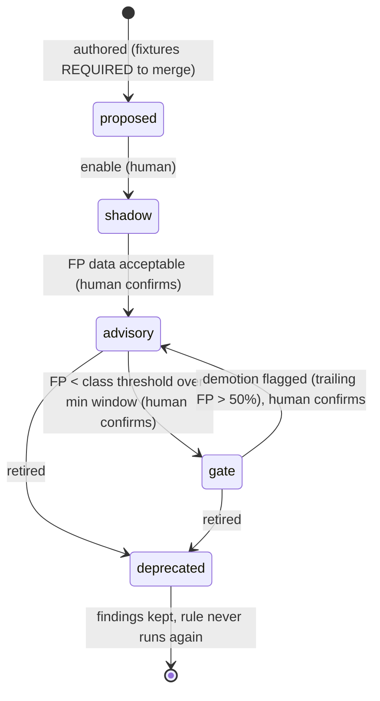
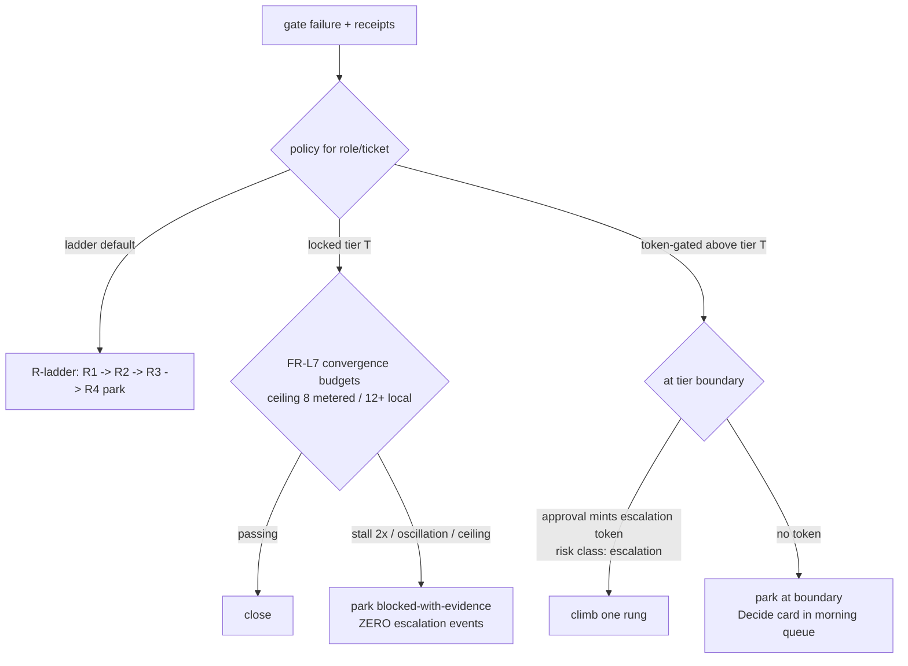

# Gate economics — rule lifecycle, FP funnel, suppression, escalation policy

**Status:** design (adopted D-014 + D-018, 2026-07-14) · feeds FR-RL1–4, FR-G3 policy modes, FR-L6 · tickets W3-08 (ledger + lifecycle), W4-06 (admin UI), W5-01 (phase gates), W2-06-amendment (policy modes)
**Question answered:** how does a gate stay trustworthy over time — neither rubber-stamp (false negatives) nor noise machine (false positives) — and who is allowed to spend money escalating past it?

**Evidence basis (why):**

| Fact | Number | Source |
|---|---|---|
| False blocks before the validator gate/advisory split | 3 of last 4 blocks (75%) | CONDUCTOR_FIELD_REPORT §5, conductor-log.jsonl |
| LLM-review-as-authority failed in both directions in one session | 1 false negative (hash forgery merged) + 3 false positives | field report §5 |
| Raw grep validators on TS | "256" in "AES-256-GCM" flagged as magic number; 20 bogus unreachable hits | field report §5 |
| localFrontier: locked-tier loops that landed where flat cap-3 escalation failed | 12-iteration ceiling proven | FINDING_LOOP_POLICY §3; opencode FIX_VERIFY_LOOP (v2.4.0) |
| Rule promotion threshold (adopted starting point) | FP < 20% over ≥20 findings/30 days; demotion flag at trailing FP > 50% | RepoPulse CODE_HEALTH_SUITE §8 (field-run values; per-class tunable) |

## 1. Rule lifecycle (FR-RL1/2)

- A rule = executable + metadata `{id, class, severity, provenance{source, license — REQUIRED, deny-by-default}, fixtures{trigger[], clean[]}}`. No fixtures ⇒ cannot merge (red-fixture law).
- **Shadow** runs on real diffs; findings stamped `experimental`, visible in their own facet, excluded from gates/scores/blocks/plans.
- **FP measurement**: a finding counts as FP when suppressed with justification `false_positive` or overturned by a maker≠verifier review; infra failures never count (FR-L6 taxonomy). Rates are per-rule, windowed, shown on the admin surface (W4-06).
- LLMs may *propose* rules (from field reports, FP clusters) — always landing `proposed`. No LLM path changes rule state.

## 2. The finding funnel (FR-RL4)

Every finding passes deterministic stages before it may block; each stage stamps, none silently drops:

`raw` → **dedup** (fingerprint, FR-L6) → **scope** (diff-scoped: a ticket answers only for its own diff) → **applicability** (rule class vs file type/language; reachability where computable) → **effective severity** → block/advise per rule state.

Surfaces always show `raw → deduped → in-scope → effective → suppressed(justified)`. Raw is never hidden (signals, not grades).

## 3. Suppression (FR-RL3)

- Requires: fixed-enum justification (`false_positive | not_applicable_scope | accepted_risk | fixed_elsewhere | wont_fix_documented`) + human signature (SC-05 machinery at finding grain).
- Keyed to `fingerprint + context_key` (rule version ‖ file hash ‖ dep version). Context change ⇒ auto-reopen as `reopened` (under review) — suppressions decay honestly, never rot into kill-lists.
- Suppressions are events; the weekly digest reports suppression volume per rule (an input to demotion).

## 4. Escalation policy modes (D-018, FR-G3)

- Three-scope setting (run > project > role default). Locked mode is the **localFrontier mode**: tokens ~free on owned hardware, so loop-until-green beats paying frontier — *as long as it is not looping on the same error* (stall/oscillation rules stay hard).
- Hard at every tier regardless of mode: deterministic gates, maker≠verifier, NEVER-AUTO, watchdog, budget breakers.
- Token-gated is the unattended-cost guard: an overnight run parks at the tier boundary rather than spending frontier money without a human-minted token.

## 5. ADRs

**ADR-14 — Deterministic validators own gates; LLM review is advisory and grounded.** (D-014, FR-RL1) A single non-deterministic review as authority failed both directions in one field session (75% false-block rate, one merged forgery). Consequence: rules carry lifecycles and measured FP; LLM findings anchor review, never gate alone. Rejected: LLM-as-gate with better prompts (non-determinism is structural, not promptable).

**ADR-15 — FP rates are measured from suppression/override outcomes, not judged.** (FR-RL2) Consequence: promotion/demotion arguments are data rows a human confirms. Rejected: periodic human rule review without data (doesn't scale past ~10 rules; the library has 66+).

**ADR-16 — Suppressions are justified, signed, context-keyed, self-reopening.** (FR-RL3) Rejected: config kill-lists (silently rot; the VEX field lesson — a suppression valid at v1 of a dep is a lie at v2).

**ADR-17 — Escalation is a policy surface, not a fixed ladder.** (D-018) The ladder stays default; locked/token-gated modes exist because the economics differ by hardware ownership and attendance. Rejected: auto-ladder always (spends frontier money unattended; contradicts the localFrontier field record); manual-only escalation (parks everything, wastes the 80% the ladder lands autonomously).
