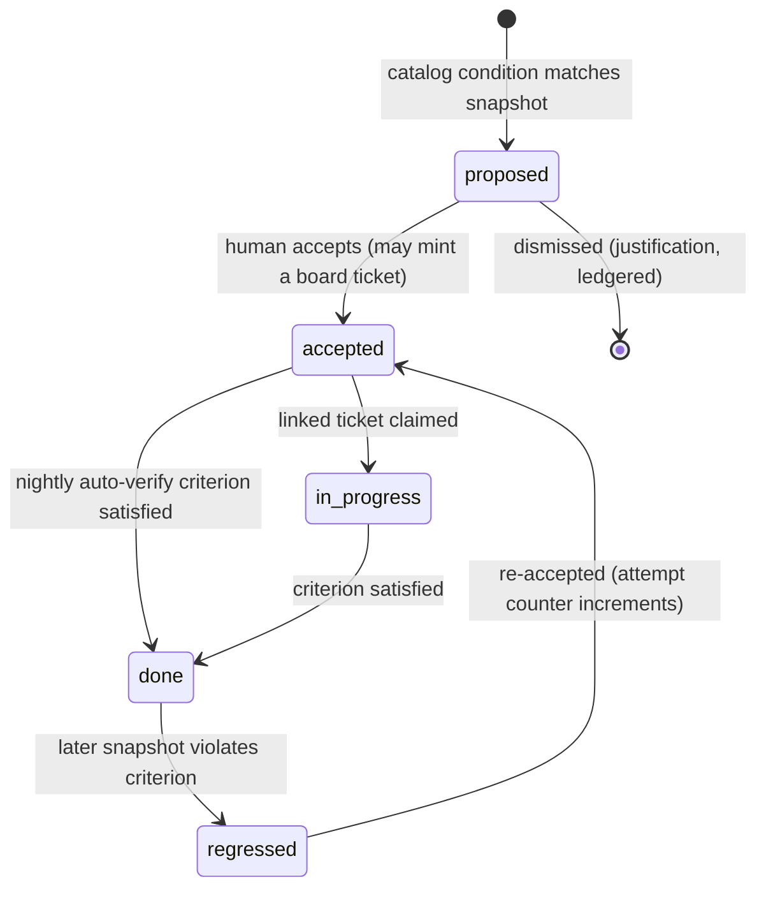

# Improvement Plans — reports → ranked, auto-verified action

**Status:** design (adopted D-016, 2026-07-14) · feeds FR-PLAN1–4 · tickets W5-10 (catalog + engine + auto-verify), W5-11 (UI + morning queue)
**Question answered:** what happens to run outputs (receipts, coverage reports, finding ledger) after the run — how do they become work instead of stale markdown?

Prime rule (rules-first, LLM-second): **plan items come ONLY from the deterministic catalog; the LLM may order, narrate, and summarize — never add, remove, or reword.** Every surface works with zero LLM calls.

## 1. The catalog (FR-PLAN1)

Versioned data, not code: `content/plan-catalog/catalog.v1.json`. Entry shape:

```jsonc
{ "id": "PC-004",
  "condition": "coverage.requiredSkipped > 0",           // deterministic predicate over snapshots
  "recommendation": "Close or waive the {n} SKIPPED required units in phase {phase}",
  "verify": "coverage.requiredSkipped == 0",              // machine-checkable criterion
  "severity": 3, "leverage": 2 }
```

Inputs (read-only snapshots): receipts, COVERAGE_REPORTs, the finding ledger (incl. suppression/FP stats — D-014 feeds D-016: "rule X trailing FP 60% → demotion review" is itself a catalog condition), spend ledger, board stats. Seed catalog ~12 entries (skipped-units, stale receipts, unwaived criticals, oscillating tickets flagged for decomposition, FP-heavy rules, budget-threshold repeats, blocked-with-evidence age, missing red fixtures, unverified provider ToS at wave, orphaned deliverables, regressed plan items, stale playbook entries).

## 2. Plan items (FR-PLAN2/3)



- Ranking is deterministic: `severity × leverage × staleness`; identical snapshot ⇒ identical plan (property-tested).
- Nightly auto-verify (sleep-time job family, FR-M3 scheduler) re-evaluates every accepted item; `done`/`regressed` flips are events; regressions are Review-tier cards in the morning queue with the violated criterion + evidence.
- Accepting an item may mint a board ticket carrying the item's `verify` as the ticket `verify` — the plan and the board never diverge on what done means.

## 3. ADR

**ADR-18 — Recommendations are catalog rows, not LLM output.** (D-016, FR-PLAN4) Anti-hallucination by construction; nightly auto-verify keeps "improved" claims true over time; regression is a first-class state. Rejected: LLM-generated improvement lists (unverifiable, unstable across runs, invents work); one-shot audit reports (rot immediately — the exact failure this pillar exists to end).
