# Dokima — screenshot tour

A scribe-style walkthrough of the shipped product, captured against the
real server + real event log with zero mocks (Law 9 local-first: no
network, throwaway `.dokima` home). Regenerate any time with:

```sh
pnpm --filter @dokima/web run build   # if dist/ is stale
node apps/web/scripts/capture-tour.mjs
```

## Step 1 — Fleet home (first launch)

The entry screen with no projects yet. The header offers the three ways in: **New Product**, **Onboard existing repo**, and **Import**.

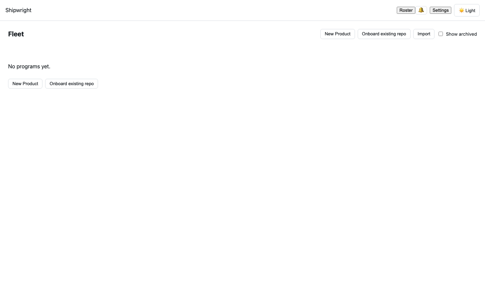

## Step 2 — New Product form

Clicking **New Product** opens the creation form: a directory path and an optional display name.

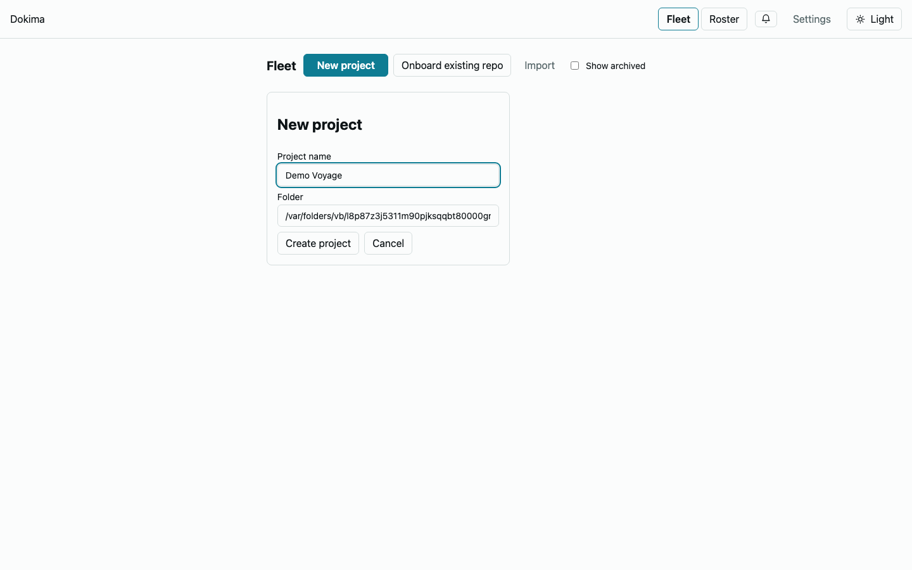

## Step 3 — Project registered on the Fleet

The project appears as a card with a **Not started** phase chip, Ready/Blocked/Done ticket counters, berth status, and today’s spend — plus Open and Archive actions.

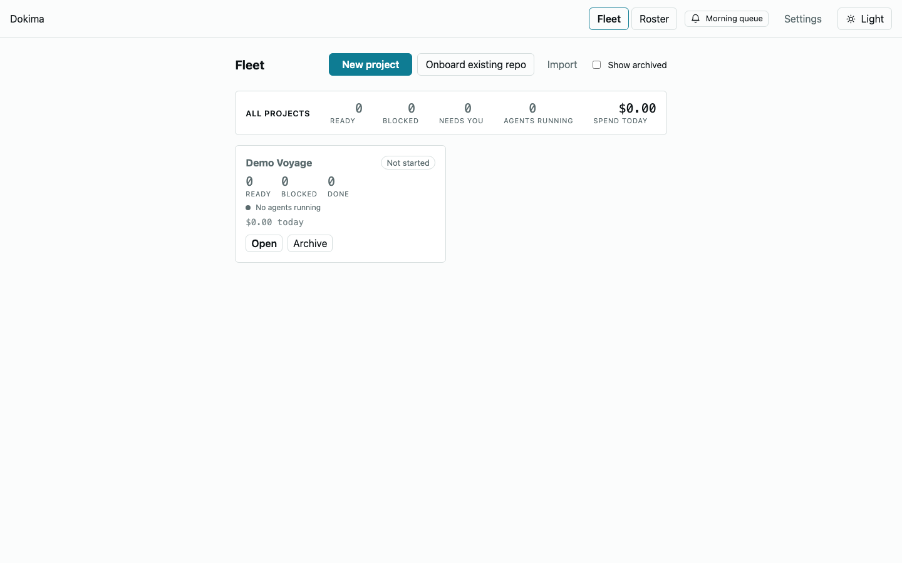

## Step 4 — Project workspace (three-pane)

Opening a project lands on the split-pane workspace: **Chat** (left, showing the guided sample thread), **Board** (center), **Artifacts** (right). Board and Artifacts state their empty conditions honestly rather than showing fabricated data.

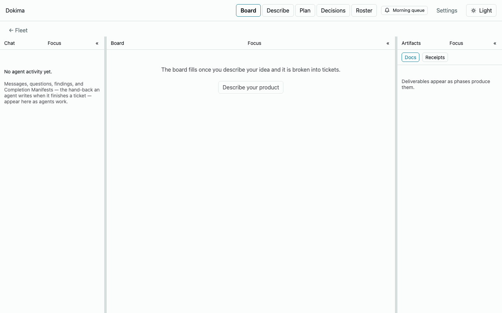

## Step 5 — Board with live tickets

Tickets seeded through the real hash-chained event log (`seed-board-tickets.mjs`): ready, blocked-on-dependency, and accepted tickets across lanes.

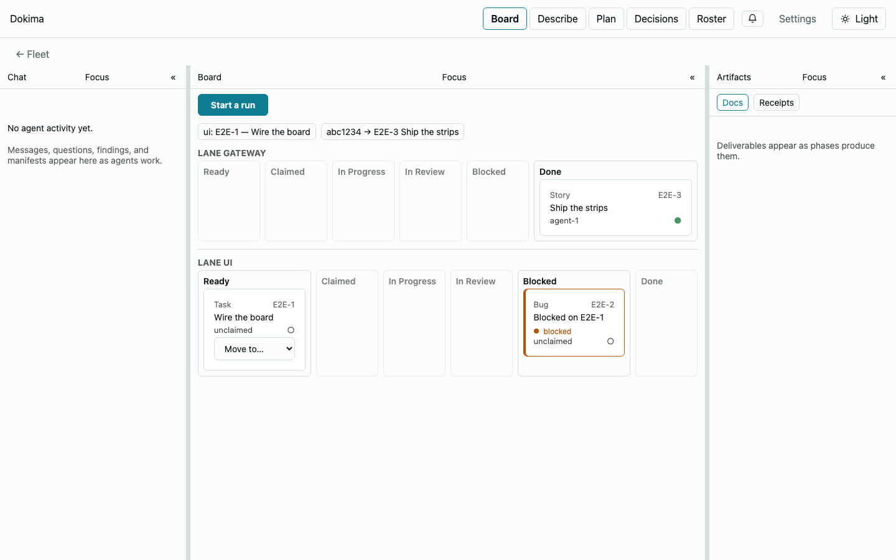

## Step 6 — Ticket drawer

Clicking a card opens the drawer: state, lane, write scope, dependency chips, telemetry, and the **session trace** entry point.

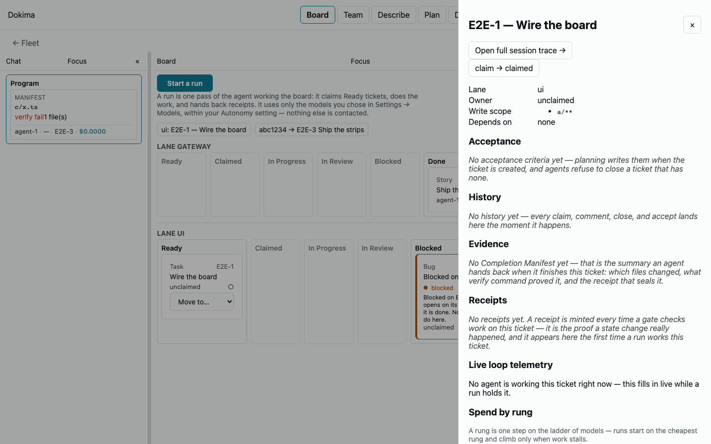

## Step 7 — Session trace replay

The trace view replays a run’s real events — loop passes, gate receipts, escalation rungs — each one feeding the lessons form (BLUEPRINT §12.4).

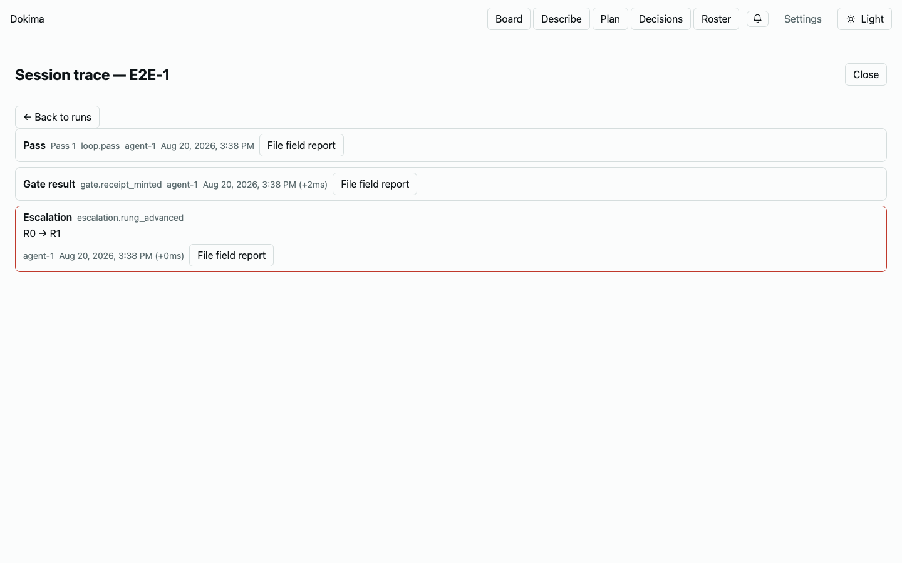

## Step 8 — Improvement Plan view

A snapshot evaluation proposed **PC-001** from the plan catalog, with its provenance, verify criterion, and Accept/Dismiss actions plus the raw-findings funnel.

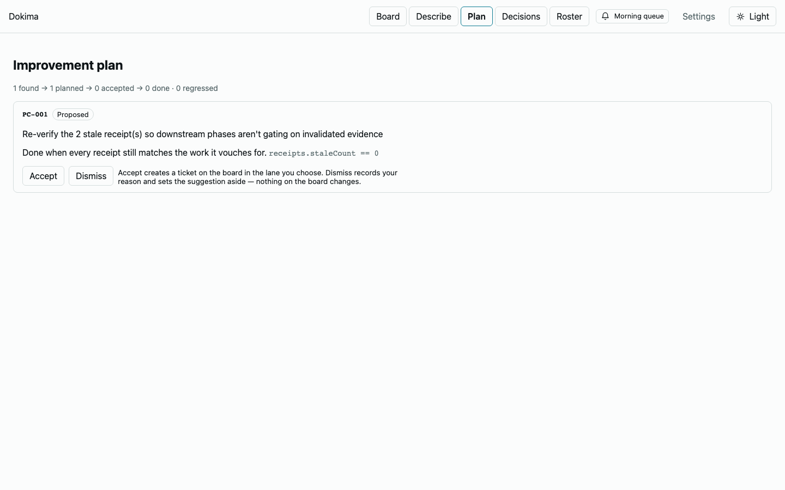

## Step 9 — Morning queue

The signature screen (UX_SPEC §7): Decide items get inline **Approve/Reject**; Review items batch into a digest. The elapsed timer nudges toward the ten-minute review.

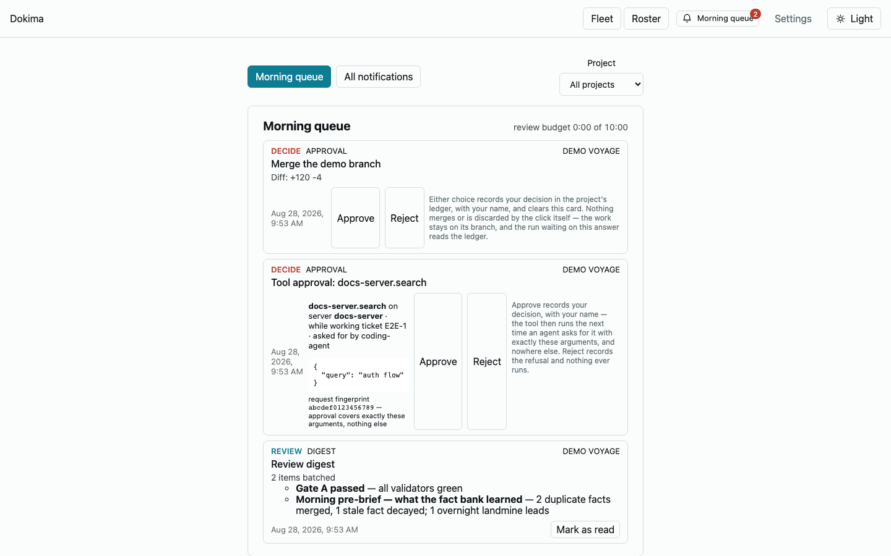

## Step 10 — Expert roster

The imported expert library (`content/experts/`) — the specialist roles the pipeline dispatches, with their provenance.

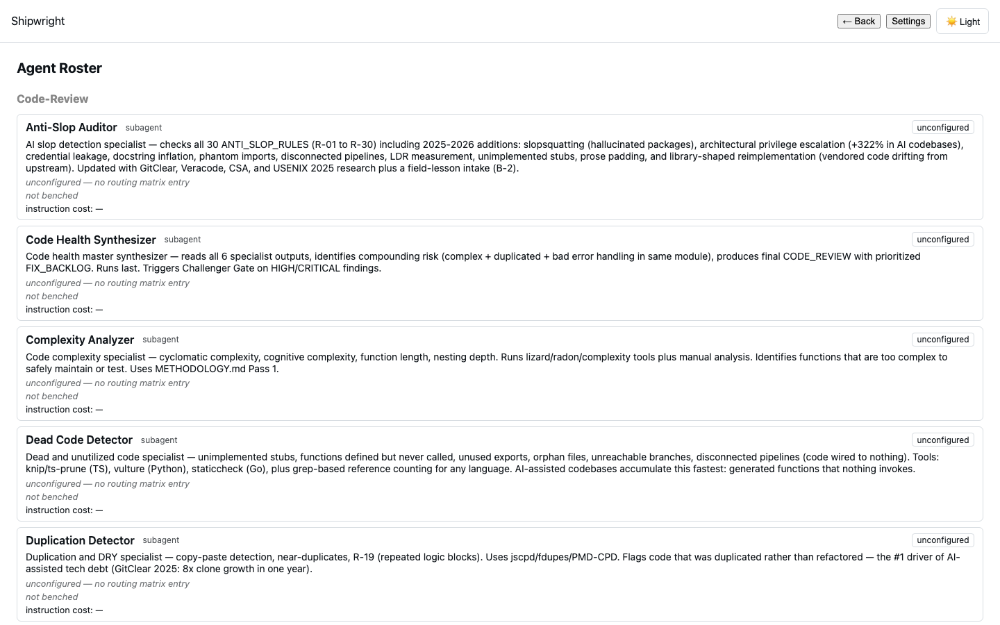

## Step 11 — Settings

The global Settings view is deliberately thin: model matrix, autonomy dial, budgets, and scopes are configured per-project (open a project first), with the Setup Wizard as the entry point.

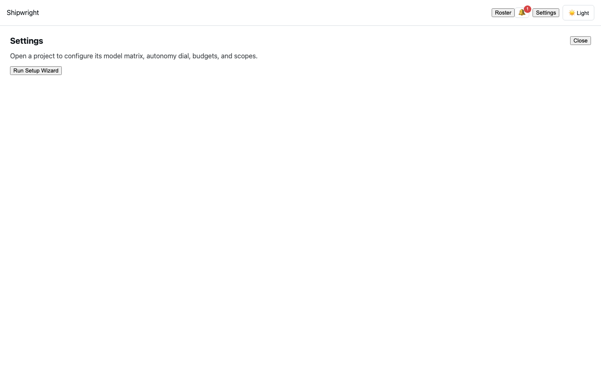

## Step 12 — Keyboard shortcuts overlay

Press **?** anywhere for the shortcut map; Escape closes it.

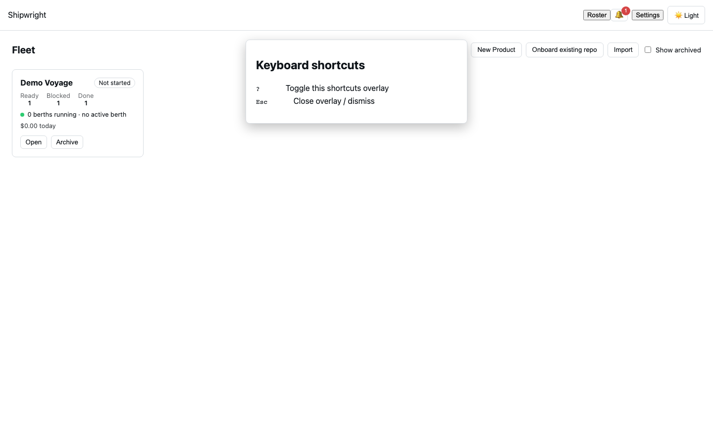

## Step 13 — Theme toggle

One click switches light/dark; the choice persists across reloads.

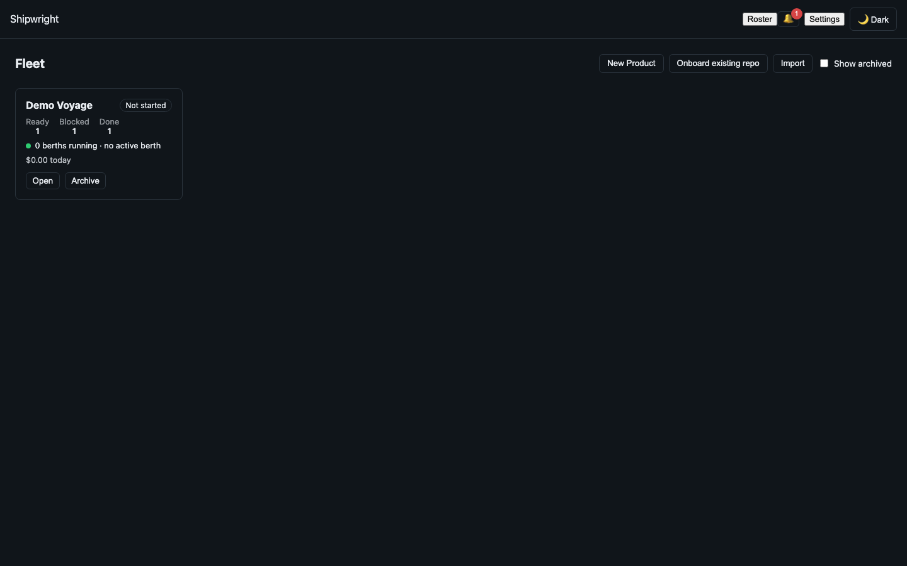
